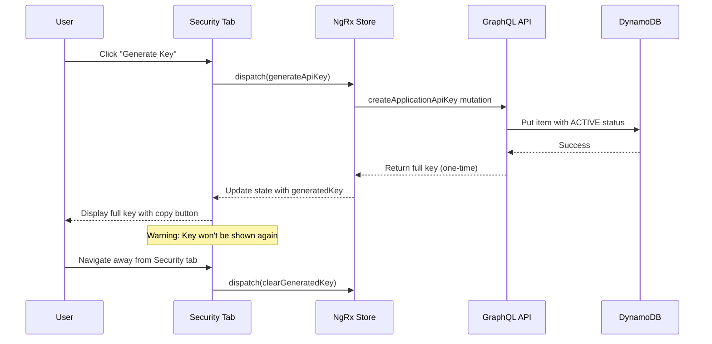
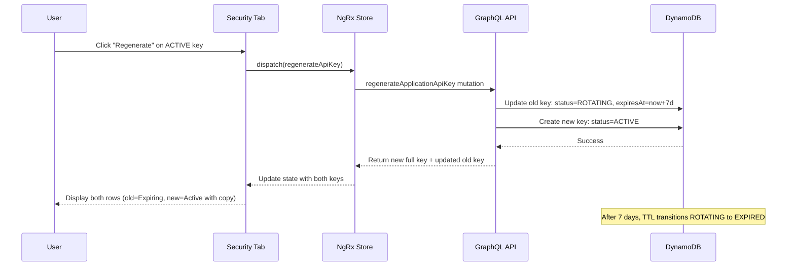
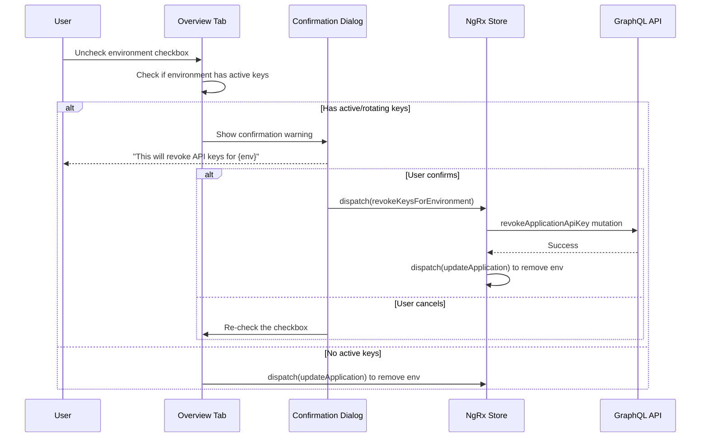

# Design Document: API Key Lifecycle Management

## Overview

This design enhances the API key management system to support a complete lifecycle including generation, rotation with grace periods, revocation, and automatic cleanup. The implementation follows the existing store-first NgRx architecture and integrates with the current Security tab on the Application Detail Page.

## Architecture

The system uses a layered architecture:

```
┌─────────────────────────────────────────────────────────────┐
│                    Security Tab UI                          │
│  (Environment rows, status badges, action buttons)          │
└─────────────────────────────────────────────────────────────┘
                              │
                              ▼
┌─────────────────────────────────────────────────────────────┐
│                    NgRx Store                               │
│  (API Keys state, selectors, actions)                       │
└─────────────────────────────────────────────────────────────┘
                              │
                              ▼
┌─────────────────────────────────────────────────────────────┐
│                    Effects Layer                            │
│  (API calls, side effects)                                  │
└─────────────────────────────────────────────────────────────┘
                              │
                              ▼
┌─────────────────────────────────────────────────────────────┐
│                    GraphQL API                              │
│  (AppSync mutations/queries)                                │
└─────────────────────────────────────────────────────────────┘
                              │
                              ▼
┌─────────────────────────────────────────────────────────────┐
│                    DynamoDB                                 │
│  (ApplicationApiKeys table with TTL)                        │
└─────────────────────────────────────────────────────────────┘
```

## Components and Interfaces

### API Key Status Enum

```typescript
// schemas/registries/ApplicationApiKeyStatus.yml
enum ApplicationApiKeyStatus {
  ACTIVE = 'ACTIVE',       // Key is valid and working
  ROTATING = 'ROTATING',   // Old key during grace period (still valid)
  REVOKED = 'REVOKED',     // Permanently disabled
  EXPIRED = 'EXPIRED'      // Past expiration date
}
```

### Environment Key Row Interface

```typescript
interface EnvironmentKeyRow {
  environment: string;
  environmentLabel: string;
  apiKey: IApplicationApiKeys | null;
  hasActiveKey: boolean;
  isRotating: boolean;
  isRevoked: boolean;
  isExpired: boolean;
  canGenerate: boolean;
  canRegenerate: boolean;
  canRevoke: boolean;
  activityText: string;
  expiresInDays: number | null;
}
```

### Row Computation Logic

```
For each environment in application.environments:
  1. Find all API keys for this environment
  2. Sort keys by status priority: ACTIVE > ROTATING > REVOKED > EXPIRED
  3. For each key, create an EnvironmentKeyRow
  4. If no ACTIVE or ROTATING key exists, add a "Generate" placeholder row

Row display rules:
  - ACTIVE key: Show prefix, green badge, "Last used X ago", [Regenerate] [Revoke]
  - ROTATING key: Show prefix, orange badge, "Expires in X days", [Revoke]
  - REVOKED key: Show prefix, red badge (muted), "Revoked on X", no actions
  - EXPIRED key: Show prefix, gray badge (muted), "Expired on X", no actions
  - No key: Show "No API key", [Generate Key] button
```

### Key Generation Flow



### Key Regeneration Flow



### Environment Deselection Flow



## Data Models

### ApplicationApiKeys Table Schema Updates

```yaml
# schemas/tables/ApplicationApiKeys.yml additions
attributes:
  activatesAt:
    type: timestamp
    required: false
    description: Future activation timestamp (null = immediate)
  expiresAt:
    type: timestamp
    required: false
    description: Expiration timestamp (null = never, set for ROTATING/REVOKED)
  revokedAt:
    type: timestamp
    required: false
    description: When the key was revoked (null if not revoked)
  ttl:
    type: number
    required: false
    description: DynamoDB TTL attribute (Unix timestamp for auto-deletion)
```

### Key Prefix Format

```
Format: orb_api_{first_4_chars}****
Example: orb_api_a1b2****

Full key format: orb_api_{env_prefix}_{random_32_chars}
Examples:
  - orb_api_prod_a1b2c3d4e5f6g7h8i9j0k1l2m3n4o5p6
  - orb_api_dev_x9y8z7w6v5u4t3s2r1q0p9o8n7m6l5k4
```

## Correctness Properties

*A property is a characteristic or behavior that should hold true across all valid executions of a system—essentially, a formal statement about what the system should do. Properties serve as the bridge between human-readable specifications and machine-verifiable correctness guarantees.*

### Property 1: Environment Row Count Matches Selected Environments

*For any* application with N selected environments, the Security tab SHALL display at least N environment sections (more if keys exist in ROTATING state showing both old and new).

**Validates: Requirements 2.1**

### Property 2: Rows Sorted by Environment Priority

*For any* set of environment key rows, they SHALL be sorted by environment in order: PRODUCTION, STAGING, DEVELOPMENT, TEST, PREVIEW.

**Validates: Requirements 2.2**

### Property 3: Rows Sorted by Status Within Environment

*For any* set of API keys within the same environment, they SHALL be sorted by status priority: ACTIVE first, then ROTATING, then REVOKED, then EXPIRED.

**Validates: Requirements 2.3**

### Property 4: Generate CTA Visible When No Active Key

*For any* environment that has no ACTIVE or ROTATING API key, the row SHALL display a "Generate Key" CTA button.

**Validates: Requirements 2.4**

### Property 5: Active Key Row Content

*For any* ACTIVE API key, the row SHALL display: key prefix matching `orb_api_****` pattern, green status badge, and activity text showing last used time.

**Validates: Requirements 2.5**

### Property 6: Rotating Environment Shows Two Rows

*For any* environment with a ROTATING key, the Security tab SHALL display exactly two rows for that environment: one ROTATING (expiring) and one ACTIVE (new).

**Validates: Requirements 2.6**

### Property 7: Activity Text Matches Key Status

*For any* API key, the activity text SHALL match its status:
- ACTIVE: "Last used {time}" or "Never used"
- ROTATING: "Expires in {days} days"
- REVOKED: "Revoked on {date}"
- EXPIRED: "Expired on {date}"

**Validates: Requirements 2.7, 5.4**

### Property 8: Generated Key Cleared on Tab Change

*For any* Security tab with a displayed generated key, navigating to another tab SHALL clear the generated key from component state.

**Validates: Requirements 3.4**

### Property 9: Key Format Matches Pattern

*For any* generated API key, it SHALL match the pattern `orb_api_{env}_{32_alphanumeric_chars}`.

**Validates: Requirements 3.5**

### Property 10: Regeneration Creates ACTIVE and ROTATING Pair

*For any* regeneration operation on an ACTIVE key, the result SHALL be: original key status = ROTATING, new key status = ACTIVE, both for the same environment.

**Validates: Requirements 4.1**

### Property 11: Rotating Key Expires in 7 Days

*For any* key in ROTATING status, its expiresAt timestamp SHALL be exactly 7 days after its updatedAt timestamp.

**Validates: Requirements 4.2**

### Property 12: Status Badge Color Matches Status

*For any* API key row, the status badge color SHALL match:
- ACTIVE: Green
- ROTATING: Orange
- REVOKED: Red
- EXPIRED: Gray

**Validates: Requirements 7.1**

### Property 13: Revoked Key Has ExpiresAt Equal to RevokedAt

*For any* REVOKED key, its expiresAt timestamp SHALL equal its revokedAt timestamp.

**Validates: Requirements 8.1**

### Property 14: All API Keys Displayed

*For any* set of API keys returned from the API for an application, all keys SHALL be displayed in the Security tab (none filtered out).

**Validates: Requirements 8.3**

### Property 15: Muted Styling for Inactive Keys

*For any* REVOKED or EXPIRED key, the row SHALL have muted styling (reduced opacity or grayed out).

**Validates: Requirements 8.4**

### Property 16: Key Prefix Format

*For any* key prefix, it SHALL match the pattern `orb_api_{4_chars}****` (exactly 4 visible characters followed by exactly 4 asterisks).

**Validates: Requirements 9.1, 9.2**

### Property 17: Multiple Keys Have Distinguishable Prefixes

*For any* two API keys in the same environment, their prefixes SHALL be different.

**Validates: Requirements 9.3**

## Error Handling

### API Key Generation Errors

| Error | User Message | Recovery |
|-------|--------------|----------|
| Network failure | "Failed to generate key. Please try again." | Retry button |
| Rate limit | "Too many requests. Please wait and try again." | Retry after delay |
| Permission denied | "You don't have permission to generate keys." | Contact admin |

### API Key Revocation Errors

| Error | User Message | Recovery |
|-------|--------------|----------|
| Key not found | "Key no longer exists." | Refresh list |
| Already revoked | "Key is already revoked." | Refresh list |
| Network failure | "Failed to revoke key. Please try again." | Retry button |

### Environment Deselection Errors

| Error | User Message | Recovery |
|-------|--------------|----------|
| Revocation failed | "Failed to revoke API keys. Environment not removed." | Retry or manual revoke |

## Testing Strategy

### Unit Tests

Unit tests verify specific examples and edge cases:

1. Tab lazy loading - verify API keys not fetched on page load
2. Tab click triggers fetch - verify action dispatched
3. Confirmation dialog appears on revoke
4. Confirmation dialog appears on environment deselection with active keys
5. Copy to clipboard functionality
6. Key warning message displayed

### Property-Based Tests

Property-based tests verify universal properties using fast-check:

1. **Property 1**: Environment row count (100+ iterations)
2. **Property 2**: Environment sorting (100+ iterations)
3. **Property 3**: Status sorting within environment (100+ iterations)
4. **Property 4**: Generate CTA visibility (100+ iterations)
5. **Property 5**: Active key row content (100+ iterations)
6. **Property 6**: Rotating shows two rows (100+ iterations)
7. **Property 7**: Activity text matches status (100+ iterations)
8. **Property 8**: Generated key cleared on tab change (100+ iterations)
9. **Property 10**: Regeneration creates pair (100+ iterations)
10. **Property 11**: Rotating expires in 7 days (100+ iterations)
11. **Property 12**: Badge color matches status (100+ iterations)
12. **Property 13**: Revoked expiresAt equals revokedAt (100+ iterations)
13. **Property 14**: All keys displayed (100+ iterations)
14. **Property 15**: Muted styling for inactive (100+ iterations)
15. **Property 16**: Key prefix format (100+ iterations)
16. **Property 17**: Distinguishable prefixes (100+ iterations)

### Test Configuration

- Framework: Jest with fast-check for property-based testing
- Minimum iterations: 100 per property test
- Each test tagged with: `Feature: api-key-lifecycle-management, Property N: {description}`
