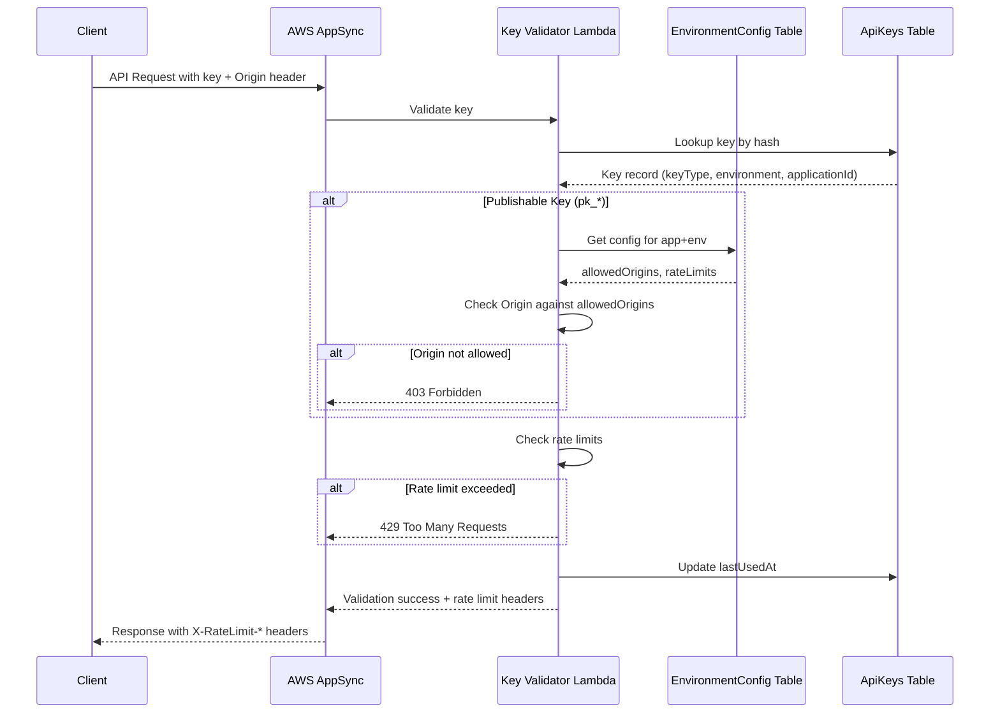
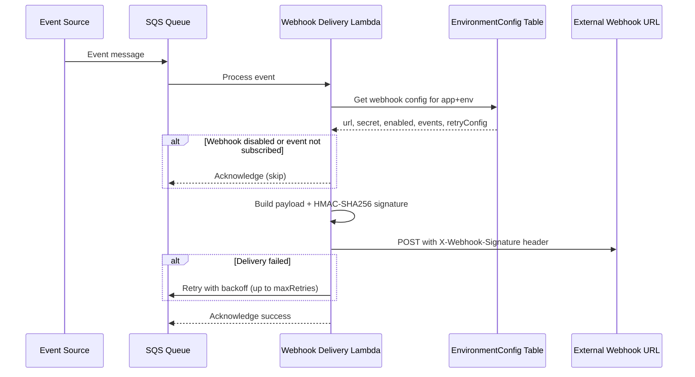

# Design Document: Application Environment Configuration

## Overview

This design implements a comprehensive environment configuration system for applications in the orb-integration-hub platform. The system introduces a new `ApplicationEnvironmentConfig` DynamoDB table to store per-environment settings including CORS allowed origins, rate limits, feature flags, and webhook configurations. It also extends the existing API key system with a dual key model supporting both publishable keys (frontend-safe) and secret keys (backend-only).

The architecture follows the existing patterns in the codebase: YAML schema definitions processed by orb-schema-generator, GraphQL API via AWS AppSync, Python Lambda resolvers, and Angular frontend with NgRx state management.

## Architecture

```
┌─────────────────────────────────────────────────────────────────────────────┐
│                         Angular Frontend                                     │
│  ┌─────────────────┐  ┌─────────────────┐  ┌─────────────────┐              │
│  │ Security Tab    │  │ Config Tab      │  │ Webhooks Tab    │              │
│  │ (Dual Keys)     │  │ (Origins/Rates) │  │ (Events/Retry)  │              │
│  └────────┬────────┘  └────────┬────────┘  └────────┬────────┘              │
│           │                    │                    │                        │
│           └────────────────────┼────────────────────┘                        │
│                                ▼                                             │
│  ┌─────────────────────────────────────────────────────────────────────┐    │
│  │                    NgRx Store (Environment Config State)             │    │
│  └─────────────────────────────────────────────────────────────────────┘    │
└─────────────────────────────────────────────────────────────────────────────┘
                                 │
                                 ▼
┌─────────────────────────────────────────────────────────────────────────────┐
│                         AWS AppSync GraphQL API                              │
│  ┌─────────────────────────────────────────────────────────────────────┐    │
│  │ Queries: getApplicationEnvironmentConfig, listFeatureFlags          │    │
│  │ Mutations: updateConfig, addOrigin, removeOrigin, updateWebhook,    │    │
│  │            regenerateWebhookSecret, setFeatureFlag, deleteFeatureFlag│    │
│  └─────────────────────────────────────────────────────────────────────┘    │
└─────────────────────────────────────────────────────────────────────────────┘
                                 │
                                 ▼
┌─────────────────────────────────────────────────────────────────────────────┐
│                         Python Lambda Resolvers                              │
│  ┌─────────────────┐  ┌─────────────────┐  ┌─────────────────┐              │
│  │ Config CRUD     │  │ Key Validation  │  │ Webhook Delivery│              │
│  └─────────────────┘  └─────────────────┘  └─────────────────┘              │
└─────────────────────────────────────────────────────────────────────────────┘
                                 │
                                 ▼
┌─────────────────────────────────────────────────────────────────────────────┐
│                         DynamoDB Tables                                      │
│  ┌─────────────────────────┐  ┌─────────────────────────────────────────┐   │
│  │ ApplicationEnvironment  │  │ ApplicationApiKeys (extended)           │   │
│  │ Config                  │  │ + keyType, permissions                  │   │
│  └─────────────────────────┘  └─────────────────────────────────────────┘   │
└─────────────────────────────────────────────────────────────────────────────┘
```

### Key Validation Flow



### Webhook Delivery Flow



## Components and Interfaces

### ApplicationApiKeyType Registry

```yaml
# schemas/registries/ApplicationApiKeyType.yml
type: registry
version: '1.0'
name: ApplicationApiKeyType
targets:
  - api
description: "Type of API key (publishable for frontend, secret for backend)"

items:
  UNKNOWN:
    value: "UNKNOWN"
    description: "Unknown key type"
  PUBLISHABLE:
    value: "PUBLISHABLE"
    description: "Frontend-safe key with pk_ prefix, validated against allowed origins"
  SECRET:
    value: "SECRET"
    description: "Backend-only key with sk_ prefix, full permissions"
```

### WebhookEventType Registry

```yaml
# schemas/registries/WebhookEventType.yml
type: registry
version: '1.0'
name: WebhookEventType
targets:
  - api
description: "Types of events that can trigger webhooks"

items:
  UNKNOWN:
    value: "UNKNOWN"
    description: "Unknown event type"
  USER_CREATED:
    value: "USER_CREATED"
    description: "A new user was created in the application"
  USER_UPDATED:
    value: "USER_UPDATED"
    description: "A user's profile was updated"
  USER_DELETED:
    value: "USER_DELETED"
    description: "A user was deleted from the application"
  GROUP_CREATED:
    value: "GROUP_CREATED"
    description: "A new group was created"
  GROUP_UPDATED:
    value: "GROUP_UPDATED"
    description: "A group was updated"
  GROUP_DELETED:
    value: "GROUP_DELETED"
    description: "A group was deleted"
  ROLE_ASSIGNED:
    value: "ROLE_ASSIGNED"
    description: "A role was assigned to a user"
  ROLE_REVOKED:
    value: "ROLE_REVOKED"
    description: "A role was revoked from a user"
```

### Key Prefix Formats

```
Publishable Key Format: pk_{env}_{32_alphanumeric_chars}
Examples:
  - pk_prod_a1b2c3d4e5f6g7h8i9j0k1l2m3n4o5p6
  - pk_dev_x9y8z7w6v5u4t3s2r1q0p9o8n7m6l5k4

Secret Key Format: sk_{env}_{32_alphanumeric_chars}
Examples:
  - sk_prod_a1b2c3d4e5f6g7h8i9j0k1l2m3n4o5p6
  - sk_dev_x9y8z7w6v5u4t3s2r1q0p9o8n7m6l5k4

Display Prefix Format: {pk|sk}_{env}_{first_4}****
Examples:
  - pk_prod_a1b2****
  - sk_dev_x9y8****
```

### Origin Validation Logic

```python
def validate_origin(request_origin: str, allowed_origins: list[str]) -> bool:
    """
    Validate request origin against allowed origins list.
    Supports exact matches and wildcard subdomains.
    """
    if not request_origin:
        return False
    
    for allowed in allowed_origins:
        if allowed.startswith("https://*."):
            # Wildcard subdomain match
            base_domain = allowed[10:]  # Remove "https://*."
            if request_origin.endswith(base_domain):
                return True
        elif request_origin == allowed:
            # Exact match
            return True
    
    return False

def is_localhost_allowed(environment: str) -> bool:
    """Only allow localhost for non-production environments."""
    return environment in ["DEVELOPMENT", "TEST"]
```

### Rate Limit Headers

```python
def build_rate_limit_headers(
    limit: int,
    remaining: int,
    reset_timestamp: int
) -> dict:
    """Build standard rate limit response headers."""
    return {
        "X-RateLimit-Limit": str(limit),
        "X-RateLimit-Remaining": str(remaining),
        "X-RateLimit-Reset": str(reset_timestamp)
    }
```

### Webhook Signature Generation

```python
import hmac
import hashlib
import json

def generate_webhook_signature(payload: dict, secret: str) -> str:
    """Generate HMAC-SHA256 signature for webhook payload."""
    payload_bytes = json.dumps(payload, sort_keys=True).encode('utf-8')
    signature = hmac.new(
        secret.encode('utf-8'),
        payload_bytes,
        hashlib.sha256
    ).hexdigest()
    return f"sha256={signature}"
```

## Data Models

### ApplicationEnvironmentConfig Table Schema

```yaml
# schemas/tables/ApplicationEnvironmentConfig.yml
type: dynamodb
pitr_enabled: false
version: '1.0'
name: ApplicationEnvironmentConfig
targets:
  - api
model:
  authConfig:
    cognitoAuthentication:
      groups:
        OWNER:
          - '*'
        EMPLOYEE:
          - '*'
  keys:
    primary:
      partition: applicationId
      sort: environment
      description: Composite key for application environment configuration
    secondary:
      - name: OrgEnvIndex
        type: GSI
        partition: organizationId
        sort: environment
        projection_type: ALL
        description: Index for querying configs by organization and environment
  attributes:
    applicationId:
      type: string
      required: true
      description: ID of the application (partition key)
    environment:
      type: string
      required: true
      enum_type: Environment
      enum_values:
        - PRODUCTION
        - STAGING
        - DEVELOPMENT
        - TEST
        - PREVIEW
      description: Environment this configuration applies to (sort key)
    organizationId:
      type: string
      required: true
      description: ID of the organization (denormalized for queries)
    allowedOrigins:
      type: array
      items: string
      required: false
      description: List of allowed CORS origins for publishable keys (max 10)
    rateLimitPerMinute:
      type: number
      required: true
      description: Maximum API requests per minute (default 60)
    rateLimitPerDay:
      type: number
      required: true
      description: Maximum API requests per day (default 10000)
    webhookUrl:
      type: string
      required: false
      description: HTTPS URL for webhook delivery
    webhookSecret:
      type: string
      required: false
      description: HMAC secret for webhook signature (32 chars)
    webhookEvents:
      type: array
      items: string
      required: false
      description: List of event types to deliver via webhook
    webhookEnabled:
      type: boolean
      required: false
      description: Whether webhook delivery is enabled
    webhookMaxRetries:
      type: number
      required: false
      description: Maximum retry attempts for failed webhook delivery (default 3)
    webhookRetryDelaySeconds:
      type: number
      required: false
      description: Delay between retry attempts in seconds (default 60)
    featureFlags:
      type: map
      required: false
      description: Map of feature flag keys to values (boolean, string, or number)
    metadata:
      type: map
      required: false
      description: Custom key-value pairs for environment-specific data
    createdAt:
      type: timestamp
      required: true
      description: When the configuration was created
    updatedAt:
      type: timestamp
      required: true
      description: When the configuration was last updated
```

### ApplicationApiKeys Table Extensions

```yaml
# Additional attributes for schemas/tables/ApplicationApiKeys.yml
attributes:
  keyType:
    type: string
    required: true
    enum_type: ApplicationApiKeyType
    enum_values:
      - PUBLISHABLE
      - SECRET
    description: Type of API key (PUBLISHABLE for frontend, SECRET for backend)
  permissions:
    type: array
    items: string
    required: false
    description: List of permission strings for this key (e.g., read:users, write:groups)
```

### TypeScript Interfaces

```typescript
// Environment Configuration
interface IApplicationEnvironmentConfig {
  applicationId: string;
  environment: Environment;
  organizationId: string;
  allowedOrigins?: string[];
  rateLimitPerMinute: number;
  rateLimitPerDay: number;
  webhookUrl?: string;
  webhookSecret?: string;
  webhookEvents?: WebhookEventType[];
  webhookEnabled?: boolean;
  webhookMaxRetries?: number;
  webhookRetryDelaySeconds?: number;
  featureFlags?: Record<string, boolean | string | number>;
  metadata?: Record<string, string>;
  createdAt: string;
  updatedAt: string;
}

// Extended API Key
interface IApplicationApiKeys {
  applicationApiKeyId: string;
  applicationId: string;
  organizationId: string;
  environment: Environment;
  keyHash: string;
  keyPrefix: string;
  keyType: ApplicationApiKeyType;
  permissions?: string[];
  status: ApplicationApiKeyStatus;
  nextKeyHash?: string;
  activatesAt?: string;
  expiresAt?: string;
  revokedAt?: string;
  lastUsedAt?: string;
  createdAt: string;
  updatedAt: string;
  ttl?: number;
}

// Webhook Payload
interface WebhookPayload {
  id: string;
  type: WebhookEventType;
  applicationId: string;
  environment: Environment;
  timestamp: string;
  data: Record<string, unknown>;
}
```

