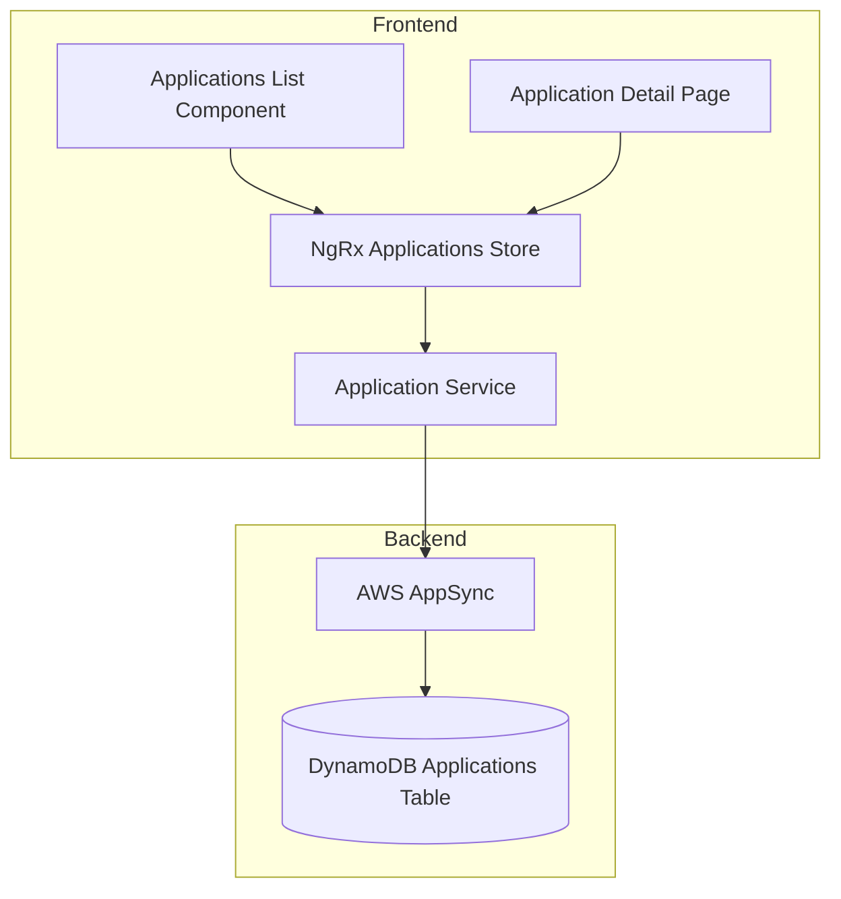

# Design Document: Applications Management

## Overview

This design document describes the implementation of a fully functional Applications management feature for the orb-integration-hub frontend. The feature replaces the current mock implementation with real GraphQL operations against the DynamoDB Applications table.

The implementation follows the established patterns from the Organizations feature, including:
- Dedicated Angular service extending ApiService
- NgRx store for state management
- DataGrid component for list display
- Create-on-click pattern for new applications
- Consistent styling with global orb-card and orb-form classes

## Architecture



### Data Flow

1. **List View**: ApplicationsListComponent dispatches `loadApplications` action → Effects call ApplicationService → Service executes GraphQL query → Results stored in NgRx state → Selector provides filtered/sorted data to component

2. **Create Flow**: User clicks "Create Application" → Component calls `createDraft` → Service creates PENDING application → Navigate to detail page → User completes form → Save changes status to ACTIVE

3. **Edit Flow**: User clicks row → Navigate to detail page → Load application by ID → User edits → Save updates application

## Components and Interfaces

### ApplicationService

```typescript
@Injectable({ providedIn: 'root' })
export class ApplicationService extends ApiService {
  
  // Create a draft application (create-on-click pattern)
  createDraft(ownerId: string, organizationId: string): Observable<IApplications>;
  
  // Create a full application
  createApplication(input: ApplicationsCreateInput): Observable<IApplications>;
  
  // Update an existing application
  updateApplication(input: ApplicationsUpdateInput): Observable<IApplications>;
  
  // Delete an application
  deleteApplication(applicationId: string): Observable<IApplications>;
  
  // Get a single application by ID
  getApplication(applicationId: string): Observable<IApplications | null>;
  
  // Get applications by organization
  getApplicationsByOrganization(
    organizationId: string, 
    limit?: number, 
    nextToken?: string
  ): Observable<Connection<IApplications>>;
  
  // Get all applications for the current user (across all their organizations)
  getUserApplications(
    organizationIds: string[], 
    limit?: number
  ): Observable<IApplications[]>;
}
```

### NgRx Store Structure

```typescript
// State
interface ApplicationsState {
  applications: ApplicationTableRow[];
  selectedApplication: IApplications | null;
  isLoading: boolean;
  isCreatingNew: boolean;
  error: string | null;
  
  // Filters
  searchTerm: string;
  organizationFilter: string;
  statusFilter: string;
}

// Actions
const ApplicationsActions = {
  loadApplications: createAction('[Applications] Load'),
  loadApplicationsSuccess: createAction('[Applications] Load Success', props<{ applications: ApplicationTableRow[] }>()),
  loadApplicationsFailure: createAction('[Applications] Load Failure', props<{ error: string }>()),
  
  createApplication: createAction('[Applications] Create', props<{ input: ApplicationsCreateInput }>()),
  createApplicationSuccess: createAction('[Applications] Create Success', props<{ application: IApplications }>()),
  createApplicationFailure: createAction('[Applications] Create Failure', props<{ error: string }>()),
  
  updateApplication: createAction('[Applications] Update', props<{ input: ApplicationsUpdateInput }>()),
  deleteApplication: createAction('[Applications] Delete', props<{ applicationId: string }>()),
  selectApplication: createAction('[Applications] Select', props<{ application: IApplications }>()),
  
  setSearchTerm: createAction('[Applications] Set Search Term', props<{ searchTerm: string }>()),
  setOrganizationFilter: createAction('[Applications] Set Organization Filter', props<{ organizationFilter: string }>()),
  setStatusFilter: createAction('[Applications] Set Status Filter', props<{ statusFilter: string }>()),
};

// Selectors
const selectApplicationsState = createFeatureSelector<ApplicationsState>('applications');
const selectAllApplications = createSelector(selectApplicationsState, state => state.applications);
const selectFilteredApplications = createSelector(
  selectApplicationsState,
  state => {
    let filtered = state.applications;
    if (state.searchTerm) {
      filtered = filtered.filter(row => 
        row.application.name.toLowerCase().includes(state.searchTerm.toLowerCase())
      );
    }
    if (state.organizationFilter) {
      filtered = filtered.filter(row => row.organizationId === state.organizationFilter);
    }
    if (state.statusFilter) {
      filtered = filtered.filter(row => row.application.status === state.statusFilter);
    }
    return filtered;
  }
);
const selectSelectedApplication = createSelector(selectApplicationsState, state => state.selectedApplication);
const selectIsLoading = createSelector(selectApplicationsState, state => state.isLoading);
const selectError = createSelector(selectApplicationsState, state => state.error);
```

### ApplicationTableRow Interface

```typescript
interface ApplicationTableRow {
  application: IApplications;
  organizationId: string;
  organizationName: string;
  environmentCount: number;
  userRole: string;
  lastActivity: string;
}
```

### DataGrid Column Configuration

```typescript
const columns: ColumnDefinition<ApplicationTableRow>[] = [
  {
    field: 'application',
    header: 'Application',
    sortable: true,
    filterable: true,
    cellTemplate: appInfoCell,
    width: '25%'
  },
  {
    field: 'application',
    header: 'Status',
    sortable: true,
    filterable: true,
    filterType: 'select',
    filterOptions: [
      { value: 'ACTIVE', label: 'Active' },
      { value: 'INACTIVE', label: 'Inactive' },
      { value: 'PENDING', label: 'Pending' }
    ],
    cellTemplate: statusCell,
    width: '12%'
  },
  {
    field: 'organizationName',
    header: 'Organization',
    sortable: true,
    filterable: true,
    width: '20%'
  },
  {
    field: 'environmentCount',
    header: 'Environments',
    sortable: true,
    cellTemplate: envCountCell,
    width: '12%',
    hideOnMobile: true
  },
  {
    field: 'userRole',
    header: 'Role',
    sortable: true,
    filterable: true,
    filterType: 'select',
    filterOptions: [
      { value: 'OWNER', label: 'Owner' },
      { value: 'ADMINISTRATOR', label: 'Administrator' },
      { value: 'DEVELOPER', label: 'Developer' },
      { value: 'VIEWER', label: 'Viewer' }
    ],
    cellTemplate: roleCell,
    width: '12%'
  },
  {
    field: 'lastActivity',
    header: 'Last Activity',
    sortable: true,
    width: '15%',
    hideOnMobile: true
  }
];
```

## Data Models

### Existing Schema (from schemas/tables/Applications.yml)

The Applications table already exists with the following structure:

| Field | Type | Required | Description |
|-------|------|----------|-------------|
| applicationId | string | Yes | Primary key |
| name | string | Yes | Application name |
| organizationId | string | Yes | Foreign key to Organizations |
| ownerId | string | Yes | Foreign key to Users |
| status | ApplicationStatus | Yes | ACTIVE, INACTIVE, PENDING, DELETED |
| apiKey | string | Yes | Current API key |
| apiKeyNext | string | No | Next API key for rotation |
| environments | string[] | Yes | List of environments |
| createdAt | timestamp | Yes | Creation timestamp |
| updatedAt | timestamp | Yes | Last update timestamp |

### GraphQL Operations (Auto-generated)

The following GraphQL operations are already generated:
- `ApplicationsCreate` - Create new application
- `ApplicationsUpdate` - Update existing application
- `ApplicationsDelete` - Delete application
- `ApplicationsGet` - Get single application
- `ApplicationsListByOrganizationId` - List by organization

## Correctness Properties

*A property is a characteristic or behavior that should hold true across all valid executions of a system—essentially, a formal statement about what the system should do. Properties serve as the bridge between human-readable specifications and machine-verifiable correctness guarantees.*

### Property 1: CRUD Round-Trip Consistency

*For any* valid application data, creating an application and then retrieving it by ID SHALL return an equivalent application object (with the same name, organizationId, ownerId, and status).

**Validates: Requirements 1.2, 1.3, 1.6**

### Property 2: Organization Filter Correctness

*For any* list of applications and any organization filter value, all applications returned by the filtered list SHALL have an organizationId matching the filter value.

**Validates: Requirements 2.3**

### Property 3: Search Filter Correctness

*For any* list of applications and any search term, all applications returned by the search SHALL have a name containing the search term (case-insensitive).

**Validates: Requirements 2.4**

### Property 4: Sorting Correctness

*For any* list of applications and any sort field/direction, the returned list SHALL be ordered according to the specified sort criteria.

**Validates: Requirements 2.5**

### Property 5: Pagination Correctness

*For any* list of applications with count N and page size P, requesting page K SHALL return at most P items, and the total number of pages SHALL equal ceil(N/P).

**Validates: Requirements 2.6**

### Property 6: Status Transition on Save

*For any* application with PENDING status, saving the application with valid data SHALL result in the application having ACTIVE status.

**Validates: Requirements 3.6**

### Property 7: Draft Deletion on Cancel

*For any* application with PENDING status, canceling the edit SHALL result in the application being deleted from the system.

**Validates: Requirements 3.7**

### Property 8: Validation Rejects Invalid Input

*For any* application form submission with an empty name or missing organizationId, the validation SHALL fail and the application SHALL NOT be saved.

**Validates: Requirements 3.8, 4.1**

### Property 9: Store Filter Consistency

*For any* applications state with filters applied, the filtered applications selector SHALL return only applications matching ALL active filter criteria.

**Validates: Requirements 5.4**

### Property 10: Store Error Persistence

*For any* failed action, the error message SHALL be stored in the state and accessible via the error selector.

**Validates: Requirements 5.5**

## Error Handling

### Service-Level Errors

| Error Type | User Message | Recovery Action |
|------------|--------------|-----------------|
| Authentication | "You are not authorized to perform this action. Please sign in." | Redirect to login |
| Not Found | "Application not found. It may have been deleted." | Navigate to list |
| Validation | "Invalid application data. Please check your input." | Show field errors |
| Network | "Unable to connect. Please check your connection." | Retry button |
| Server | "An unexpected error occurred. Please try again." | Retry button |

### Component-Level Error Display

- Form validation errors displayed inline below fields
- API errors displayed in alert banner at top of form
- Loading failures show error state with retry option

## Testing Strategy

### Unit Tests

1. **ApplicationService**
   - Test each CRUD method with mocked GraphQL responses
   - Test error handling for each failure scenario
   - Test timestamp conversion with toGraphQLInput

2. **ApplicationsListComponent**
   - Test data loading and display
   - Test filter interactions
   - Test navigation on row click
   - Test create button behavior

3. **ApplicationDetailPageComponent**
   - Test form validation
   - Test save/cancel flows for PENDING vs ACTIVE
   - Test organization dropdown loading
   - Test delete confirmation

4. **NgRx Store**
   - Test reducer state transitions
   - Test selector computations
   - Test effect service calls

### Property-Based Tests

Using `fast-check` library with minimum 100 iterations per property:

```typescript
import * as fc from 'fast-check';

describe('ApplicationService Properties', () => {
  it('Property 1: CRUD Round-Trip Consistency', () => {
    // Feature: applications-management, Property 1: CRUD Round-Trip Consistency
    // Validates: Requirements 1.2, 1.3, 1.6
    fc.assert(
      fc.property(
        fc.record({
          name: fc.string({ minLength: 1, maxLength: 100 }),
          organizationId: fc.uuid(),
          ownerId: fc.uuid()
        }),
        async (data) => {
          const created = await service.createApplication(data);
          const retrieved = await service.getApplication(created.applicationId);
          return retrieved?.name === data.name &&
                 retrieved?.organizationId === data.organizationId;
        }
      ),
      { numRuns: 100 }
    );
  });
});

describe('Applications Store Properties', () => {
  it('Property 2: Organization Filter Correctness', () => {
    // Feature: applications-management, Property 2: Organization Filter Correctness
    // Validates: Requirements 2.3
    fc.assert(
      fc.property(
        fc.array(applicationRowArbitrary, { minLength: 1, maxLength: 50 }),
        fc.uuid(),
        (applications, filterOrgId) => {
          const state = { applications, organizationFilter: filterOrgId };
          const filtered = selectFilteredApplications.projector(state);
          return filtered.every(row => row.organizationId === filterOrgId);
        }
      ),
      { numRuns: 100 }
    );
  });
});
```

## File Structure

```
apps/web/src/app/
├── core/
│   └── services/
│       └── application.service.ts          # NEW: Application CRUD service
├── features/
│   └── customers/
│       └── applications/
│           ├── store/
│           │   ├── applications.actions.ts  # NEW: NgRx actions
│           │   ├── applications.reducer.ts  # NEW: NgRx reducer
│           │   ├── applications.effects.ts  # NEW: NgRx effects
│           │   ├── applications.selectors.ts # NEW: NgRx selectors
│           │   └── applications.state.ts    # NEW: State interface
│           ├── components/
│           │   ├── applications-list/
│           │   │   └── applications-list.component.ts  # UPDATE: Use DataGrid + Service
│           │   └── application-detail-page/
│           │       └── application-detail-page.component.ts  # UPDATE: Use Service
│           └── applications.module.ts       # UPDATE: Register store
```

## Related Documentation

- [Organizations Feature](../../../docs/design/organizations-ux-ui.md) - Reference implementation
- [GraphQL Service Cleanup Spec](../graphql-service-cleanup/design.md) - Service patterns
- [Testing Standards](../../../repositories/orb-templates/docs/testing-standards/README.md) - Test guidelines
