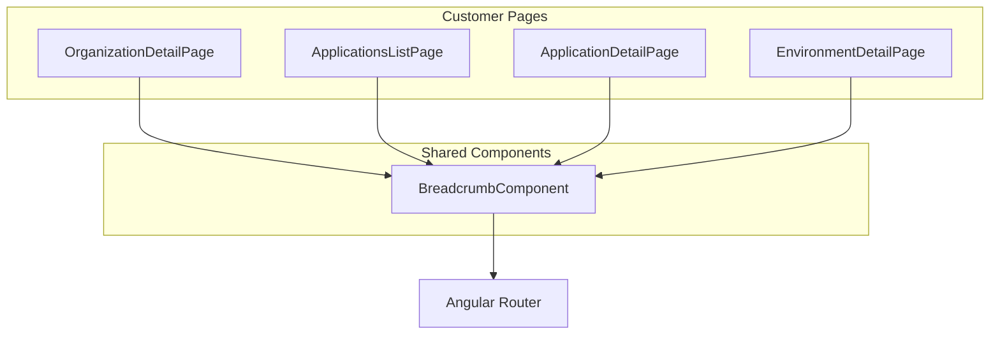

# Design Document: Breadcrumb Navigation

## Overview

This design describes a shared breadcrumb navigation component for the customers area. The component provides hierarchical navigation showing the user's current location and enabling navigation to parent levels.

The breadcrumb follows a consistent pattern across all customer pages:
- Organization Detail: `Organizations > "Org Name"`
- Applications List: `Organizations > "Org Name" > Applications`
- Application Detail: `Organizations > "Org Name" > Applications > "App Name"`
- Environment Detail: `Organizations > "Org Name" > Applications > "App Name" > Environments > "Env Name"`

## Architecture



## Components and Interfaces

### BreadcrumbItem Interface

```typescript
/**
 * Represents a single item in the breadcrumb trail
 */
export interface BreadcrumbItem {
  /** Display label for the breadcrumb item */
  label: string;
  /** Route to navigate to when clicked (null for current page) */
  route: string | null;
}
```

### BreadcrumbComponent

Location: `apps/web/src/app/shared/components/breadcrumb/breadcrumb.component.ts`

```typescript
@Component({
  selector: 'app-breadcrumb',
  standalone: true,
  imports: [CommonModule, RouterModule, FontAwesomeModule],
  templateUrl: './breadcrumb.component.html',
  styleUrls: ['./breadcrumb.component.scss']
})
export class BreadcrumbComponent {
  /** Array of breadcrumb items to display */
  @Input() items: BreadcrumbItem[] = [];
}
```

**Template Structure:**
```html
<nav class="breadcrumb" aria-label="Breadcrumb">
  <ol class="breadcrumb__list">
    <li *ngFor="let item of items; let last = last" class="breadcrumb__item">
      <a *ngIf="item.route && !last" 
         [routerLink]="item.route" 
         class="breadcrumb__link">
        {{ item.label }}
      </a>
      <span *ngIf="!item.route || last" 
            class="breadcrumb__current"
            [attr.aria-current]="last ? 'page' : null">
        {{ item.label }}
      </span>
      <fa-icon *ngIf="!last" 
               icon="chevron-right" 
               class="breadcrumb__separator">
      </fa-icon>
    </li>
  </ol>
</nav>
```

### Page Integration Patterns

Each page builds its breadcrumb items array based on available data:

**Organization Detail Page:**
```typescript
breadcrumbItems: BreadcrumbItem[] = [
  { label: 'Organizations', route: '/customers/organizations' },
  { label: this.organization.name, route: null }
];
```

**Application Detail Page:**
```typescript
breadcrumbItems: BreadcrumbItem[] = [
  { label: 'Organizations', route: '/customers/organizations' },
  { label: this.organization.name, route: `/customers/organizations/${this.organization.organizationId}` },
  { label: 'Applications', route: '/customers/applications' },
  { label: this.application.name, route: null }
];
```

**Environment Detail Page:**
```typescript
breadcrumbItems: BreadcrumbItem[] = [
  { label: 'Organizations', route: '/customers/organizations' },
  { label: this.organization.name, route: `/customers/organizations/${this.organization.organizationId}` },
  { label: 'Applications', route: '/customers/applications' },
  { label: this.application.name, route: `/customers/applications/${this.application.applicationId}` },
  { label: 'Environments', route: null },
  { label: this.getEnvironmentLabel(this.environment), route: null }
];
```

## Data Models

### BreadcrumbItem

| Field | Type | Description |
|-------|------|-------------|
| label | string | Display text for the breadcrumb segment |
| route | string \| null | Navigation route, null for current page |

## Correctness Properties

*A property is a characteristic or behavior that should hold true across all valid executions of a system—essentially, a formal statement about what the system should do. Properties serve as the bridge between human-readable specifications and machine-verifiable correctness guarantees.*

### Property 1: Last item is never a link

*For any* breadcrumb items array with at least one item, the last item SHALL be rendered as plain text (not a clickable link), regardless of whether it has a route defined.

**Validates: Requirements 1.4**

### Property 2: Non-last items with routes are links

*For any* breadcrumb items array, all items except the last that have a non-null route SHALL be rendered as clickable links.

**Validates: Requirements 1.3**

### Property 3: Separator count equals items minus one

*For any* breadcrumb items array with n items (n > 0), the component SHALL render exactly n-1 separator icons.

**Validates: Requirements 1.5**

### Property 4: Accessibility attributes present

*For any* rendered breadcrumb, the component SHALL include a nav element with aria-label="Breadcrumb" and the last item SHALL have aria-current="page".

**Validates: Requirements 6.1, 6.3**

## Error Handling

| Scenario | Handling |
|----------|----------|
| Empty items array | Render nothing (empty nav) |
| Single item | Render as current page (no separator) |
| Missing organization data | Show loading state or fallback label |
| Navigation failure | Let Angular router handle errors |

## Testing Strategy

### Unit Tests

- Test component renders correct number of items
- Test last item is not a link
- Test non-last items with routes are links
- Test separators are rendered between items
- Test accessibility attributes are present
- Test empty array renders nothing

### Property-Based Tests

Property tests should use fast-check to generate random breadcrumb item arrays and verify:

1. **Property 1**: Last item rendering - Generate arrays of 1-10 items, verify last is always plain text
2. **Property 2**: Link rendering - Generate arrays with mixed route/null values, verify link logic
3. **Property 3**: Separator count - Generate arrays of various sizes, verify separator count = n-1
4. **Property 4**: Accessibility - Generate any valid array, verify aria attributes present

### Integration Tests

- Test breadcrumb navigation on Organization Detail page
- Test breadcrumb navigation on Application Detail page
- Test breadcrumb navigation on Environment Detail page
- Test clicking breadcrumb links navigates correctly
