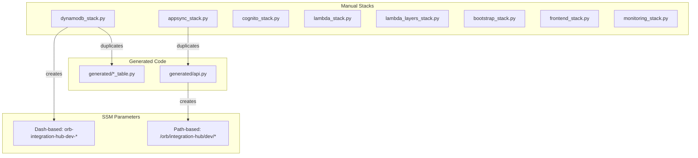
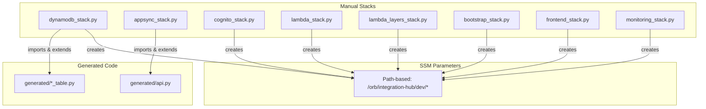

# Design Document: CDK Refactoring

## Overview

This design document describes the refactoring of CDK infrastructure to maximize use of orb-schema-generator, eliminate code duplication, and align SSM parameter naming with orb-templates standards.

## Architecture

### Current Architecture



### Target Architecture



## Components and Interfaces

### Config Class Updates

The `Config` class will be updated to use path-based SSM parameter naming:

```python
@dataclass
class Config:
    customer_id: str
    project_id: str
    environment: str
    # ... other fields
    
    def ssm_parameter_name(self, resource_path: str) -> str:
        """Generate path-based SSM parameter name.
        
        Pattern: /{customer_id}/{project_id}/{environment}/{resource_path}
        Example: /orb/integration-hub/dev/cognito/user-pool-id
        
        Args:
            resource_path: Resource-specific path (e.g., "cognito/user-pool-id")
            
        Returns:
            Full SSM parameter path
        """
        return f"/{self.customer_id}/{self.project_id}/{self.environment}/{resource_path}"
```

### SSM Parameter Path Structure

| Stack | Resource | Parameter Path |
|-------|----------|----------------|
| cognito_stack | User Pool ID | `/orb/integration-hub/dev/cognito/user-pool-id` |
| cognito_stack | Client ID | `/orb/integration-hub/dev/cognito/client-id` |
| cognito_stack | Identity Pool ID | `/orb/integration-hub/dev/cognito/identity-pool-id` |
| dynamodb_stack | Users Table ARN | `/orb/integration-hub/dev/dynamodb/users/arn` |
| dynamodb_stack | Users Table Name | `/orb/integration-hub/dev/dynamodb/users/name` |
| lambda_stack | SMS Verification ARN | `/orb/integration-hub/dev/lambda/sms-verification/arn` |
| lambda_layers_stack | Org Security Layer ARN | `/orb/integration-hub/dev/lambda-layers/organizations-security/arn` |
| bootstrap_stack | Alerts Queue ARN | `/orb/integration-hub/dev/sqs/alerts-queue/arn` |
| frontend_stack | CloudFront Distribution ID | `/orb/integration-hub/dev/frontend/distribution-id` |
| monitoring_stack | Audit Log Group Name | `/orb/integration-hub/dev/monitoring/audit-log-group/name` |

### DynamoDB Stack Refactoring

The dynamodb_stack will import generated table constructs and extend them:

```python
from generated.users_table import UsersTable
from generated.organizations_table import OrganizationsTable

class DynamoDBStack(Stack):
    def __init__(self, scope, construct_id, config, **kwargs):
        super().__init__(scope, construct_id, **kwargs)
        
        # Use generated table construct
        users_table_construct = UsersTable(self, "UsersTableConstruct")
        users_table = users_table_construct.table
        
        # Add PITR (not in generated code)
        cfn_table = users_table.node.default_child
        cfn_table.point_in_time_recovery_specification = {
            "pointInTimeRecoveryEnabled": True
        }
        
        # Set removal policy (not in generated code)
        users_table.apply_removal_policy(RemovalPolicy.RETAIN)
        
        # Create SSM parameters with path-based naming
        ssm.StringParameter(
            self, "UsersTableArnParameter",
            parameter_name=config.ssm_parameter_name("dynamodb/users/arn"),
            string_value=users_table.table_arn,
        )
```

## Data Models

No new data models are introduced. The existing Config dataclass is modified.

## Correctness Properties

*A property is a characteristic or behavior that should hold true across all valid executions of a system-essentially, a formal statement about what the system should do. Properties serve as the bridge between human-readable specifications and machine-verifiable correctness guarantees.*

### Property 1: SSM Parameter Path Format
*For any* SSM parameter created by a manual stack, the parameter name SHALL start with `/{customer_id}/{project_id}/{environment}/` and contain no consecutive slashes or trailing slashes.
**Validates: Requirements 1.1, 1.2, 1.3**

### Property 2: No Dash-Based Parameters After Migration
*For any* synthesized CloudFormation template, there SHALL be no SSM parameters with names matching the pattern `{customer_id}-{project_id}-{environment}-*`.
**Validates: Requirements 12.1, 12.5**

### Property 3: DynamoDB Tables Have PITR Enabled
*For any* DynamoDB table in the synthesized CloudFormation template, the `PointInTimeRecoverySpecification.PointInTimeRecoveryEnabled` property SHALL be `true`.
**Validates: Requirements 2.2**

### Property 4: DynamoDB Tables Have Retain Policy
*For any* DynamoDB table in the synthesized CloudFormation template, the `DeletionPolicy` SHALL be `Retain`.
**Validates: Requirements 2.2**

### Property 5: Lambda Layer ARN Parameters Use Path Format
*For any* SSM parameter storing a Lambda layer ARN, the parameter name SHALL match the pattern `/orb/integration-hub/{env}/lambda-layers/{layer-name}/arn`.
**Validates: Requirements 5.1, 5.2**

### Property 6: Cognito Parameters Under Cognito Path
*For any* SSM parameter created by cognito_stack, the parameter name SHALL start with `/orb/integration-hub/{env}/cognito/`.
**Validates: Requirements 6.1, 6.2**

## Error Handling

### Migration Errors

If the CDK deployment fails due to parameter conflicts:
1. Check CloudFormation events for specific error
2. Verify all code references updated to new parameter names
3. If rollback needed, revert code changes and redeploy

### Generated Code Conflicts

If generated code conflicts with manual extensions:
1. Check orb-schema-generator version
2. Regenerate code with `orb-schema generate`
3. Review generated code for breaking changes

## Testing Strategy

### Unit Tests

Unit tests will verify:
- Config.ssm_parameter_name() returns correct path format
- Each stack creates parameters with correct naming
- Generated table constructs are properly imported

### Property-Based Tests

Property tests will verify:
- All SSM parameters follow path-based naming convention
- No duplicate parameters exist
- All DynamoDB tables have PITR and retain policies

### Integration Tests

Integration tests will verify:
- CDK synth succeeds without errors
- All tests pass after refactoring
- Generated CloudFormation is valid

## Migration Plan

### Phase 1: Update Config Class
1. Modify `ssm_parameter_name()` to use path-based format
2. Update all tests to expect new format

### Phase 2: Update Each Stack
1. cognito_stack - Update SSM parameter names
2. dynamodb_stack - Import generated constructs, update SSM names
3. lambda_stack - Update SSM parameter names
4. lambda_layers_stack - Update SSM parameter names
5. bootstrap_stack - Update SSM parameter names
6. frontend_stack - Update SSM parameter names
7. monitoring_stack - Update SSM parameter names
8. appsync_stack - Evaluate generated construct usage

### Phase 3: Update Tests
1. Update all CDK tests to expect new parameter names
2. Add property tests for parameter naming convention
3. Verify all tests pass

### Phase 4: Deploy
1. Deploy all stacks in correct order
2. Verify new parameters created
3. Verify old parameters removed (CloudFormation handles this)

### Phase 5: Documentation and Cleanup
1. Update steering files
2. Update CHANGELOG.md
3. Open issues with orb-schema-generator team
