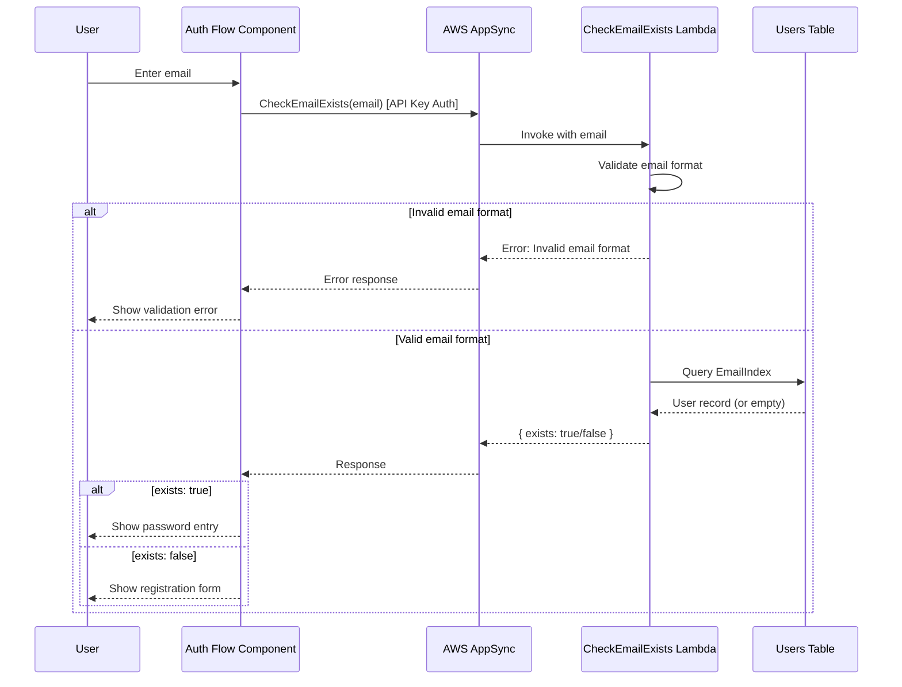

# Design Document: CheckEmailExists

## Overview

This design describes a secure, Lambda-backed GraphQL query for checking email existence during the authentication flow. The solution provides a minimal-disclosure endpoint that returns only a boolean result, accessible via API key authentication for unauthenticated users.

## Architecture



## Components and Interfaces

### 1. Schema Definition (schemas/lambdas/CheckEmailExists.yml)

```yaml
type: lambda
name: CheckEmailExists
targets:
  - api
model:
  operation: query
  authConfig:
    apiKeyAuthentication:
      - CheckEmailExists
  attributes:
    email:
      type: string
      required: true
      description: Email address to check
    exists:
      type: boolean
      required: true
      description: Whether the email exists in the system
```

### 2. Generated GraphQL

```graphql
input CheckEmailExistsInput {
  email: String!
}

type CheckEmailExists {
  email: String!
  exists: Boolean!
}

type Query {
  CheckEmailExists(input: CheckEmailExistsInput!): CheckEmailExists @aws_api_key
}
```

### 3. Lambda Handler (apps/api/lambdas/check_email_exists.py)

```python
import re
import logging
from typing import Any, Dict

logger = logging.getLogger()
logger.setLevel(logging.INFO)

EMAIL_REGEX = re.compile(r'^[a-zA-Z0-9._%+-]+@[a-zA-Z0-9.-]+\.[a-zA-Z]{2,}$')

def validate_email(email: str) -> bool:
    """Validate email format."""
    return bool(EMAIL_REGEX.match(email))

def handler(event: Dict[str, Any], context: Any) -> Dict[str, Any]:
    """Check if email exists in the system."""
    email = event.get('arguments', {}).get('input', {}).get('email', '')
    
    # Log request (without PII in production)
    logger.info(f"CheckEmailExists request received")
    
    # Validate email format
    if not email or not validate_email(email):
        raise ValueError("Invalid email format")
    
    # Query DynamoDB EmailIndex
    # Implementation uses existing Users table GSI
    exists = check_email_in_database(email)
    
    return {
        'email': email,
        'exists': exists
    }
```

### 4. Frontend Service Update (user.service.ts)

```typescript
/**
 * Check if email exists using the public CheckEmailExists query
 * This uses API key auth and doesn't require user authentication
 */
public async checkEmailExists(email: string): Promise<{ exists: boolean }> {
  const response = await this.query(
    CheckEmailExists,
    { input: { email } },
    'apiKey'
  );
  return response.data?.CheckEmailExists ?? { exists: false };
}
```

### 5. Frontend Effects Update (user.effects.ts)

```typescript
checkEmail$ = createEffect(() =>
  this.actions$.pipe(
    ofType(UserActions.checkEmail),
    switchMap(({ email }) => {
      return from(this.userService.checkEmailExists(email)).pipe(
        map((result) => {
          if (result.exists) {
            return UserActions.checkEmailSuccess({ userExists: true });
          }
          return UserActions.checkEmailUserNotFound();
        }),
        catchError((error: Error) => {
          return of(UserActions.checkEmailFailure({
            error: error.message || 'Failed to check email'
          }));
        })
      );
    })
  )
);
```

## Data Models

### Input Model

| Field | Type | Required | Description |
|-------|------|----------|-------------|
| email | string | Yes | Email address to check |

### Output Model

| Field | Type | Required | Description |
|-------|------|----------|-------------|
| email | string | Yes | The email that was checked |
| exists | boolean | Yes | Whether the email exists |

## Correctness Properties

*A property is a characteristic or behavior that should hold true across all valid executions of a system—essentially, a formal statement about what the system should do. Properties serve as the bridge between human-readable specifications and machine-verifiable correctness guarantees.*

### Property 1: Valid email returns correct existence status

*For any* valid email address format, the CheckEmailExists query SHALL return a response containing only `email` and `exists` fields, where `exists` accurately reflects whether the email is registered in the system.

**Validates: Requirements 1.1, 1.3**

### Property 2: Invalid email format rejection

*For any* string that does not match a valid email format (missing @, missing domain, invalid characters, etc.), the CheckEmailExists query SHALL return an error response without querying the database.

**Validates: Requirements 1.2, 2.1**

### Property 3: Auth flow state transition correctness

*For any* CheckEmailExists response, the Auth_Flow_Component SHALL transition to the password entry step when `exists: true`, and to the registration flow when `exists: false`.

**Validates: Requirements 3.2, 3.3**

## Error Handling

| Error Condition | Response | HTTP Status |
|-----------------|----------|-------------|
| Invalid email format | `{ error: "Invalid email format" }` | 400 |
| Database connection error | `{ error: "Service temporarily unavailable" }` | 503 |
| Rate limit exceeded | `{ error: "Too many requests" }` | 429 |

### Error Codes

| Code | Message | Description |
|------|---------|-------------|
| ORB-AUTH-007 | Invalid email format | Email doesn't match expected format |
| ORB-API-005 | Email check service unavailable | Backend service error |

## Testing Strategy

### Unit Tests

1. **Lambda Handler Tests** (Python/pytest)
   - Test valid email returns correct existence status
   - Test invalid email format returns error
   - Test database error handling
   - Test logging behavior

2. **Frontend Service Tests** (TypeScript/Jest)
   - Test `checkEmailExists` calls correct GraphQL query
   - Test API key authentication is used
   - Test error handling and response parsing

3. **Frontend Effects Tests** (TypeScript/Jest)
   - Test `checkEmail$` effect dispatches correct actions
   - Test success path transitions to password entry
   - Test not-found path transitions to registration
   - Test error path dispatches failure action

### Property-Based Tests

Using `hypothesis` (Python) for Lambda and `fast-check` (TypeScript) for frontend:

1. **Email Validation Property Test**
   - Generate random valid email formats → should return response
   - Generate random invalid strings → should return error
   - Minimum 100 iterations per property

2. **Response Shape Property Test**
   - For any successful response, verify only `email` and `exists` fields present
   - No user data leakage

### Integration Tests

1. **End-to-end auth flow test**
   - Test complete flow from email entry to password/registration screen
   - Verify API key auth works for unauthenticated users

## Security Considerations

1. **Minimal Disclosure**: Only returns boolean, no user data exposed
2. **Email Validation**: Validates format before database query
3. **Logging**: All requests logged for audit (email hashed in logs)
4. **Rate Limiting**: Consider adding rate limiting at API Gateway level
5. **Timing Attacks**: Use consistent response times (add artificial delay if needed)

## Dependencies

- AWS AppSync (GraphQL API)
- AWS Lambda (Python 3.12 runtime)
- AWS DynamoDB (Users table with EmailIndex GSI)
- orb-schema-generator (schema definition and code generation)

## Related Documentation

- [API Documentation](../../../docs/api.md)
- [Error Handling](../../../docs/error-handling.md)
- [Authentication Architecture](../../../docs/architecture.md)
