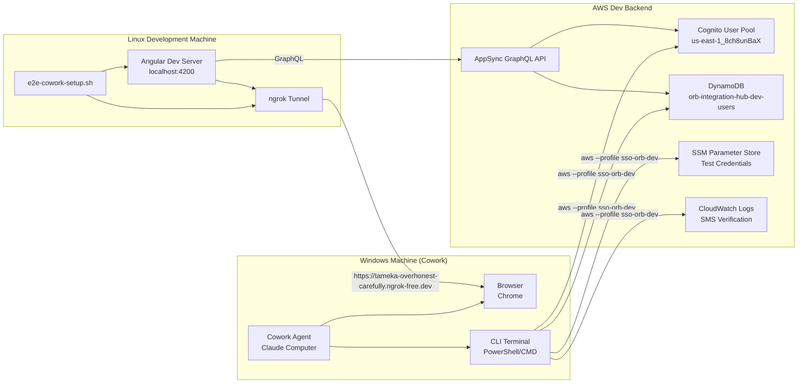
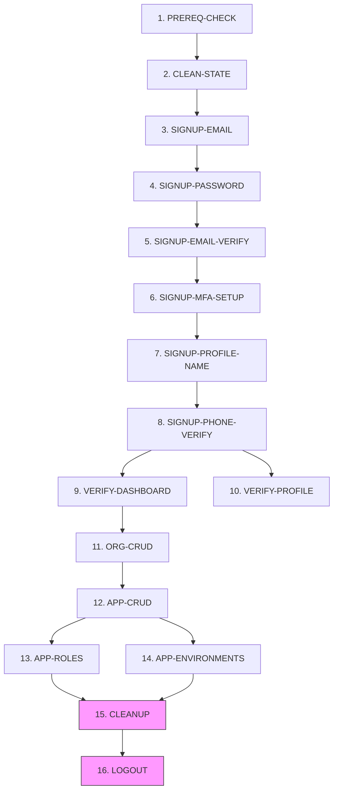
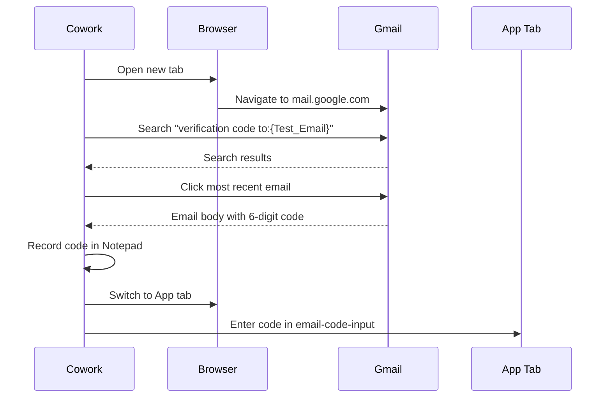
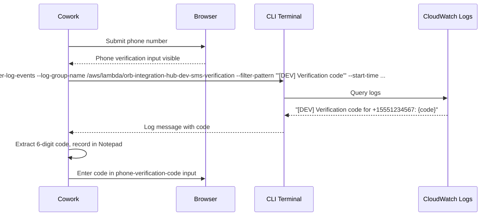

# Design Document: Claude Computer E2E Testing

## Overview

This design describes a two-machine end-to-end testing system where Cowork (Claude Computer), an AI agent on a Windows machine, executes sequential browser and CLI test workflows against the orb-integration-hub Angular frontend running on a separate Linux development machine. The frontend is exposed via ngrok, and the Windows machine has full AWS SSO access for CLI operations against the dev backend (Cognito, DynamoDB, CloudWatch, SSM).

The system consists of three main deliverables:
1. A Linux setup script (`scripts/e2e-cowork-setup.sh`) that prepares the environment
2. A set of 16 named test workflows executed sequentially by Cowork with a dependency chain
3. A structured test summary report with pass/fail/skip per workflow

This is not a traditional automated test framework — it is a set of deterministic instructions for an AI agent that controls a browser and CLI. The "test runner" is Cowork itself, following step-by-step instructions with explicit selectors, CLI commands, and expected outcomes.

## Architecture

### Two-Machine Setup



### Workflow Dependency Chain



Note: CLEANUP and LOGOUT always execute regardless of prior failures.

## Components and Interfaces

### 1. Linux Setup Script (`scripts/e2e-cowork-setup.sh`)

A bash script that prepares the Linux development machine for Cowork testing.

**Interface:**
```bash
# Start mode (default)
./scripts/e2e-cowork-setup.sh

# Stop mode — kills Angular and ngrok
./scripts/e2e-cowork-setup.sh --stop
```

**Start mode steps (sequential, fail-fast):**
1. Verify AWS SSO session: `aws --profile sso-orb-dev sts get-caller-identity`
2. Install frontend dependencies: `cd apps/web && npm install`
3. Start Angular dev server in background: `npm start &`
4. Poll `http://localhost:4200` until ready (timeout: 60s)
5. Start ngrok tunnel: `npm run ngrok`
6. Output the ngrok URL confirming readiness

**Stop mode:**
- Kill Angular dev server process (port 4200)
- Kill ngrok process
- Confirm cleanup

**Error handling:** Each step checks its exit code. On failure, the script outputs which step failed, a remediation hint, and exits non-zero.

### 2. Cowork Test Workflows

The 16 named workflows are executed sequentially by Cowork. Each workflow is a self-contained set of instructions that Cowork follows using browser actions and CLI commands.

**Workflow execution model:**
- Cowork maintains a Notepad (running record) throughout the session
- Each workflow records its start time, performs actions, takes screenshots, and records pass/fail
- On failure, dependent workflows are skipped
- CLEANUP and LOGOUT always run

**Workflow interface (per workflow):**

| Field | Description |
|-------|-------------|
| Name | Unique workflow identifier (e.g., `SIGNUP-EMAIL`) |
| Requirements | Which requirements this workflow validates |
| Dependencies | Which workflows must pass before this one runs |
| Actions | Ordered list of browser/CLI actions |
| Expected Outcomes | What constitutes a pass |
| Screenshot Label | Label for the screenshot taken at completion |
| Notepad Updates | What data to record |

### 3. Verification Code Retrieval Subsystems

Three distinct verification code retrieval mechanisms are used during the signup flow:

#### 3a. Email Verification (Gmail Browser)



**Retry:** If email not found within 60s, wait 15s and retry search once.

#### 3b. TOTP Code (CLI Computation)

```mermaid
sequenceDiagram
    participant C as Cowork
    participant B as Browser
    participant CLI as CLI Terminal

    C->>B: Read #secret-key-text from MFA setup page
    C->>C: Record TOTP_Secret in Notepad
    C->>CLI: python -c "import pyotp; print(pyotp.TOTP('{secret}').now())"
    CLI-->>C: 6-digit TOTP code
    C->>B: Enter code in mfa-setup-input
```

**Retry:** If TOTP code rejected (30s window elapsed), recompute via CLI and retry once.

#### 3c. SMS Verification (CloudWatch Logs via CLI)



**Retry:** If SMS code not found, wait 10s and retry CLI command once.

### 4. Test Summary Report Generator

Cowork produces a structured text report at the end of each run.

**Report sections:**
- Header: date, test email, total duration
- Workflow results table: #, name, status (PASS/FAIL/SKIP), duration, notes
- Totals: passed, failed, skipped counts
- Screenshots captured count
- Resources created/cleaned counts
- Failure details: error message, CLI command, screenshot reference
- Notepad dump: all recorded test data

### 5. Notepad (Test Data Record)

A running record maintained by Cowork throughout the session. Not a file — it's Cowork's internal working memory.

**Contents:**
| Key | Source | Used By |
|-----|--------|---------|
| Test_Email | SSM Parameter Store | Signup, Cleanup, Report |
| Test_Password | Secrets Manager | Signup |
| TOTP_Secret | MFA setup page `#secret-key-text` | MFA verification |
| Phone Number | Hardcoded `+15551234567` | Phone verify, Report |
| userId | DynamoDB scan during cleanup | DynamoDB delete |
| Organization ID | URL after create | Cleanup, App linking |
| Application ID | URL after create | Cleanup |
| Verification codes | Gmail, CLI | Code entry steps |
| Workflow results | Each workflow | Report generation |

## Data Models

### Setup Script Configuration

The setup script uses no persistent configuration. All values are hardcoded or derived from the existing project structure:

| Value | Source |
|-------|--------|
| AWS Profile | `sso-orb-dev` (hardcoded) |
| Frontend directory | `apps/web` (project structure) |
| Frontend URL | `http://localhost:4200` (Angular default) |
| ngrok URL | `https://tameka-overhonest-carefully.ngrok-free.dev` (reserved domain) |
| Poll timeout | 60 seconds |
| Start command | `npm start` |
| ngrok command | `npm run ngrok` |

### Test Credentials (SSM Parameter Store & Secrets Manager)

| Parameter Path | Type | Description |
|---------------|------|-------------|
| `/orb/integration-hub/dev/e2e/test-user-email` | SSM String | Test user email address |
| `orb/integration-hub/dev/secrets/e2e/test-user-password` | Secrets Manager | Test user password |
| `/orb/integration-hub/dev/e2e/test-user-password/secret-name` | SSM String | Secrets Manager secret name for password lookup |

### Workflow Result Model

Each workflow produces a result record:

```
WorkflowResult {
  number: int           // 1-16
  name: string          // e.g., "PREREQ-CHECK"
  status: PASS | FAIL | SKIP
  duration: seconds
  notes: string | null  // Error details or skip reason
  screenshot: string    // Label of screenshot taken
  dependencies: string[] // Workflow names this depends on
}
```

### Dependency Chain Model

```
PREREQ-CHECK → CLEAN-STATE → SIGNUP-EMAIL → SIGNUP-PASSWORD → SIGNUP-EMAIL-VERIFY
→ SIGNUP-MFA-SETUP → SIGNUP-PROFILE-NAME → SIGNUP-PHONE-VERIFY → VERIFY-DASHBOARD
→ VERIFY-PROFILE → ORG-CRUD → APP-CRUD → [APP-ROLES, APP-ENVIRONMENTS] → CLEANUP → LOGOUT

Special rules:
- CLEANUP: always runs (no skip on upstream failure)
- LOGOUT: always runs (no skip on upstream failure)
- APP-ROLES and APP-ENVIRONMENTS: both depend on APP-CRUD, independent of each other
- VERIFY-DASHBOARD and VERIFY-PROFILE: both depend on SIGNUP-PHONE-VERIFY
```

### AWS Resource References

| Resource | Identifier |
|----------|-----------|
| Cognito User Pool | `us-east-1_8ch8unBaX` |
| DynamoDB Users Table | `orb-integration-hub-dev-users` |
| SMS Log Group | `/aws/lambda/orb-integration-hub-dev-sms-verification` |
| AWS CLI Profile | `sso-orb-dev` |
| ngrok Domain | `tameka-overhonest-carefully.ngrok-free.dev` |


## Correctness Properties

*A property is a characteristic or behavior that should hold true across all valid executions of a system — essentially, a formal statement about what the system should do. Properties serve as the bridge between human-readable specifications and machine-verifiable correctness guarantees.*

Note: The majority of this spec's requirements are procedural instructions for Cowork (the AI agent) — browser clicks, CLI commands, screenshot captures. These are not software functions and cannot be property-tested. The testable properties below focus on the setup script logic, string parsing utilities, and the workflow dependency/reporting logic that will be implemented as code.

### Property 1: Setup script fails fast with non-zero exit on any step failure

*For any* step in the setup script (SSO check, npm install, Angular start, poll, ngrok start), if that step returns a non-zero exit code, the script SHALL exit with a non-zero code and produce a non-empty error message on stderr/stdout.

**Validates: Requirements 1.5**

### Property 2: SMS verification code extraction from CloudWatch log format

*For any* string matching the format `[DEV] Verification code for {phone_number}: {code}` where `{phone_number}` is a valid E.164 phone number and `{code}` is a 6-digit numeric string, the extraction function SHALL return exactly the 6-digit code. For any string not matching this format, the extraction function SHALL return null/empty.

**Validates: Requirements 10.5, 10.6**

### Property 3: Resource ID extraction from URL path

*For any* URL path matching the pattern `/customers/{resource_type}/{uuid}`, the ID extraction function SHALL return the UUID segment. For any URL path not matching this pattern, the extraction function SHALL return null/empty.

**Validates: Requirements 13.4**

### Property 4: Test summary report contains all required sections and workflow entries

*For any* set of 16 workflow results (each with name, status, duration, and optional notes), the generated report SHALL contain: a header section with date and test email, a results table with all 16 workflows in the specified order, a totals line with correct pass/fail/skip counts, a failures section listing all FAIL workflows with error details, and a notepad section.

**Validates: Requirements 19.1, 19.2, 19.4**

### Property 5: Dependency skip propagation

*For any* workflow that has status FAIL, all workflows that transitively depend on it (per the dependency chain) SHALL have status SKIP, with a note indicating the dependency. Workflows with no dependency on the failed workflow SHALL not be affected.

**Validates: Requirements 19.5**

### Property 6: CLEANUP and LOGOUT always execute

*For any* combination of workflow failures in workflows 1-14, the CLEANUP (workflow 15) and LOGOUT (workflow 16) workflows SHALL never have status SKIP. They SHALL always execute and report either PASS or FAIL.

**Validates: Requirements 19.6**

## Error Handling

### Setup Script Errors

| Error Condition | Handling | Exit Code |
|----------------|----------|-----------|
| AWS SSO session expired | Print "SSO session expired. Run: aws sso login --profile sso-orb-dev" | 1 |
| `npm install` fails | Print "npm install failed. Check network and node_modules." | 1 |
| Angular dev server fails to start | Print "Angular dev server failed to start. Check for port conflicts on 4200." | 1 |
| Frontend poll timeout (60s) | Print "Frontend did not become ready within 60 seconds." | 1 |
| ngrok fails to start | Print "ngrok failed to start. Check ngrok auth token and domain reservation." | 1 |
| `--stop` with no running processes | Print "No processes found to stop." and exit 0 (idempotent) |

### Cowork Workflow Error Handling

| Error Condition | Retry Strategy | On Final Failure |
|----------------|---------------|-----------------|
| Frontend not accessible via ngrok | No retry — report and recommend setup script | FAIL PREREQ-CHECK |
| SSO session expired | No retry — report and recommend `aws sso login` | FAIL PREREQ-CHECK |
| Email verification code not found in Gmail | Wait 15s, retry search once | FAIL SIGNUP-EMAIL-VERIFY |
| TOTP code rejected (30s window elapsed) | Recompute via CLI, retry once | FAIL SIGNUP-MFA-SETUP |
| SMS code not found in CloudWatch Logs | Wait 10s, retry CLI command once | FAIL SIGNUP-PHONE-VERIFY |
| Page element not visible within timeout | Take screenshot, report failure | FAIL current workflow |
| Cognito user deletion fails during cleanup | Log error, continue with DynamoDB cleanup | Report in CLEANUP notes |
| DynamoDB record deletion fails during cleanup | Log error, continue | Report in CLEANUP notes |
| Browser resource deletion fails during cleanup | Report resource ID for manual cleanup | Report in CLEANUP notes |

### Timeout Strategy

All browser waits use explicit timeouts:

| Wait Type | Timeout | Used In |
|-----------|---------|---------|
| Auth flow step transition | 15 seconds | Signup workflows |
| MFA redirect to /profile | 30 seconds | SIGNUP-MFA-SETUP |
| Gmail email search | 60 seconds | SIGNUP-EMAIL-VERIFY |
| Page element visibility | 15 seconds | All browser workflows |
| Frontend poll (setup script) | 60 seconds | Setup script |

### Dependency Chain Skip Logic

When a workflow fails, the skip propagation follows the dependency graph:

```
If PREREQ-CHECK fails → skip all 2-14, run CLEANUP + LOGOUT
If CLEAN-STATE fails → skip all 3-14, run CLEANUP + LOGOUT
If any SIGNUP-* fails → skip remaining SIGNUP-* and all 9-14, run CLEANUP + LOGOUT
If VERIFY-DASHBOARD fails → skip 11-14, run CLEANUP + LOGOUT
If ORG-CRUD fails → skip 12-14, run CLEANUP + LOGOUT
If APP-CRUD fails → skip 13-14, run CLEANUP + LOGOUT
```

CLEANUP adapts to partial state: if no user was created, it skips Cognito/DynamoDB deletion. If no resources were created, it skips browser deletion.

## Testing Strategy

### Dual Testing Approach

This spec uses both unit tests and property-based tests:

- **Unit tests**: Verify specific examples, edge cases, and error conditions for the setup script and utility functions
- **Property tests**: Verify universal properties across generated inputs for parsing functions and dependency logic

### What Gets Tested

Since most requirements are procedural Cowork instructions (not software functions), the testable surface is:

1. **Setup script** (`scripts/e2e-cowork-setup.sh`) — shell script behavior via integration tests
2. **SMS code extraction** — string parsing utility (if extracted as a reusable function)
3. **URL resource ID extraction** — string parsing utility
4. **Report generation** — report formatting logic
5. **Dependency resolution** — skip propagation algorithm

### Property-Based Testing Configuration

- **Library**: Hypothesis (Python) for any Python utilities, fast-check (TypeScript) for any TypeScript utilities
- **Minimum iterations**: 100 per property test
- **Tag format**: `Feature: claude-computer-e2e-testing, Property {number}: {property_text}`

### Unit Test Coverage

| Component | Test Type | What to Test |
|-----------|-----------|-------------|
| Setup script | Integration | SSO check failure, npm install failure, poll timeout, --stop flag |
| SMS code extraction | Unit + Property | Valid format, invalid format, edge cases (empty string, partial match) |
| URL ID extraction | Unit + Property | Valid paths, invalid paths, edge cases (no ID, extra segments) |
| Report generation | Unit + Property | All-pass scenario, mixed results, all-fail scenario |
| Dependency resolution | Unit + Property | Single failure propagation, multiple failures, always-run workflows |

### Property Test Mapping

| Property # | Test Tag | Test Description |
|-----------|----------|-----------------|
| 1 | Feature: claude-computer-e2e-testing, Property 1: Setup script fails fast | Test script exits non-zero on simulated step failures |
| 2 | Feature: claude-computer-e2e-testing, Property 2: SMS code extraction | Generate random phone numbers and codes, verify extraction |
| 3 | Feature: claude-computer-e2e-testing, Property 3: URL resource ID extraction | Generate random UUIDs and resource types, verify extraction |
| 4 | Feature: claude-computer-e2e-testing, Property 4: Report structure completeness | Generate random workflow result sets, verify report contains all sections |
| 5 | Feature: claude-computer-e2e-testing, Property 5: Dependency skip propagation | Generate random failure positions, verify transitive skip |
| 6 | Feature: claude-computer-e2e-testing, Property 6: Always-run workflows | Generate random failure combinations, verify CLEANUP and LOGOUT never skip |

### What Is NOT Tested

The following are Cowork procedural instructions and are validated by the E2E test run itself, not by automated tests:
- Browser interactions (clicking, typing, navigating)
- Screenshot capture
- Gmail email retrieval
- CLI command execution
- Notepad record keeping
- Visual verification of page elements
