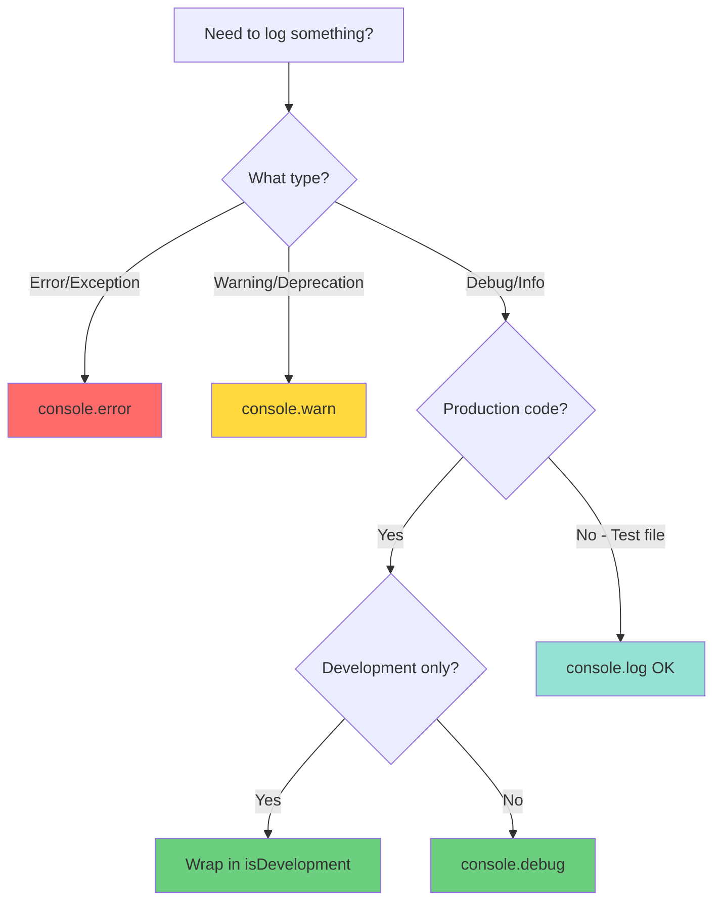
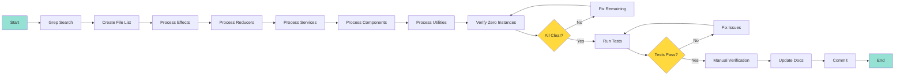
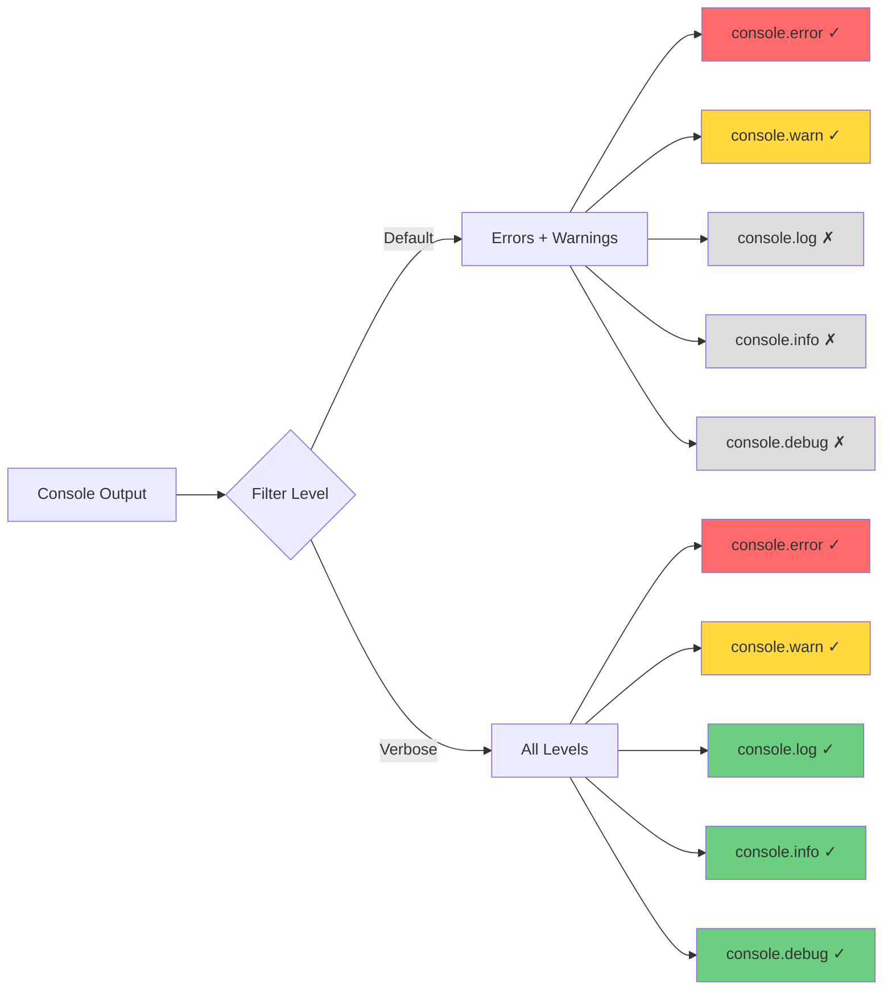

# Design: Console Logging Cleanup

## 1. Overview

### 1.1 Purpose

This design document outlines the technical approach for replacing all production `console.log()` and `console.info()` statements with `console.debug()` to reduce noise in production console output and follow browser logging best practices.

### 1.2 Scope

The cleanup targets the Angular frontend codebase (`apps/web/src/app/`) and affects approximately 30-40 instances across:
- NgRx effects (user.effects.ts, environments.effects.ts, applications.effects.ts)
- NgRx reducers (user.reducer.ts)
- Components (dashboard.component.ts, user-layout.component.ts, application-detail-page.component.ts)
- Services (error-handler.service.ts, rate-limiting.service.ts)
- Utility files (api-key-validation.ts)

Test files (`*.spec.ts`) are explicitly excluded from this cleanup.

### 1.3 Design Goals

1. **Zero Production Noise**: Eliminate all `console.log()` and `console.info()` from production code
2. **Preserve Debug Information**: Maintain all existing debug messages using `console.debug()`
3. **No Behavioral Changes**: Ensure application functionality remains identical
4. **Consistent Pattern**: Establish a uniform logging pattern across the codebase
5. **Future Prevention**: Document patterns to prevent regression

## 2. Architecture

### 2.1 Logging Level Strategy

The design adopts a three-tier logging strategy aligned with browser console filtering:

```
┌─────────────────────────────────────────────────────────────┐
│ Browser Console Filter Levels                               │
├─────────────────────────────────────────────────────────────┤
│ Default (Errors + Warnings)                                 │
│   ├─ console.error()   → Always visible                     │
│   └─ console.warn()    → Always visible                     │
├─────────────────────────────────────────────────────────────┤
│ Verbose (All Levels)                                        │
│   ├─ console.error()   → Always visible                     │
│   ├─ console.warn()    → Always visible                     │
│   ├─ console.info()    → Visible (AVOID IN PRODUCTION)      │
│   ├─ console.log()     → Visible (AVOID IN PRODUCTION)      │
│   └─ console.debug()   → Visible (USE FOR DEBUG INFO)       │
└─────────────────────────────────────────────────────────────┘
```

**Logging Level Guidelines:**

| Level | Method | Use Case | Production Visibility |
|-------|--------|----------|----------------------|
| Error | `console.error()` | Actual errors, exceptions | Always visible |
| Warning | `console.warn()` | Non-fatal issues, deprecations | Always visible |
| Debug | `console.debug()` | Development info, state transitions | Only when "Verbose" enabled |
| Info | `console.info()` | ❌ Avoid (same as log) | Always visible (noisy) |
| Log | `console.log()` | ❌ Avoid (default level) | Always visible (noisy) |

### 2.2 Replacement Strategy

The design uses a simple find-and-replace strategy with manual verification:

```typescript
// BEFORE (noisy in production)
console.log('[Effect] User created:', user.email);
console.info('[Service] Rate limit cleared');

// AFTER (clean in production, visible in verbose mode)
console.debug('[Effect] User created:', user.email);
console.debug('[Service] Rate limit cleared');
```

**Exclusions:**
- Conditional development logging already wrapped in `isDevelopment()` checks (already acceptable)
- Test files (`*.spec.ts`) - test output may use `console.log()`
- JSDoc examples - will be updated or removed

### 2.3 File Organization

The cleanup is organized by file type for systematic execution:

```
apps/web/src/app/
├── features/
│   ├── user/
│   │   ├── store/
│   │   │   ├── user.effects.ts        (15+ instances)
│   │   │   └── user.reducer.ts        (1 instance)
│   │   ├── components/
│   │   │   └── dashboard/             (1 instance)
│   │   └── services/
│   │       └── auth-analytics.service.ts (SKIP - has isDevelopment())
│   └── customers/
│       └── applications/
│           ├── store/
│           │   ├── applications.effects.ts  (2+ instances)
│           │   └── environments/
│           │       └── environments.effects.ts (1+ instance)
│           ├── components/
│           │   └── application-detail-page/ (4 instances)
│           └── utils/
│               └── api-key-validation.ts    (JSDoc example)
├── layouts/
│   └── user-layout/
│       └── user-layout.component.ts   (1 instance)
├── core/
│   ├── services/
│   │   ├── error-handler.service.ts   (4 console.info instances)
│   │   └── rate-limiting.service.ts   (1 console.info instance)
│   └── testing/
│       └── organization-test-data.factory.ts (1 instance)
```

## 3. Components and Interfaces

### 3.1 Affected Components

#### 3.1.1 NgRx Effects

**File:** `apps/web/src/app/features/user/store/user.effects.ts`

**Instances:** 15+ console.log statements

**Pattern:**
```typescript
// Current pattern
console.log('[Effect][createUserRecordOnly$] Creating DynamoDB record for:', sanitizeEmail(user.email));
console.log('[AuthEffects] MFA verification successful, completing auth flow for user:', sanitizeEmail(currentUser.email));

// New pattern
console.debug('[Effect][createUserRecordOnly$] Creating DynamoDB record for:', sanitizeEmail(user.email));
console.debug('[AuthEffects] MFA verification successful, completing auth flow for user:', sanitizeEmail(currentUser.email));
```

**Other Effect Files:**
- `applications.effects.ts` - 2+ instances
- `environments.effects.ts` - 1+ instance

#### 3.1.2 NgRx Reducers

**File:** `apps/web/src/app/features/user/store/user.reducer.ts`

**Instances:** 1 console.log statement

**Pattern:**
```typescript
// Current
on(UserActions.authFlowComplete, (state, { user }) => {
  console.log('[AuthReducer] authFlowComplete - Authentication flow completed for user:', sanitizeEmail(user.email));
  return { ...state, ... };
});

// New
on(UserActions.authFlowComplete, (state, { user }) => {
  console.debug('[AuthReducer] authFlowComplete - Authentication flow completed for user:', sanitizeEmail(user.email));
  return { ...state, ... };
});
```

#### 3.1.3 Components

**Files:**
- `user-layout.component.ts` - 1 instance
- `dashboard.component.ts` - 1 instance
- `application-detail-page.component.ts` - 4 instances

**Pattern:**
```typescript
// Current
onSideNavItemClicked(item: SideNavItem): void {
  console.log('[UserLayout] Side nav item clicked:', item.id, item.tooltip);
}

// New
onSideNavItemClicked(item: SideNavItem): void {
  console.debug('[UserLayout] Side nav item clicked:', item.id, item.tooltip);
}
```

#### 3.1.4 Services

**File:** `apps/web/src/app/core/services/error-handler.service.ts`

**Instances:** 4 console.info statements

**Pattern:**
```typescript
// Current
console.info('[AppErrorHandlerService] Executing recovery action:', action);
console.info('[AppErrorHandlerService] Attempting auto-recovery for network error');

// New
console.debug('[AppErrorHandlerService] Executing recovery action:', action);
console.debug('[AppErrorHandlerService] Attempting auto-recovery for network error');
```

**File:** `apps/web/src/app/core/services/rate-limiting.service.ts`

**Instances:** 1 console.info statement

**Pattern:**
```typescript
// Current
console.info(`[RateLimitingService] Rate limit cleared for ${identifier}`);

// New
console.debug(`[RateLimitingService] Rate limit cleared for ${identifier}`);
```

### 3.2 Excluded Components

#### 3.2.1 Conditional Development Logging

**Files:**
- `auth-analytics.service.ts` (both locations)

**Reason:** Already wrapped in `isDevelopment()` checks

**Pattern (NO CHANGE NEEDED):**
```typescript
if (this.isDevelopment()) {
  console.log('Analytics Event:', fullEvent);  // OK - only runs in dev
}
```

#### 3.2.2 Test Files

**Files:**
- All `*.spec.ts` files
- `cognito.service.bug-exploration.spec.ts`
- `upgrade-verification.spec.ts`

**Reason:** Test output is not part of production builds

#### 3.2.3 Test Data Factories

**File:** `organization-test-data.factory.ts`

**Decision:** Include in cleanup (used in development, should use debug level)

**Pattern:**
```typescript
// Current
if ((i + 1) % 10 === 0) {
  console.log(`Created ${i + 1}/${organizationCount} performance test organizations`);
}

// New
if ((i + 1) % 10 === 0) {
  console.debug(`Created ${i + 1}/${organizationCount} performance test organizations`);
}
```

### 3.3 JSDoc Examples

**File:** `api-key-validation.ts`

**Current:**
```typescript
/**
 * const result = validateApplicationApiKeys(app, keys);
 * if (!result.isValid) {
 *   console.log(`Missing keys for: ${result.missingEnvironments.join(', ')}`);
 * }
 */
```

**Options:**
1. Update to `console.debug()`
2. Remove the console statement from example
3. Replace with comment: `// Handle missing keys`

**Recommendation:** Update to `console.debug()` for consistency

## 4. Data Models

### 4.1 No Data Model Changes

This cleanup does not affect any data models, interfaces, or types. All changes are limited to logging method calls.

### 4.2 Logging Pattern Convention

While not a formal data model, the design establishes a consistent logging pattern:

```typescript
/**
 * Standard logging pattern for console.debug()
 * 
 * Format: console.debug('[ComponentName] Message:', data);
 * 
 * Examples:
 * - console.debug('[Effect][createUser$] Creating user:', user.email);
 * - console.debug('[AuthReducer] Auth flow completed for:', user.email);
 * - console.debug('[UserLayout] Side nav clicked:', item.id);
 * - console.debug('[RateLimitingService] Rate limit cleared for:', identifier);
 */
```

**Pattern Elements:**
1. **Prefix:** `[ComponentName]` or `[ServiceName]` or `[Effect][effectName$]`
2. **Message:** Descriptive action or state change
3. **Data:** Relevant context (sanitized if PII)

## 5. Correctness Properties


*A property is a characteristic or behavior that should hold true across all valid executions of a system—essentially, a formal statement about what the system should do. Properties serve as the bridge between human-readable specifications and machine-verifiable correctness guarantees.*

### 5.1 Testable Properties

Based on the prework analysis, this cleanup has limited automated testability. The primary verification is through code search and manual testing.

### Property 1: Zero console.log in Production Code

*For any* search of `console.log(` in production TypeScript files (excluding `*.spec.ts`), the result count should be zero.

**Validates: Requirements 4.1.1**

**Verification Method:**
```bash
# Search for console.log in production code (excluding test files)
grep -r "console\.log(" apps/web/src/app --include="*.ts" --exclude="*.spec.ts" | wc -l
# Expected: 0
```

### Property 2: Zero console.info in Production Code

*For any* search of `console.info(` in production TypeScript files (excluding `*.spec.ts` and development-wrapped calls), the result count should be zero.

**Validates: Requirements 4.1.2**

**Verification Method:**
```bash
# Search for console.info in production code (excluding test files)
grep -r "console\.info(" apps/web/src/app --include="*.ts" --exclude="*.spec.ts" | wc -l
# Expected: 0 (or only instances wrapped in isDevelopment())
```

### 5.2 Non-Testable Requirements

The following requirements are verified through manual testing and code review:

- **Preserve console.error and console.warn** (4.1.3) - Code review verification
- **Application functionality unchanged** (4.2.1) - Existing test suite + manual testing
- **Debug information available** (4.2.2) - Manual browser console verification
- **Production console clean** (4.2.3) - Manual production build verification
- **All tests pass** (4.3.1) - Run existing test suite
- **No linting errors** (4.3.2) - Run existing linter
- **Build succeeds** (4.3.3) - Run existing build process

## 6. Error Handling

### 6.1 No Error Handling Changes

This cleanup does not modify error handling logic. All existing `console.error()` and `console.warn()` calls remain unchanged.

### 6.2 Verification of Error Logging

During the cleanup, special attention will be paid to ensure:

1. **No Accidental Changes:** `console.error()` and `console.warn()` are not modified
2. **Context Preservation:** Error context and stack traces remain intact
3. **Recovery Actions:** Error recovery logging in `error-handler.service.ts` uses appropriate levels

### 6.3 Edge Cases

**Case 1: Multi-line console.log statements**

Some console.log statements span multiple lines:

```typescript
// Current
console.log(
  '[Effect] Creating user:',
  user.email
);

// New
console.debug(
  '[Effect] Creating user:',
  user.email
);
```

**Case 2: Template literals with console.log**

```typescript
// Current
console.log(`[Service] Rate limit cleared for ${identifier}`);

// New
console.debug(`[Service] Rate limit cleared for ${identifier}`);
```

**Case 3: Conditional logging without isDevelopment()**

```typescript
// Current
if (someCondition) {
  console.log('[Component] Condition met');
}

// New
if (someCondition) {
  console.debug('[Component] Condition met');
}
```

## 7. Testing Strategy

### 7.1 Dual Testing Approach

This cleanup uses a combination of automated verification and manual testing:

**Automated Verification:**
- Grep search for remaining `console.log()` instances
- Grep search for remaining `console.info()` instances
- Run existing unit test suite
- Run linter
- Run build process

**Manual Testing:**
- Browser console verification in development mode (Verbose filter)
- Browser console verification in production build (Default filter)
- Spot-check key user flows (auth, dashboard, CRUD operations)

### 7.2 Unit Testing

**No New Unit Tests Required**

This cleanup does not require new unit tests because:
1. Logging statements do not affect application logic
2. Existing unit tests verify application behavior
3. The change is purely cosmetic (logging level)

**Existing Test Suite:**
- All existing unit tests must continue to pass
- Test files (`*.spec.ts`) are excluded from cleanup
- No test modifications needed

### 7.3 Property-Based Testing

**Not Applicable**

Property-based testing is not applicable for this cleanup because:
1. The properties are verification checks (grep searches), not behavioral properties
2. There are no input variations to test
3. The cleanup is a one-time code modification, not runtime behavior

### 7.4 Integration Testing

**Manual Integration Testing:**

After cleanup, verify these key flows work correctly:

1. **Authentication Flow:**
   - Sign up → MFA setup → Dashboard
   - Sign in → MFA verification → Dashboard
   - Sign out

2. **Dashboard:**
   - View organizations
   - View applications
   - Navigate between sections

3. **CRUD Operations:**
   - Create organization
   - Create application
   - Generate API key
   - View details

4. **Error Scenarios:**
   - Network error → Error message appears
   - Invalid input → Validation error appears
   - Rate limiting → Warning appears

### 7.5 Verification Checklist

After completing the cleanup, verify:

- [ ] Zero `console.log()` in production code (grep search)
- [ ] Zero `console.info()` in production code (grep search)
- [ ] All `console.error()` preserved (code review)
- [ ] All `console.warn()` preserved (code review)
- [ ] All unit tests pass (`npm test`)
- [ ] No linting errors (`npm run lint`)
- [ ] Build succeeds (`npm run build`)
- [ ] Debug messages visible in Verbose mode (browser console)
- [ ] Production console clean in Default mode (browser console)
- [ ] Key user flows work correctly (manual testing)

### 7.6 Rollback Plan

If issues are discovered after deployment:

1. **Immediate Rollback:** Revert the commit
2. **Investigation:** Identify which logging change caused the issue
3. **Targeted Fix:** Fix the specific issue
4. **Re-deploy:** Deploy the corrected version

**Low Risk:** This cleanup has very low risk because:
- No logic changes
- No data model changes
- No API changes
- Only logging method names change

## 8. Implementation Plan

### 8.1 Execution Strategy

The cleanup will be executed in phases to ensure systematic coverage:

**Phase 1: Automated Search**
1. Run grep search for all `console.log(` instances
2. Run grep search for all `console.info(` instances
3. Create a comprehensive list with file paths and line numbers
4. Exclude test files and development-wrapped calls

**Phase 2: Systematic Replacement**
1. Process files by category (effects → reducers → components → services)
2. Use find-and-replace with manual verification for each file
3. Verify context and ensure no unintended changes
4. Commit changes by file category for easy review

**Phase 3: Verification**
1. Run grep searches to confirm zero instances remain
2. Run unit tests
3. Run linter
4. Run build
5. Manual browser console verification

**Phase 4: Documentation**
1. Update CHANGELOG.md
2. Bump version (patch)
3. Add comment in main.ts about console.debug() usage

### 8.2 File Processing Order

Process files in this order for logical grouping:

1. **NgRx Effects** (highest volume)
   - `user.effects.ts`
   - `applications.effects.ts`
   - `environments.effects.ts`

2. **NgRx Reducers**
   - `user.reducer.ts`

3. **Services**
   - `error-handler.service.ts`
   - `rate-limiting.service.ts`

4. **Components**
   - `user-layout.component.ts`
   - `dashboard.component.ts`
   - `application-detail-page.component.ts`

5. **Utilities**
   - `api-key-validation.ts` (JSDoc example)
   - `organization-test-data.factory.ts`

### 8.3 Replacement Pattern

For each file:

1. **Open file** in editor
2. **Search** for `console.log(` and `console.info(`
3. **Review context** - ensure it's not wrapped in `isDevelopment()`
4. **Replace** with `console.debug(`
5. **Verify** - check surrounding code for correctness
6. **Save** file
7. **Run diagnostics** - check for any TypeScript errors

### 8.4 Quality Gates

Before committing each file:

- [ ] All `console.log()` replaced with `console.debug()`
- [ ] All `console.info()` replaced with `console.debug()`
- [ ] No `console.error()` or `console.warn()` modified
- [ ] No syntax errors introduced
- [ ] File compiles successfully

### 8.5 Commit Strategy

Use atomic commits by file category:

```bash
# Commit 1: Effects
git add apps/web/src/app/features/*/store/*.effects.ts
git commit -m "refactor: replace console.log with console.debug in effects"

# Commit 2: Reducers
git add apps/web/src/app/features/*/store/*.reducer.ts
git commit -m "refactor: replace console.log with console.debug in reducers"

# Commit 3: Services
git add apps/web/src/app/core/services/*.service.ts
git commit -m "refactor: replace console.info with console.debug in services"

# Commit 4: Components
git add apps/web/src/app/**/components/**/*.component.ts
git commit -m "refactor: replace console.log with console.debug in components"

# Commit 5: Utilities
git add apps/web/src/app/**/utils/*.ts apps/web/src/app/core/testing/*.ts
git commit -m "refactor: replace console.log with console.debug in utilities"
```

### 8.6 Documentation Updates

After cleanup:

1. **Add comment in main.ts:**
```typescript
/**
 * Console Logging Standards:
 * - Use console.debug() for development/debugging information
 * - Use console.warn() for non-fatal warnings
 * - Use console.error() for errors and exceptions
 * - Avoid console.log() and console.info() in production code
 * 
 * To see debug messages, set browser console filter to "Verbose"
 */
```

2. **Update CHANGELOG.md:**
```markdown
## [X.Y.Z] - YYYY-MM-DD

### Changed
- Replaced all `console.log()` and `console.info()` with `console.debug()` in production code to reduce console noise
- Debug messages now only appear when browser console filter is set to "Verbose"
```

3. **Bump version in package.json:**
```json
{
  "version": "X.Y.Z"  // Patch version bump
}
```

## 9. Diagrams

### 9.1 Logging Level Decision Tree



### 9.2 Cleanup Workflow



### 9.3 Browser Console Filter Behavior



## 10. Design Decisions and Rationale

### 10.1 Why console.debug() Instead of Removing Logs?

**Decision:** Replace with `console.debug()` rather than removing logging statements entirely.

**Rationale:**
1. **Preserve Debug Information:** Developers need debug output during development
2. **Troubleshooting:** Debug logs help diagnose issues in development and staging
3. **No Performance Impact:** `console.debug()` has negligible performance cost
4. **Browser Control:** Developers can enable/disable via console filter
5. **Future Maintenance:** Easier to maintain existing debug context than recreate it

**Alternative Considered:** Remove all logging statements
- **Rejected:** Would lose valuable debug information for troubleshooting

### 10.2 Why Not Use a Logging Library?

**Decision:** Use native browser console methods rather than introducing a logging library.

**Rationale:**
1. **Simplicity:** No additional dependencies
2. **Browser Native:** Works in all browsers without configuration
3. **Zero Bundle Size:** No library to bundle
4. **Sufficient for Needs:** Browser console filtering meets requirements
5. **Low Complexity:** Simple find-and-replace cleanup

**Alternative Considered:** Introduce a logging library (e.g., loglevel, winston)
- **Rejected:** Overkill for this use case, adds complexity and bundle size

### 10.3 Why Exclude Test Files?

**Decision:** Exclude `*.spec.ts` files from cleanup.

**Rationale:**
1. **Test Output:** Test files often use `console.log()` for test output
2. **Not Production Code:** Test files are not included in production builds
3. **Developer Convenience:** Developers expect test output in console
4. **No Noise Impact:** Test output only appears during test runs

### 10.4 Why Keep isDevelopment() Wrapped Logs?

**Decision:** Keep existing `console.log()` statements that are wrapped in `isDevelopment()` checks.

**Rationale:**
1. **Already Conditional:** Only runs in development mode
2. **No Production Impact:** Never executes in production builds
3. **Explicit Intent:** Developer explicitly marked as development-only
4. **Avoid Churn:** No need to change code that already works correctly

**Example (NO CHANGE NEEDED):**
```typescript
if (this.isDevelopment()) {
  console.log('Analytics Event:', fullEvent);  // OK - only runs in dev
}
```

### 10.5 Why Manual Verification Instead of Automated Tests?

**Decision:** Use manual verification for browser console behavior rather than automated tests.

**Rationale:**
1. **Browser-Specific:** Console filtering is a browser feature, not application logic
2. **Visual Verification:** Requires human to verify console appearance
3. **Test Complexity:** Automating browser console checks is complex and brittle
4. **Low Risk:** Logging changes don't affect application behavior
5. **One-Time Cleanup:** Not ongoing behavior that needs continuous testing

## 11. Future Enhancements

### 11.1 ESLint Rule to Prevent Regression

**Enhancement:** Add ESLint rule to prevent future `console.log()` usage.

**Implementation:**
```json
// .eslintrc.json
{
  "rules": {
    "no-console": ["error", {
      "allow": ["debug", "warn", "error"]
    }]
  }
}
```

**Benefits:**
- Prevents accidental `console.log()` in new code
- Enforces consistent logging pattern
- Catches issues during development

**Status:** Optional future enhancement (not part of this cleanup)

### 11.2 Centralized Logging Service

**Enhancement:** Create a centralized logging service for structured logging.

**Example:**
```typescript
@Injectable({ providedIn: 'root' })
export class LoggingService {
  debug(component: string, message: string, data?: any): void {
    console.debug(`[${component}] ${message}`, data);
  }
  
  warn(component: string, message: string, data?: any): void {
    console.warn(`[${component}] ${message}`, data);
  }
  
  error(component: string, message: string, error?: any): void {
    console.error(`[${component}] ${message}`, error);
  }
}
```

**Benefits:**
- Consistent logging format
- Easier to add log aggregation later
- Type-safe logging calls
- Centralized configuration

**Status:** Optional future enhancement (not part of this cleanup)

### 11.3 Log Aggregation

**Enhancement:** Send production errors to a log aggregation service (e.g., Sentry, LogRocket).

**Benefits:**
- Monitor production errors
- Track error frequency
- Debug production issues
- User session replay

**Status:** Optional future enhancement (not part of this cleanup)

## 12. References

### 12.1 Browser Console Documentation

- [Chrome DevTools Console Reference](https://developer.chrome.com/docs/devtools/console/reference/)
- [Firefox Console API](https://developer.mozilla.org/en-US/docs/Web/API/Console)
- [Console API Standard](https://console.spec.whatwg.org/)

### 12.2 Related Documentation

- Requirements: `.kiro/specs/console-logging-cleanup/requirements.md`
- Project Standards: `project-standards.md` (Change Plan Requirement)
- Spec Standards: `repositories/orb-templates/docs/kiro-steering/templates/spec-standards.md`

### 12.3 Affected Files

**NgRx Effects:**
- `apps/web/src/app/features/user/store/user.effects.ts`
- `apps/web/src/app/features/customers/applications/store/applications.effects.ts`
- `apps/web/src/app/features/customers/applications/store/environments/environments.effects.ts`

**NgRx Reducers:**
- `apps/web/src/app/features/user/store/user.reducer.ts`

**Services:**
- `apps/web/src/app/core/services/error-handler.service.ts`
- `apps/web/src/app/core/services/rate-limiting.service.ts`

**Components:**
- `apps/web/src/app/layouts/user-layout/user-layout.component.ts`
- `apps/web/src/app/features/user/components/dashboard/dashboard.component.ts`
- `apps/web/src/app/features/customers/applications/components/application-detail-page/application-detail-page.component.ts`

**Utilities:**
- `apps/web/src/app/features/customers/applications/utils/api-key-validation.ts`
- `apps/web/src/app/core/testing/organization-test-data.factory.ts`

**Excluded (Development-Wrapped):**
- `apps/web/src/app/features/user/services/auth-analytics.service.ts`
- `apps/web/src/app/core/services/auth/auth-analytics.service.ts`

**Excluded (Test Files):**
- All `*.spec.ts` files

---

**Design Document Version:** 1.0  
**Last Updated:** 2025-01-XX  
**Status:** Ready for Review
