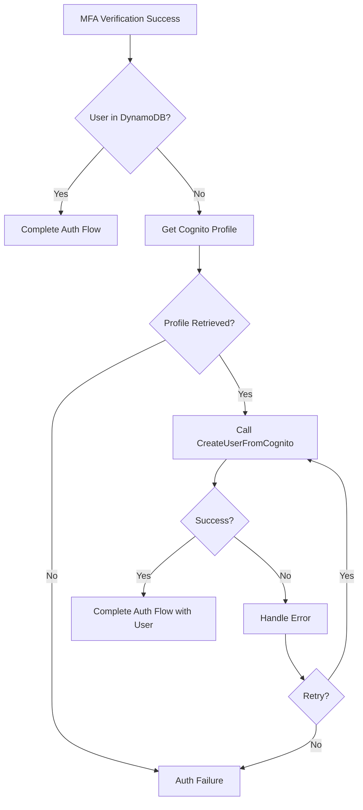

# Design Document: CreateUserFromCognito

## Overview

This design introduces a secure Lambda-backed GraphQL mutation `CreateUserFromCognito` that creates user records in DynamoDB by validating against AWS Cognito. This separates the self-registration flow (API key auth) from administrative user management (Cognito auth), following the security pattern established by `CheckEmailExists`.

### Security Rationale

The current `UsersCreate` mutation has dual authentication (`@aws_api_key` and `@aws_auth`), which presents security concerns:

1. **API key auth allows arbitrary data injection** - Clients can set any user attributes
2. **No server-side validation** - User data isn't verified against Cognito
3. **Privilege escalation risk** - Clients could potentially set elevated groups

The new architecture:
- `CreateUserFromCognito` (API key only) - Validates against Cognito, extracts verified data
- `UsersCreate` (Cognito auth only) - For admin operations with full control

## Architecture

### Component Diagram

```mermaid
graph TB
    subgraph "Frontend (Angular)"
        AuthFlow[Auth Flow Component]
        UserService[User Service]
    end
    
    subgraph "AWS AppSync"
        CreateUserFromCognito[CreateUserFromCognito<br/>@aws_api_key]
        UsersCreate[UsersCreate<br/>@aws_auth EMPLOYEE/OWNER]
    end
    
    subgraph "AWS Lambda"
        CreateUserLambda[CreateUserFromCognito Lambda]
    end
    
    subgraph "AWS Services"
        Cognito[Cognito User Pool]
        DynamoDB[(DynamoDB Users Table)]
    end
    
    AuthFlow --> UserService
    UserService -->|API Key Auth| CreateUserFromCognito
    UserService -->|Cognito Auth| UsersCreate
    CreateUserFromCognito --> CreateUserLambda
    CreateUserLambda -->|Validate User| Cognito
    CreateUserLambda -->|Create Record| DynamoDB
    UsersCreate -->|VTL Resolver| DynamoDB
```

### Auth Flow Decision Tree



## Components and Interfaces

### 1. Lambda Schema Definition

**File:** `schemas/lambdas/CreateUserFromCognito.yml`

```yaml
type: lambda
name: CreateUserFromCognito
targets:
  - api
model:
  operation: mutation
  authConfig:
    apiKeyAuthentication:
      - CreateUserFromCognito
  attributes:
    cognitoSub:
      type: string
      required: true
      description: Cognito user ID (sub) to create record for
    # Response attributes (populated by Lambda)
    userId:
      type: string
      required: false
      description: Created user ID (same as cognitoSub)
    email:
      type: string
      required: false
    firstName:
      type: string
      required: false
    lastName:
      type: string
      required: false
    status:
      type: string
      required: false
    emailVerified:
      type: boolean
      required: false
    groups:
      type: string
      list: true
      required: false
    createdAt:
      type: timestamp
      required: false
    updatedAt:
      type: timestamp
      required: false
```

### 2. Lambda Implementation

**File:** `apps/api/lambdas/create_user_from_cognito/index.py`

```python
# Pseudocode structure
def lambda_handler(event, context):
    start_time = time.time()
    
    try:
        # 1. Extract and validate cognitoSub
        cognito_sub = extract_cognito_sub(event)
        if not validate_uuid(cognito_sub):
            raise ValidationError("Invalid cognitoSub format")
        
        # 2. Check if user already exists in DynamoDB
        existing_user = query_user_by_cognito_sub(cognito_sub)
        if existing_user:
            ensure_min_response_time(start_time)
            return existing_user  # Idempotent - return existing
        
        # 3. Validate user exists in Cognito and get attributes
        cognito_user = get_cognito_user(cognito_sub)
        if not cognito_user:
            raise NotFoundError("User not found in Cognito")
        
        # 4. Extract verified attributes from Cognito
        user_data = extract_cognito_attributes(cognito_user)
        
        # 5. Create DynamoDB record with Cognito-verified data
        created_user = create_user_record(user_data)
        
        ensure_min_response_time(start_time)
        return created_user
        
    except Exception as e:
        ensure_min_response_time(start_time)
        raise
```

### 3. Frontend Service Updates

**File:** `apps/web/src/app/core/services/user.service.ts`

```typescript
// New method for creating user from Cognito
public async createUserFromCognito(cognitoSub: string): Promise<UsersResponse> {
  return this.mutate(
    CreateUserFromCognito,
    { input: { cognitoSub } },
    'apiKey'  // Use API key auth
  );
}
```

### 4. GraphQL Operations

**Generated Query:**
```graphql
mutation CreateUserFromCognito($input: CreateUserFromCognitoInput!) {
  CreateUserFromCognito(input: $input) {
    userId
    email
    firstName
    lastName
    status
    emailVerified
    groups
    createdAt
    updatedAt
  }
}
```

## Data Models

### CreateUserFromCognitoInput

| Field | Type | Required | Description |
|-------|------|----------|-------------|
| cognitoSub | String | Yes | Cognito user ID (UUID format) |

### CreateUserFromCognitoResponse

| Field | Type | Description |
|-------|------|-------------|
| userId | String | User ID (same as cognitoSub) |
| email | String | Email from Cognito |
| firstName | String | Given name from Cognito |
| lastName | String | Family name from Cognito |
| status | UserStatus | Always PENDING for new users |
| emailVerified | Boolean | From Cognito email_verified |
| groups | [String] | Always ['USER'] for new users |
| createdAt | Timestamp | Record creation time |
| updatedAt | Timestamp | Record update time |

### User Record Mapping

| DynamoDB Field | Source | Notes |
|----------------|--------|-------|
| userId | cognitoSub | Primary key |
| cognitoId | cognitoSub | Same as userId |
| cognitoSub | cognitoSub | Cognito identifier |
| email | Cognito email attribute | Verified by Cognito |
| firstName | Cognito given_name | May be empty |
| lastName | Cognito family_name | May be empty |
| emailVerified | Cognito email_verified | Boolean |
| phoneVerified | false | Default |
| mfaEnabled | true | User completed MFA |
| mfaSetupComplete | true | User completed MFA |
| status | PENDING | Default for new users |
| groups | ['USER'] | Default group |
| createdAt | Current timestamp | Lambda sets |
| updatedAt | Current timestamp | Lambda sets |


## Correctness Properties

*A property is a characteristic or behavior that should hold true across all valid executions of a system—essentially, a formal statement about what the system should do. Properties serve as the bridge between human-readable specifications and machine-verifiable correctness guarantees.*

### Property 1: Cognito Validation

*For any* cognitoSub input, the Lambda SHALL call Cognito to validate the user exists before creating a DynamoDB record. If the user does not exist in Cognito, the Lambda SHALL return an error without creating any record.

**Validates: Requirements 2.1, 2.6**

### Property 2: Data Source Integrity

*For any* successful CreateUserFromCognito call, the returned user data SHALL contain only:
- Data extracted from Cognito (email, firstName, lastName, emailVerified)
- Server-generated values (userId = cognitoSub, status = PENDING, groups = ['USER'], timestamps)

No client-provided data (other than cognitoSub) SHALL appear in the output.

**Validates: Requirements 2.2, 2.3, 2.5**

### Property 3: Idempotency

*For any* cognitoSub that already has a DynamoDB record, calling CreateUserFromCognito SHALL return the existing user without creating a duplicate. The returned user SHALL be equivalent to the existing record.

**Validates: Requirements 2.7**

### Property 4: Input Validation

*For any* string input that is not a valid UUID format, the Lambda SHALL reject it with a generic error message. The error SHALL NOT reveal whether the format was invalid vs. user not found.

**Validates: Requirements 5.1, 5.4**

### Property 5: Timing Consistency

*For any* input (valid or invalid), the Lambda response time SHALL be at least MIN_RESPONSE_TIME (0.1 seconds) to prevent timing-based enumeration attacks.

**Validates: Requirements 5.2**

### Property 6: PII Protection in Logs

*For any* Lambda execution, the logs SHALL NOT contain email addresses, names, or other personally identifiable information. Only non-PII identifiers (cognitoSub, userId) may be logged.

**Validates: Requirements 5.3**

## Error Handling

### Error Codes

| Code | Message | Condition |
|------|---------|-----------|
| ORB-AUTH-010 | Authentication service unavailable | Cognito API error |
| ORB-AUTH-011 | Invalid request format | cognitoSub not valid UUID |
| ORB-AUTH-012 | User not found | cognitoSub not in Cognito |
| ORB-API-010 | Database service unavailable | DynamoDB error |

### Error Response Format

```json
{
  "errorType": "ValidationError",
  "errorMessage": "Invalid request format"
}
```

### Error Handling Strategy

1. **Validation errors** - Return immediately with generic message
2. **Cognito errors** - Log details, return generic "service unavailable"
3. **DynamoDB errors** - Log details, return generic "service unavailable"
4. **All errors** - Ensure minimum response time before returning

## Testing Strategy

### Dual Testing Approach

This feature requires both unit tests and property-based tests:

- **Unit tests**: Verify specific examples, edge cases, error conditions
- **Property tests**: Verify universal properties across all inputs

### Property-Based Testing Configuration

- **Library**: hypothesis (Python)
- **Minimum iterations**: 100 per property
- **Tag format**: `Feature: create-user-from-cognito, Property {N}: {title}`

### Test Structure

```
apps/api/lambdas/create_user_from_cognito/
├── __init__.py
├── index.py
├── test_create_user_from_cognito.py          # Unit tests
└── test_create_user_from_cognito_property.py # Property tests
```

### Unit Test Cases

1. **Happy path** - Valid cognitoSub, user exists in Cognito, no existing DynamoDB record
2. **Idempotent** - User already exists in DynamoDB
3. **User not in Cognito** - Valid UUID but user doesn't exist
4. **Invalid UUID format** - Various invalid formats
5. **Cognito service error** - Simulated Cognito failure
6. **DynamoDB service error** - Simulated DynamoDB failure
7. **Missing input** - No cognitoSub provided

### Property Test Cases

Each property from the Correctness Properties section will have a corresponding property-based test using hypothesis:

```python
from hypothesis import given, settings
import hypothesis.strategies as st

@settings(max_examples=100)
@given(cognito_sub=st.uuids())
def test_property_1_cognito_validation(cognito_sub):
    """Feature: create-user-from-cognito, Property 1: Cognito Validation
    
    Validates: Requirements 2.1, 2.6
    """
    # Test implementation
    pass
```

### Frontend Test Cases

1. **Effect test** - handleMFASuccess dispatches createUserFromCognito action
2. **Service test** - createUserFromCognito uses apiKey auth mode
3. **Integration test** - Complete flow from MFA success to auth complete

### Schema Validation Tests

1. **Generated schema** - Verify CreateUserFromCognito has @aws_api_key only
2. **UsersCreate schema** - Verify UsersCreate has @aws_auth only (no @aws_api_key)

## Related Documentation

- [API Documentation](../../../docs/api.md)
- [Auth Flow Components](../../../docs/components/auth/auth-flow/)
- [CheckEmailExists Lambda](../../../apps/api/lambdas/check_email_exists/)
- [orb-templates Spec Standards](../../repositories/orb-templates/docs/kiro-steering/templates/spec-standards.md)
