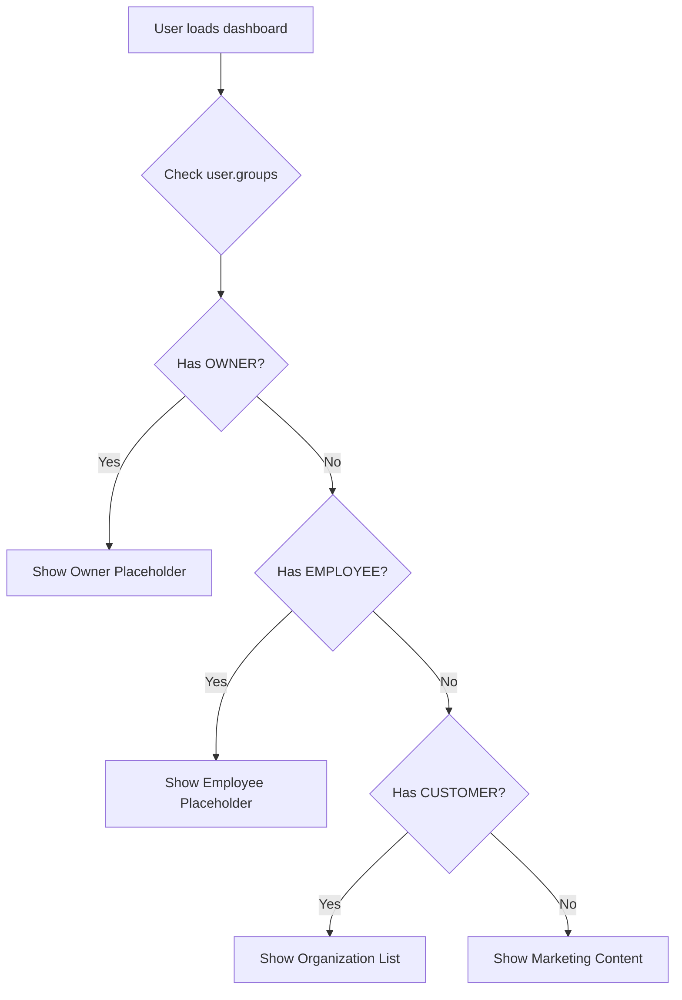

# Design Document: Dashboard Role-Based Content

## Overview

This design introduces a role-based content system for the dashboard, displaying different content in a left-hand pane based on the user's group membership. The implementation uses Angular's conditional rendering with the existing NgRx store for user state management.

## Architecture

The dashboard will be restructured into a two-column layout:

```
┌─────────────────────────────────────────────────────────────────┐
│                        Header Section                            │
├───────────────────────────────────┬─────────────────────────────┤
│                                   │                             │
│         Left Pane (66%)           │     Right Pane (34%)        │
│                                   │                             │
│   Role-specific content:          │   Existing content:         │
│   - USER: Marketing               │   - Quick Actions           │
│   - CUSTOMER: Organizations       │   - Account Health          │
│   - EMPLOYEE/OWNER: Placeholder   │   - Recent Activity         │
│                                   │                             │
└───────────────────────────────────┴─────────────────────────────┘
```

### Component Structure

```
DashboardComponent
├── dashboard-left-pane (new)
│   ├── user-marketing-content (new)
│   ├── customer-organizations (new)
│   └── employee-placeholder (new)
└── dashboard-right-pane (existing content refactored)
    ├── quick-actions
    ├── account-health
    └── recent-activity
```

### Role Detection Flow



## Components and Interfaces

### New Interfaces

```typescript
// Role priority for determining primary content
export enum DashboardContentType {
  USER_MARKETING = 'USER_MARKETING',
  CUSTOMER_ORGANIZATIONS = 'CUSTOMER_ORGANIZATIONS',
  EMPLOYEE_PLACEHOLDER = 'EMPLOYEE_PLACEHOLDER',
  OWNER_PLACEHOLDER = 'OWNER_PLACEHOLDER'
}

// Organization summary for list display
export interface OrganizationSummary {
  organizationId: string;
  name: string;
  userRole: string;
  memberCount?: number;
  logoUrl?: string;
}
```

### DashboardComponent Updates

```typescript
// New method to determine content type
getDashboardContentType(user: IUsers | null): DashboardContentType {
  if (!user?.groups || user.groups.length === 0) {
    return DashboardContentType.USER_MARKETING;
  }
  
  const groups = user.groups;
  
  if (groups.includes('OWNER')) {
    return DashboardContentType.OWNER_PLACEHOLDER;
  }
  if (groups.includes('EMPLOYEE')) {
    return DashboardContentType.EMPLOYEE_PLACEHOLDER;
  }
  if (groups.includes('CUSTOMER')) {
    return DashboardContentType.CUSTOMER_ORGANIZATIONS;
  }
  
  return DashboardContentType.USER_MARKETING;
}
```

### UserMarketingContentComponent

New standalone component for USER role marketing content:

```typescript
@Component({
  selector: 'app-user-marketing-content',
  standalone: true,
  imports: [CommonModule, FontAwesomeModule, RouterModule],
  templateUrl: './user-marketing-content.component.html',
  styleUrls: ['./user-marketing-content.component.scss']
})
export class UserMarketingContentComponent {
  // Marketing content configuration
  features = [
    { icon: 'building', title: 'Create Organizations', description: 'Build and manage your business entities' },
    { icon: 'users', title: 'Team Management', description: 'Invite team members and assign roles' },
    { icon: 'plug', title: 'Integrations', description: 'Connect with third-party services' },
    { icon: 'chart-line', title: 'Analytics', description: 'Track usage and performance metrics' }
  ];
  
  onUpgradeClick(): void {
    // Navigate to customer upgrade flow
  }
}
```

### CustomerOrganizationsComponent

New standalone component for CUSTOMER role organization list:

```typescript
@Component({
  selector: 'app-customer-organizations',
  standalone: true,
  imports: [CommonModule, FontAwesomeModule, RouterModule],
  templateUrl: './customer-organizations.component.html',
  styleUrls: ['./customer-organizations.component.scss']
})
export class CustomerOrganizationsComponent implements OnInit {
  organizations$: Observable<OrganizationSummary[]>;
  isLoading$: Observable<boolean>;
  
  constructor(private store: Store, private router: Router) {}
  
  ngOnInit(): void {
    // Load organizations from store
  }
  
  onOrganizationClick(org: OrganizationSummary): void {
    this.router.navigate(['/customers/organizations', org.organizationId]);
  }
  
  onCreateOrganization(): void {
    this.router.navigate(['/customers/organizations/create']);
  }
}
```

### EmployeePlaceholderComponent

New standalone component for EMPLOYEE/OWNER placeholder:

```typescript
@Component({
  selector: 'app-employee-placeholder',
  standalone: true,
  imports: [CommonModule, FontAwesomeModule],
  templateUrl: './employee-placeholder.component.html',
  styleUrls: ['./employee-placeholder.component.scss']
})
export class EmployeePlaceholderComponent {
  @Input() roleType: 'EMPLOYEE' | 'OWNER' = 'EMPLOYEE';
}
```

## Data Models

### Organization Data (Future Integration)

The organization list will integrate with the existing Organizations model when available. For initial implementation, we'll use mock data:

```typescript
// Mock data for initial implementation
const mockOrganizations: OrganizationSummary[] = [
  {
    organizationId: 'org-1',
    name: 'Acme Corporation',
    userRole: 'Admin',
    memberCount: 12
  },
  {
    organizationId: 'org-2', 
    name: 'Tech Startup Inc',
    userRole: 'Member',
    memberCount: 5
  }
];
```

## Correctness Properties

*A property is a characteristic or behavior that should hold true across all valid executions of a system—essentially, a formal statement about what the system should do. Properties serve as the bridge between human-readable specifications and machine-verifiable correctness guarantees.*

### Property 1: Role Priority Determination

*For any* user with a groups array containing any combination of USER, CUSTOMER, EMPLOYEE, and OWNER, the `getDashboardContentType` function SHALL return the content type corresponding to the highest priority role where OWNER > EMPLOYEE > CUSTOMER > USER.

**Validates: Requirements 5.1, 5.2, 5.3**

### Property 2: Default Content for Empty Groups

*For any* user with an empty, null, or undefined groups array, the `getDashboardContentType` function SHALL return `USER_MARKETING`.

**Validates: Requirements 5.4**

### Property 3: Role-Based Content Rendering

*For any* user, the dashboard left pane SHALL render exactly one of the following based on the determined content type:
- USER_MARKETING: Marketing content component
- CUSTOMER_ORGANIZATIONS: Organization list component  
- EMPLOYEE_PLACEHOLDER: Employee placeholder component
- OWNER_PLACEHOLDER: Owner placeholder component

**Validates: Requirements 2.1, 3.1, 4.1, 4.2**

### Property 4: Organization Data Display Integrity

*For any* organization in the customer's organization list, the rendered output SHALL contain both the organization's name and the user's role within that organization.

**Validates: Requirements 3.2, 3.3**

## Error Handling

### Organization Loading Errors

- Display error message with retry button if organization fetch fails
- Log error to console for debugging
- Show empty state if no organizations exist

### Role Detection Edge Cases

- Handle null/undefined user gracefully (default to USER content)
- Handle malformed groups array (filter invalid values)
- Handle users with no groups (default to USER content)

## Testing Strategy

### Unit Tests

1. **DashboardComponent**
   - Test `getDashboardContentType` returns correct type for each role
   - Test role priority ordering (OWNER > EMPLOYEE > CUSTOMER > USER)
   - Test default behavior for empty/null groups

2. **UserMarketingContentComponent**
   - Test upgrade button navigation
   - Test feature list rendering

3. **CustomerOrganizationsComponent**
   - Test organization list rendering
   - Test organization click navigation
   - Test empty state display
   - Test loading state display

4. **EmployeePlaceholderComponent**
   - Test placeholder message rendering
   - Test role type input handling

### Property-Based Tests

1. **Role Priority Property Test**
   - Generate random combinations of user groups
   - Verify highest priority role always determines content type
   - Minimum 100 iterations

2. **Default Content Property Test**
   - Generate users with empty/null/undefined groups
   - Verify USER_MARKETING is always returned
   - Minimum 100 iterations

### Integration Tests

1. Test full dashboard rendering for each role type
2. Test responsive layout behavior
3. Test navigation from organization list to detail page
