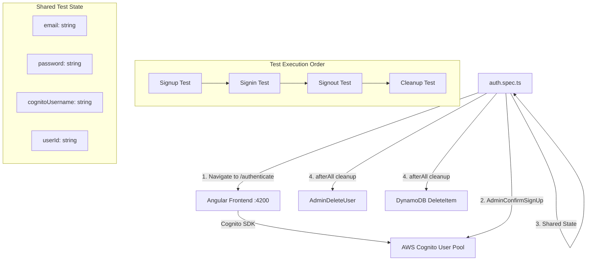
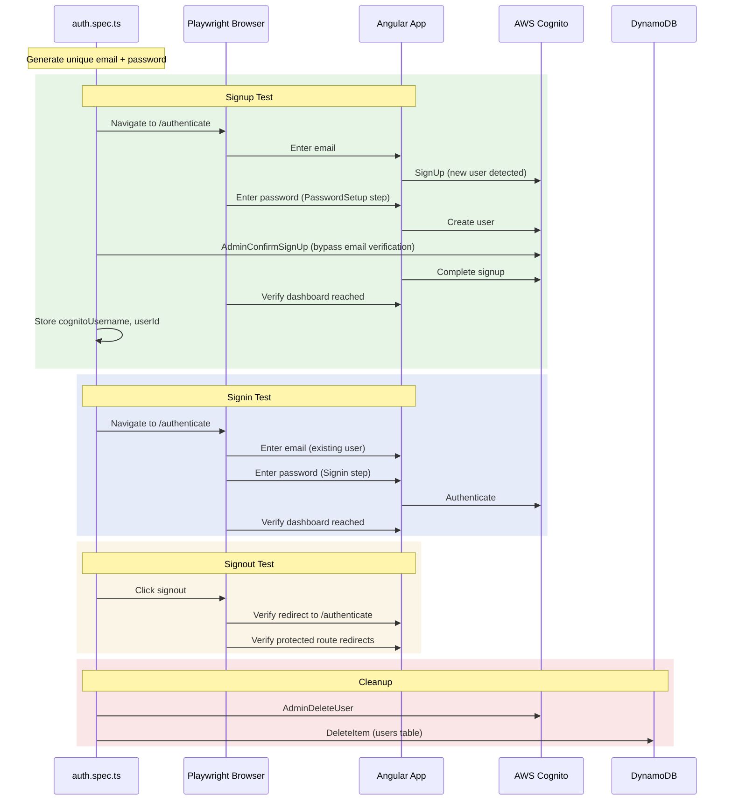

# Design Document: E2E Auth Tests

## Overview

This design covers a self-contained Playwright E2E test suite for the authentication lifecycle in orb-integration-hub. The suite exercises signup → signin → signout → cleanup against the real Angular frontend (`localhost:4200`) and deployed AWS dev backend (Cognito, AppSync, DynamoDB).

The test suite creates its own user dynamically, shares state between serial tests, and cleans up via AWS SDK calls. No pre-existing test users, `.env.test` files, or secrets retrieval is needed.

Additionally, this design covers removing the `GRAPHQL_API_KEY` references from setup scripts and environment files, since the main AppSync API authenticates exclusively via Cognito user pools.

### Key Design Decisions

1. **Serial test execution with shared state** — Tests run in a fixed order within a single `test.describe.serial` block. A module-scoped state object holds the generated email, password, and Cognito user ID across tests.

2. **No page object model** — The auth flow is a single component with well-defined form fields (`#email-input`, `#password-input`, `#password-setup-input`). A page object adds indirection without value for a single-page flow. Helper functions in the test file suffice.

3. **AWS SDK for verification and cleanup** — `AdminConfirmSignUp` auto-confirms the user's email (bypassing the verification code step that can't be retrieved in E2E). `AdminDeleteUser` and DynamoDB `DeleteItem` handle cleanup.

4. **Amplify apiKey removal** — The `Amplify.configure()` call in `main.ts` includes `apiKey` in the GraphQL config. Since `defaultAuthMode: 'userPool'`, the apiKey is unused for the main API. Removing it from environment files cascades cleanly.

## Architecture



### Test Flow Sequence



## Components and Interfaces

### New Files

| File | Purpose |
|------|---------|
| `apps/web/e2e/tests/auth.spec.ts` | Rewritten self-contained auth test suite (replaces existing placeholder) |

### Modified Files

| File | Change |
|------|--------|
| `apps/web/scripts/setup-dev-env.js` | Remove `GRAPHQL_API_KEY` from `FRONTEND_SECRETS_MAP` and generated `environment.local.ts` |
| `apps/web/scripts/secrets-retrieval.js` | Remove `GRAPHQL_API_KEY` from `FRONTEND_SECRETS_MAP` |
| `apps/web/scripts/test-replace-secrets.js` | Remove `GRAPHQL_API_KEY` from mock secrets and test templates |
| `apps/web/src/environments/environment.ts` | Remove `apiKey` from `graphql` object |
| `apps/web/src/environments/environment.prod.ts` | Remove `apiKey` from `graphql` object |
| `apps/web/src/main.ts` | Remove `apiKey` from `Amplify.configure()` GraphQL config |
| `apps/web/e2e/README.md` | Update to document self-contained auth test approach |

### Existing Files Used (No Changes)

| File | Usage |
|------|-------|
| `apps/web/e2e/fixtures/index.ts` | Reuse `deleteTestUser()`, AWS SDK clients (`cognitoClient`, `dynamoClient`) |
| `apps/web/e2e/utils/index.ts` | Reuse `checkAWSCredentials()`, `generateTestId()` |
| `apps/web/playwright.config.ts` | Existing config already supports serial mode, baseURL, screenshots, timeouts |

### Shared Test State Interface

```typescript
interface AuthTestState {
  email: string;
  password: string;
  cognitoUsername: string | null;  // Cognito sub/UUID
  userId: string | null;           // DynamoDB userId
  signupSucceeded: boolean;
}
```

This object is declared at module scope within `auth.spec.ts` and mutated by each test in sequence.

### Auth Test Helper Functions

```typescript
// Generate a unique test email with timestamp
function generateTestEmail(): string;

// Generate a strong random password meeting Cognito policy
function generateTestPassword(): string;

// Auto-confirm a user's email via AWS SDK
async function adminConfirmSignUp(username: string): Promise<void>;

// Delete user from Cognito (tolerates UserNotFoundException)
async function adminDeleteUser(username: string): Promise<void>;

// Delete user record from DynamoDB users table
async function deleteUserFromDynamoDB(userId: string): Promise<void>;
```

### Playwright Selectors Strategy

The auth flow component uses standard HTML `id` attributes and Angular form controls. The test will use these selectors:

| Element | Selector | Step |
|---------|----------|------|
| Email input | `#email-input` | Email entry |
| Password input | `#password-input` | Signin |
| Password setup input | `#password-setup-input` | Signup (new user) |
| Submit button | `button[type="submit"]` | All steps |
| Form title | `.auth-flow__header-title` | Step detection |
| Error display | `.auth-flow__error` | Error detection |
| Progress steps | `.auth-flow__progress-step` | Step tracking |

## Data Models

### Test User Data

| Field | Type | Example | Source |
|-------|------|---------|--------|
| `email` | string | `e2e-test-1719500000000@test.orb-integration-hub.com` | Generated with timestamp |
| `password` | string | `E2eTest#1719500000` | Generated: uppercase + lowercase + number + special char |
| `cognitoUsername` | string | `a1b2c3d4-e5f6-...` | Extracted from Cognito after signup |
| `userId` | string | `usr_abc123...` | Extracted from app state or DynamoDB after signup |

### AWS Resources Accessed

| Resource | Identifier | Operation |
|----------|-----------|-----------|
| Cognito User Pool | `us-east-1_8ch8unBaX` | AdminConfirmSignUp, AdminDeleteUser |
| DynamoDB Users Table | `orb-integration-hub-dev-users` | DeleteItem |

### Environment Config Changes (apiKey Removal)

Before:
```typescript
graphql: {
  url: '{{GRAPHQL_API_URL}}',
  region: '{{AWS_REGION}}',
  apiKey: '{{GRAPHQL_API_KEY}}'
}
```

After:
```typescript
graphql: {
  url: '{{GRAPHQL_API_URL}}',
  region: '{{AWS_REGION}}'
}
```


## Correctness Properties

*A property is a characteristic or behavior that should hold true across all valid executions of a system — essentially, a formal statement about what the system should do. Properties serve as the bridge between human-readable specifications and machine-verifiable correctness guarantees.*

Most acceptance criteria in this spec describe E2E interaction steps (navigate, click, assert) or configuration/process requirements. These are inherently example-based and tested by the E2E suite itself. Two criteria yield meaningful universal properties over the helper functions:

### Property 1: Generated test emails are unique and well-formed

*For any* two calls to `generateTestEmail()` with distinct timestamps, the resulting emails should be different, and each email should match the pattern `e2e-test-{digits}@test.orb-integration-hub.com`.

**Validates: Requirements 1.1**

### Property 2: Generated passwords meet Cognito password policy

*For any* call to `generateTestPassword()`, the resulting password should satisfy all Cognito requirements: at least 8 characters, contains at least one uppercase letter, at least one lowercase letter, at least one digit, and at least one special character from `!@#$%^&*`.

**Validates: Requirements 1.2**

## Error Handling

### E2E Test Error Scenarios

| Scenario | Handling |
|----------|----------|
| Signup fails (Cognito error) | Test fails, `afterAll` hook still attempts cleanup using any stored `cognitoUsername` |
| Email verification timeout | `AdminConfirmSignUp` is called via AWS SDK to bypass email verification entirely |
| Signin fails after signup | Test fails, cleanup runs in `afterAll` |
| Signout button not found | Test fails with descriptive error, cleanup runs in `afterAll` |
| AWS credentials expired | `checkAWSCredentials()` called in `beforeAll`; logs clear message: "Run `aws sso login --profile sso-orb-dev`" |
| Cognito AdminDeleteUser fails | Error logged, DynamoDB deletion still attempted |
| DynamoDB DeleteItem fails | Error logged, test suite reports cleanup failure |
| User not found during cleanup | `UserNotFoundException` caught and ignored (user may not have been created) |

### Cleanup Resilience

The `afterAll` hook implements a best-effort cleanup strategy:

```
afterAll:
  1. If cognitoUsername exists → AdminDeleteUser (catch and log errors)
  2. If userId exists → DynamoDB DeleteItem (catch and log errors)
  3. Log summary of cleanup results
```

Both deletions are attempted independently. A failure in Cognito deletion does not prevent DynamoDB deletion.

### GRAPHQL_API_KEY Removal Error Handling

The removal is a straightforward code deletion. The key risk is that `Amplify.configure()` might fail without the `apiKey` field. Since `defaultAuthMode: 'userPool'`, Amplify does not require an API key. The `apiKey` field is optional in the Amplify GraphQL config when using Cognito auth.

## Testing Strategy

### Dual Testing Approach

This feature uses both E2E tests (the primary deliverable) and property-based tests for the helper functions.

### E2E Tests (Primary)

The E2E test suite at `apps/web/e2e/tests/auth.spec.ts` covers the full authentication lifecycle:

| Test | Validates |
|------|-----------|
| Signup flow | Requirements 2.1–2.6 |
| Signin flow | Requirements 3.1–3.4 |
| Signout flow | Requirements 4.1–4.3 |
| Cleanup (afterAll) | Requirements 5.1–5.5 |

Tests run serially using `test.describe.serial` in Playwright. Each test depends on the previous test's state.

### Unit Tests

| Test | Validates |
|------|-----------|
| `generateTestEmail()` returns valid format | Requirement 1.1 |
| `generateTestPassword()` returns valid password | Requirement 1.2 |
| GRAPHQL_API_KEY absent from environment files | Requirements 6.1–6.6 |
| `setup-dev-env.js` FRONTEND_SECRETS_MAP has no GRAPHQL_API_KEY | Requirement 6.1 |

### Property-Based Tests

Property-based tests use `fast-check` (already available in the project's test ecosystem via npm).

Each property test runs a minimum of 100 iterations.

| Property | Test Description | Tag |
|----------|-----------------|-----|
| Property 1 | Generate 100+ emails with random timestamps, verify uniqueness and format | `Feature: e2e-auth-tests, Property 1: Generated test emails are unique and well-formed` |
| Property 2 | Generate 100+ passwords, verify each meets all Cognito policy requirements | `Feature: e2e-auth-tests, Property 2: Generated passwords meet Cognito password policy` |

Each correctness property is implemented by a single property-based test. The property tests validate the helper functions that the E2E tests depend on, ensuring the test infrastructure itself is correct.
