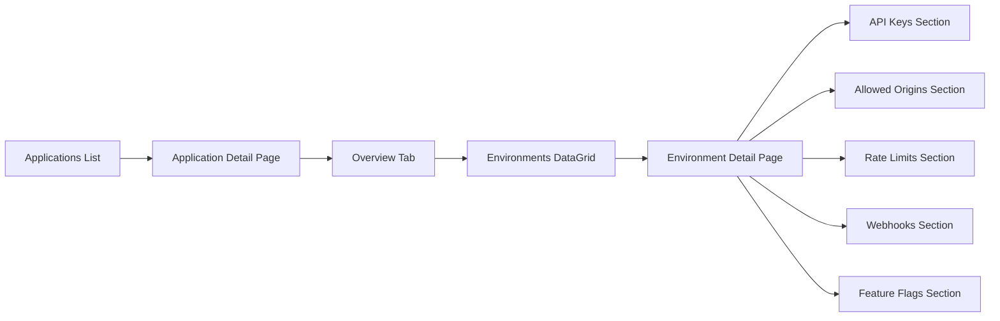
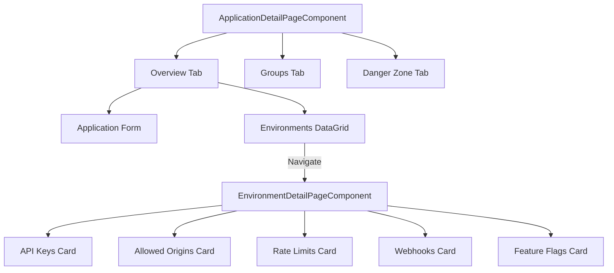
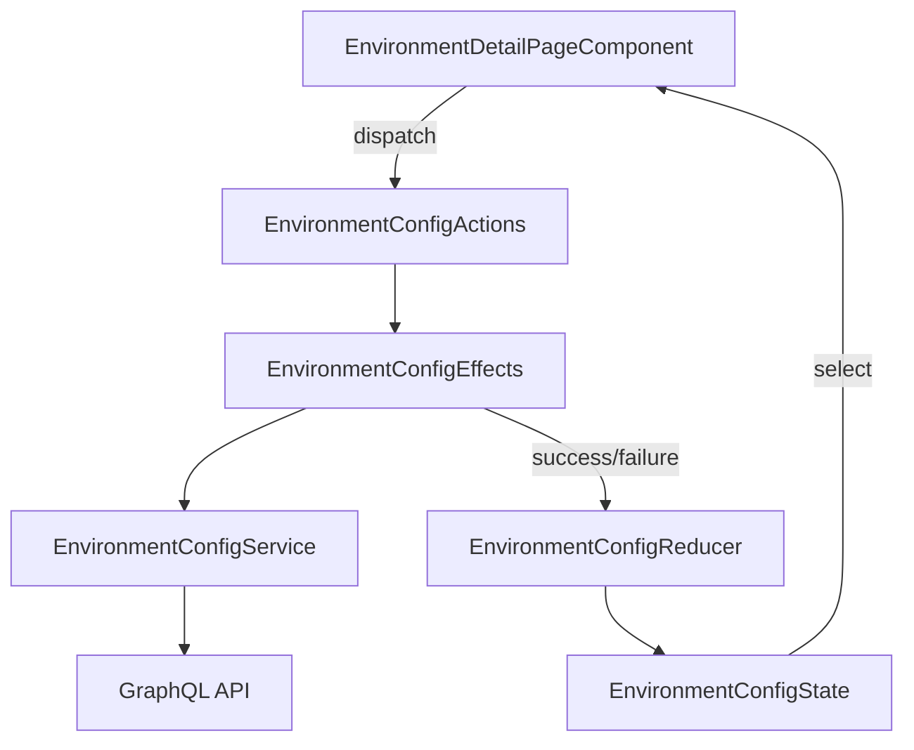

# Design Document: Environment Detail Page

## Standard Requirements

This spec follows the [orb-templates Spec Standards](../../../repositories/orb-templates/docs/kiro-steering/templates/spec-standards.md).

## Overview

This design describes the frontend restructuring to create a dedicated Environment Detail Page for managing environment-specific configuration in the orb-integration-hub application. The change introduces a new navigation pattern where users access environment configuration through a dedicated page rather than a tab within the Application Detail Page.

Key changes:
1. Add an Environments DataGrid to the Application Detail Page Overview tab
2. Remove the Security tab from Application Detail Page
3. Create a new Environment Detail Page component at `/customers/applications/:appId/environments/:env`
4. Reuse the existing NgRx environment-config store and EnvironmentConfigTabComponent logic

This is a FRONTEND-ONLY change - all backend infrastructure is already complete.

## Architecture

### Navigation Flow



### Component Hierarchy



### State Management

The Environment Detail Page reuses the existing NgRx store:



## Components and Interfaces

### Route Configuration

```typescript
// applications.routes.ts
export const applicationsRoutes: Routes = [
  {
    path: '',
    component: ApplicationsComponent,
  },
  {
    path: ':id',
    component: ApplicationDetailPageComponent,
  },
  {
    path: ':id/environments/:env',
    component: EnvironmentDetailPageComponent,
  }
];
```

### EnvironmentDetailPageComponent

New standalone component that displays all configuration for a single environment.

```typescript
interface EnvironmentDetailPageComponent {
  // Route parameters
  applicationId: string;
  environment: Environment;
  
  // Store selectors
  application$: Observable<IApplications | null>;
  selectedConfig$: Observable<IApplicationEnvironmentConfig | null>;
  isLoading$: Observable<boolean>;
  isSaving$: Observable<boolean>;
  loadError$: Observable<string | null>;
  saveError$: Observable<string | null>;
  
  // API Keys (from api-keys store)
  apiKey$: Observable<IApplicationApiKeys | null>;
  isGeneratingKey$: Observable<boolean>;
  isRevokingKey$: Observable<boolean>;
  generatedKey$: Observable<GeneratedKeyResult | null>;
}
```

### EnvironmentRow Interface

For the Environments DataGrid on the Overview tab:

```typescript
interface EnvironmentRow {
  environment: string;
  environmentLabel: string;
  apiKeyStatus: 'Active' | 'Revoked' | 'Expired' | 'Not Configured';
  webhookStatus: 'Enabled' | 'Disabled' | 'Not Configured';
  lastUpdated: string;
}
```

### ApplicationDetailPageComponent Changes

Remove Security tab and add Environments DataGrid:

```typescript
// Remove from enum
enum ApplicationDetailTab {
  Overview = 'overview',
  Groups = 'groups',
  // Security = 'security',  // REMOVED
  Danger = 'danger',
}

// Add to component
environmentRows: EnvironmentRow[] = [];
environmentColumns: ColumnDefinition<EnvironmentRow>[] = [];
```

## Data Models

### Existing Models (No Changes)

The following models are already implemented and will be reused:

- `IApplicationEnvironmentConfig` - Environment configuration data
- `IApplicationApiKeys` - API key data
- `IApplications` - Application data
- `Environment` enum - Environment types

### New Display Models

```typescript
// Environment row for DataGrid display
interface EnvironmentRow {
  environment: string;           // e.g., 'PRODUCTION'
  environmentLabel: string;      // e.g., 'Production'
  apiKeyStatus: ApiKeyDisplayStatus;
  webhookStatus: WebhookDisplayStatus;
  lastUpdated: string;           // Formatted relative time
}

type ApiKeyDisplayStatus = 'Active' | 'Rotating' | 'Revoked' | 'Expired' | 'Not Configured';
type WebhookDisplayStatus = 'Enabled' | 'Disabled' | 'Not Configured';
```


## Correctness Properties

*A property is a characteristic or behavior that should hold true across all valid executions of a system—essentially, a formal statement about what the system should do. Properties serve as the bridge between human-readable specifications and machine-verifiable correctness guarantees.*

Based on the prework analysis, the following properties are testable:

### Property 1: Environment DataGrid Row Count Matches Configuration

*For any* application with N environments configured in its `environments` array, the Environments DataGrid SHALL display exactly N rows, where each row corresponds to one configured environment.

**Validates: Requirements 1.4**

### Property 2: Save Operations Dispatch Actions and Show Loading States

*For any* save operation (rate limits, webhook config, allowed origins, feature flags), the component SHALL dispatch the appropriate NgRx action AND the loading state selector SHALL return true while the operation is in progress.

**Validates: Requirements 4.7**

### Property 3: API Key Status Display Consistency

*For any* API key state (Active, Rotating, Revoked, Expired, or null), the Environment Detail Page SHALL display the corresponding status text that matches the key's actual status property.

**Validates: Requirements 6.1**

## Error Handling

### Invalid Environment Parameter

When the route parameter `:env` does not match any environment in the application's `environments` array:

1. Display an error message: "Environment not found"
2. Show a back button to return to the Application Detail Page
3. Do not attempt to load configuration for the invalid environment

```typescript
// In EnvironmentDetailPageComponent
private validateEnvironment(): boolean {
  const validEnvironments = this.application?.environments || [];
  if (!validEnvironments.includes(this.environment)) {
    this.error = `Environment "${this.environment}" is not configured for this application.`;
    return false;
  }
  return true;
}
```

### Application Not Found

When the application cannot be loaded:

1. Display the error from the store's error selector
2. Show a back button to return to the Applications list
3. Do not render configuration sections

### Save Errors

When a save operation fails:

1. Display the error message from `saveError$` selector
2. Keep the form data intact for retry
3. Provide a dismiss button to clear the error

### Network Errors

All network errors are handled by the existing NgRx effects and displayed via error selectors.

## Testing Strategy

### Unit Tests

Unit tests verify specific examples and edge cases:

1. **EnvironmentDetailPageComponent**
   - Renders correct sections when config is loaded
   - Displays error state when environment is invalid
   - Dispatches correct actions on page load
   - Handles API key generation/revoke/rotate actions

2. **ApplicationDetailPageComponent (modified)**
   - Renders Environments DataGrid on Overview tab
   - Does NOT render Security tab
   - Navigates to Environment Detail Page on row click
   - Shows empty state when no environments configured

3. **Route Configuration**
   - Route `/customers/applications/:id/environments/:env` loads EnvironmentDetailPageComponent
   - Route parameters are correctly extracted

### Property-Based Tests

Property tests verify universal properties across generated inputs using fast-check:

1. **Property 1: Environment DataGrid Row Count**
   - Generate random applications with 0-5 environments
   - Verify DataGrid row count equals environments array length

2. **Property 2: Save Operations**
   - Generate random configuration changes
   - Verify action dispatch and loading state behavior

3. **Property 3: API Key Status Display**
   - Generate API keys with all possible statuses
   - Verify displayed status matches key status

### Test Configuration

```typescript
// fast-check configuration
import * as fc from 'fast-check';

fc.assert(
  fc.property(/* ... */),
  { numRuns: 100 }
);
```

### Test File Structure

```
apps/web/src/app/features/customers/applications/
├── components/
│   ├── environment-detail-page/
│   │   ├── environment-detail-page.component.ts
│   │   ├── environment-detail-page.component.html
│   │   ├── environment-detail-page.component.scss
│   │   └── environment-detail-page.component.spec.ts
│   └── application-detail-page/
│       └── application-detail-page.component.spec.ts  # Updated
└── applications.routes.spec.ts  # New or updated
```

## Implementation Notes

### Reusing Existing Code

The EnvironmentConfigTabComponent contains the UI logic for:
- Allowed Origins management
- Rate Limits configuration
- Webhook configuration
- Feature Flags management

This logic will be extracted and reused in the new EnvironmentDetailPageComponent. The key difference is:
- **EnvironmentConfigTabComponent**: Shows environment selector tabs, manages multiple environments
- **EnvironmentDetailPageComponent**: Shows single environment, no selector needed (environment from route)

### Store Integration

The existing NgRx store (`environment-config`) already provides:
- `loadConfig` action - loads config for specific environment
- `setApplicationContext` action - sets current app/org context
- `selectSelectedConfig` selector - gets current config
- `selectIsLoading`, `selectIsSaving` selectors - loading states
- `selectLoadError`, `selectSaveError` selectors - error states

The new component will use these directly without modification.

### API Keys Integration

The existing API keys store (`api-keys`) provides:
- `loadApiKeys` action - loads keys for application
- `generateApiKey`, `revokeApiKey`, `rotateApiKey` actions
- `selectApiKeys` selector - gets all keys
- Key filtering by environment will be done in the component

### CSS Classes

Use existing global `orb-*` classes from `styles/components.scss`:
- `orb-card`, `orb-card__header`, `orb-card__content` for sections
- `orb-btn`, `orb-btn--primary`, `orb-btn--danger` for buttons
- `orb-info`, `orb-info__name`, `orb-info__id` for key display
- `orb-role-badge` for environment badges
