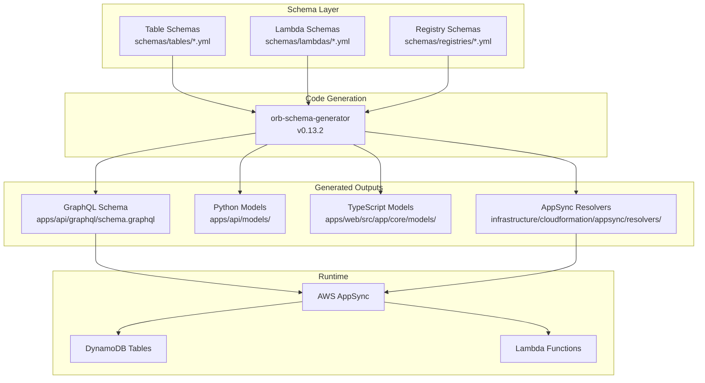

# Design Document

## Overview

This design document outlines the technical approach for completing the orb-integration-hub GraphQL API layer. The primary issue is that the current table schemas are configured but orb-schema-generator is not generating GraphQL operations (Query/Mutation types are empty in schema.graphql).

After analyzing the orb-geo-fence reference project, the solution involves:
1. Ensuring table schemas have proper `authConfig` with `cognitoAuthentication.groups`
2. Verifying schema-generator.yml has correct GraphQL output configuration
3. Adding missing table schemas (Organizations)
4. Regenerating all code with orb-schema-generator

## Architecture



## Components and Interfaces

### 1. Table Schema Structure

Each table schema in `schemas/tables/` must follow this structure for GraphQL generation:

```yaml
type: dynamodb
version: '1.0'
name: EntityName
targets:
  - api
model:
  authConfig:
    cognitoAuthentication:
      groups:
        OWNER:
          - '*'
        EMPLOYEE:
          - '*'
        CUSTOMER:
          - '*'
        USER:
          - '*'
  keys:
    primary:
      partition: entityId
    secondary:
      - name: IndexName
        type: GSI
        partition: fieldName
        sort: sortField
        projection_type: ALL
  attributes:
    # ... field definitions
```

### 2. Lambda Schema Structure

Lambda-backed resolvers use `type: lambda-secured`:

```yaml
type: lambda-secured
version: '1.0'
name: EntityName
targets:
  - api
model:
  authConfig:
    cognitoAuthentication:
      groups:
        OWNER:
          - '*'
        EMPLOYEE:
          - '*'
        CUSTOMER:
          - '*'
```

### 3. Generated GraphQL Operations

For each DynamoDB table, orb-schema-generator generates:

**Queries:**
- `{Entity}QueryBy{PrimaryKey}` - Query by primary key
- `{Entity}QueryBy{GSIPartition}` - Query by each GSI partition key
- `{Entity}QueryBy{GSIPartition}And{GSISort}` - Query by GSI partition + sort

**Mutations:**
- `{Entity}Create` - Create new record
- `{Entity}Update` - Update existing record
- `{Entity}Delete` - Delete record
- `{Entity}Disable` - Soft delete (if applicable)

**Types:**
- `{Entity}` - Main entity type
- `{Entity}Response` - Response wrapper with items and nextToken
- `{Entity}CreateInput` - Input for create mutation
- `{Entity}UpdateInput` - Input for update mutation
- `{Entity}DeleteInput` - Input for delete mutation
- `{Entity}QueryBy{Key}Input` - Input for each query

### 4. Frontend Service Interface

```typescript
// Entity service pattern
@Injectable({ providedIn: 'root' })
export class EntityService extends ApiService {
  
  async query(input: EntityQueryInput): Promise<EntityResponse> {
    return this.query<EntityResponse>(ENTITY_QUERY, { input });
  }
  
  async create(input: EntityCreateInput): Promise<EntityResponse> {
    return this.mutate<EntityResponse>(ENTITY_CREATE, { input });
  }
  
  async update(input: EntityUpdateInput): Promise<EntityResponse> {
    return this.mutate<EntityResponse>(ENTITY_UPDATE, { input });
  }
  
  async delete(input: EntityDeleteInput): Promise<EntityResponse> {
    return this.mutate<EntityResponse>(ENTITY_DELETE, { input });
  }
}
```

## Data Models

### Tables to Schema Mapping

| DynamoDB Table | Schema File | Type | Status |
|----------------|-------------|------|--------|
| Users | schemas/tables/Users.yml | dynamodb | ✅ Exists |
| Applications | schemas/tables/Applications.yml | dynamodb | ✅ Exists |
| ApplicationUsers | schemas/tables/ApplicationUsers.yml | dynamodb | ✅ Exists |
| ApplicationRoles | schemas/tables/ApplicationRoles.yml | dynamodb | ✅ Exists |
| Roles | schemas/tables/Roles.yml | dynamodb | ✅ Exists |
| OrganizationUsers | schemas/tables/OrganizationUsers.yml | dynamodb | ⚠️ Missing |
| Notifications | schemas/tables/Notifications.yml | dynamodb | ✅ Exists |
| SmsRateLimit | schemas/tables/SmsRateLimit.yml | dynamodb | ✅ Exists |
| Organizations | schemas/tables/Organizations.yml | dynamodb | ❌ Missing (only lambda schema exists) |
| OwnershipTransferRequests | schemas/tables/OwnershipTransferRequests.yml | dynamodb | ❌ Missing |
| PrivacyRequests | schemas/tables/PrivacyRequests.yml | dynamodb | ❌ Missing |

### Missing Table Schema: Organizations

```yaml
# schemas/tables/Organizations.yml
type: dynamodb
version: '1.0'
name: Organizations
targets:
  - api
model:
  authConfig:
    cognitoAuthentication:
      groups:
        OWNER:
          - '*'
        EMPLOYEE:
          - '*'
        CUSTOMER:
          - '*'
  keys:
    primary:
      partition: organizationId
    secondary:
      - name: OwnerIndex
        type: GSI
        partition: ownerId
        sort: createdAt
        projection_type: ALL
      - name: StatusCreatedIndex
        type: GSI
        partition: status
        sort: createdAt
        projection_type: ALL
  attributes:
    organizationId:
      type: string
      required: true
    name:
      type: string
      required: true
    description:
      type: string
      required: false
    ownerId:
      type: string
      required: true
    status:
      type: string
      required: true
      enum_type: OrganizationStatus
    createdAt:
      type: timestamp
      required: true
    updatedAt:
      type: timestamp
      required: true
    kmsKeyId:
      type: string
      required: false
    kmsKeyArn:
      type: string
      required: false
    kmsAlias:
      type: string
      required: false
```


## Correctness Properties

*A property is a characteristic or behavior that should hold true across all valid executions of a system—essentially, a formal statement about what the system should do. Properties serve as the bridge between human-readable specifications and machine-verifiable correctness guarantees.*

### Property 1: GSI-to-Query Operation Mapping

*For any* table schema with GSI indexes defined, the generated GraphQL schema SHALL contain query operations that utilize those indexes (QueryBy{GSIPartition} and QueryBy{GSIPartition}And{GSISort}).

**Validates: Requirements 1.6**

### Property 2: Authentication Directive Coverage

*For any* Query or Mutation operation in the generated GraphQL schema, the operation SHALL have either @aws_auth or @aws_cognito_user_pools directive with cognito_groups specified.

**Validates: Requirements 4.1, 4.2**

### Property 3: Schema-to-Table Consistency

*For any* DynamoDB table defined in infrastructure/cloudformation/dynamodb.yml, there SHALL exist a corresponding schema file in schemas/tables/ with matching primary key, attributes, and GSI definitions.

**Validates: Requirements 7.1, 7.2, 7.3**

### Property 4: Query Definition Consistency

*For any* GraphQL operation defined in schema.graphql, there SHALL exist a corresponding TypeScript query/mutation definition in apps/web/src/app/core/graphql/ that matches the operation signature.

**Validates: Requirements 6.2**

## Error Handling

### Schema Generation Errors

| Error Type | Cause | Resolution |
|------------|-------|------------|
| Missing targets | Schema file lacks `targets: [api]` | Add targets configuration |
| Invalid enum_type | Referenced enum not in registries | Create registry schema or fix reference |
| Duplicate operation | Multiple schemas define same operation | Rename or consolidate |
| Invalid attribute type | Unsupported type in schema | Use supported types (string, number, boolean, timestamp, array, object) |

### Runtime Errors

| Error Type | Status Code | Response |
|------------|-------------|----------|
| Unauthorized | 401 | `{ "StatusCode": 401, "Message": "Not authorized", "Data": null }` |
| Forbidden | 403 | `{ "StatusCode": 403, "Message": "Insufficient permissions", "Data": null }` |
| Not Found | 404 | `{ "StatusCode": 404, "Message": "Resource not found", "Data": null }` |
| Validation Error | 400 | `{ "StatusCode": 400, "Message": "Validation failed: {details}", "Data": null }` |
| Internal Error | 500 | `{ "StatusCode": 500, "Message": "Internal server error", "Data": null }` |

## Testing Strategy

### Unit Tests

Unit tests verify specific examples and edge cases:

1. **Schema Validation Tests**
   - Verify each table schema has required fields
   - Verify enum references resolve correctly
   - Verify GSI definitions are valid

2. **Service Method Tests**
   - Test each CRUD method with mock data
   - Test error handling paths
   - Test type safety with TypeScript compiler

### Property-Based Tests

Property tests verify universal properties across all inputs using Hypothesis (Python) or fast-check (TypeScript):

1. **GSI Query Generation Test**
   - Generate random table schemas with GSIs
   - Verify generated GraphQL has corresponding queries
   - Minimum 100 iterations

2. **Auth Directive Test**
   - Parse generated schema
   - Verify all operations have auth directives
   - Minimum 100 iterations

3. **Schema Consistency Test**
   - Compare dynamodb.yml tables against schemas/tables/
   - Verify 1:1 mapping with matching structure
   - Minimum 100 iterations

### Integration Tests

1. **End-to-End GraphQL Tests**
   - Deploy to test environment
   - Execute queries/mutations
   - Verify responses match expected format

2. **Authentication Tests**
   - Test with valid/invalid tokens
   - Test group-based access control
   - Verify 401/403 responses

### Test Configuration

```yaml
# pytest.ini for Python tests
[pytest]
minversion = 7.0
testpaths = tests
python_files = test_*.py
python_functions = test_*
addopts = -v --hypothesis-show-statistics

# karma.conf.js for Angular tests
frameworks: ['jasmine', '@angular-devkit/build-angular']
reporters: ['progress', 'kjhtml']
```

### Property Test Annotations

Each property test must include:
```python
# Feature: graphql-api-completion, Property 1: GSI-to-Query Operation Mapping
# Validates: Requirements 1.6
@given(table_schema=table_schema_strategy())
def test_gsi_generates_queries(table_schema):
    ...
```
