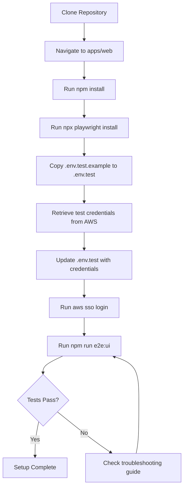
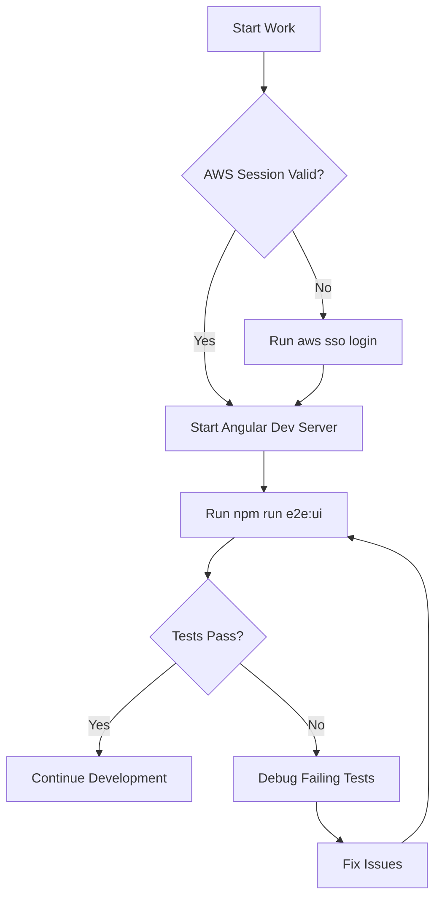
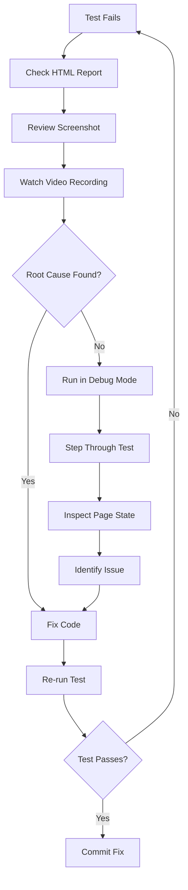
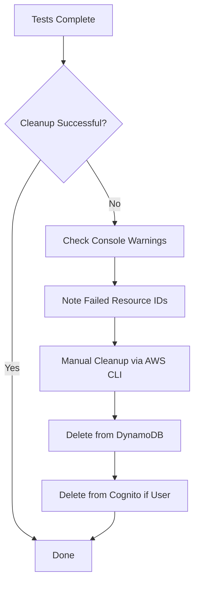
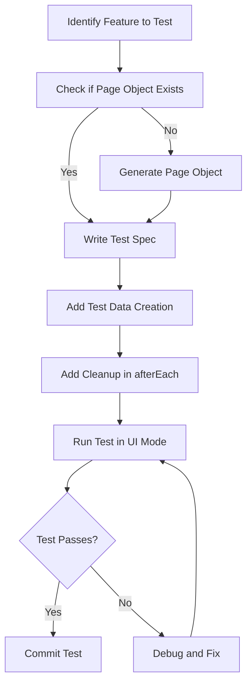
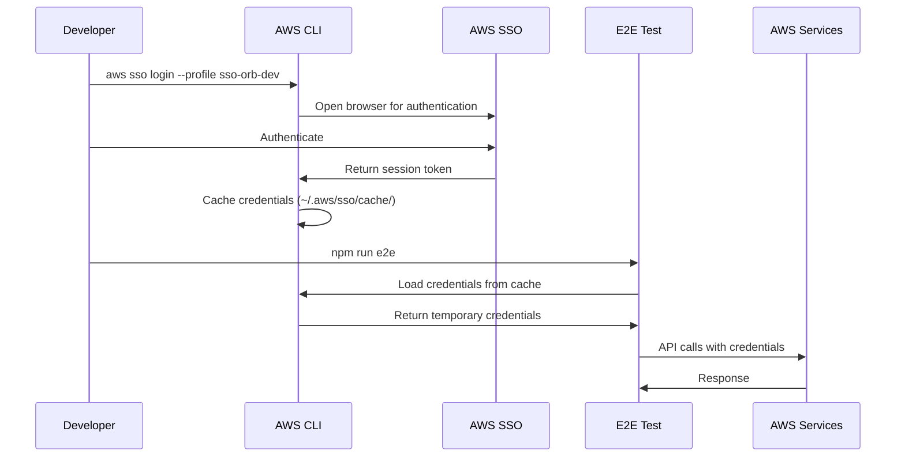
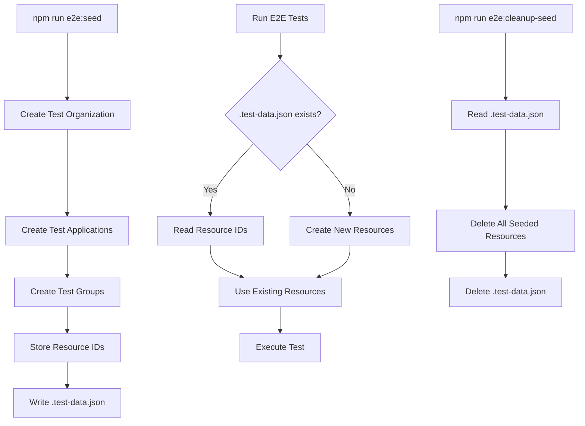

# Design Document: Local E2E Testing Setup

## Overview

This design document specifies the technical implementation for the Local E2E Testing Setup feature in orb-integration-hub. The feature provides a complete local development workflow for running Playwright end-to-end tests against the Angular frontend and AWS backend services.

### Purpose

Enable developers to run, debug, and maintain E2E tests locally with minimal setup, ensuring consistent test execution across development and CI/CD environments.

### Scope

This design covers:
- File structure and organization for E2E tests
- Developer workflow from setup through execution
- Test user and data management strategies
- Environment configuration patterns
- AWS service integration for test operations
- Documentation structure and content
- npm scripts and Playwright configuration
- Integration with orb-templates standards

### Key Design Principles

1. **Convention over Configuration**: Standardized directory structure and naming conventions
2. **Developer Experience First**: Simple setup, clear error messages, comprehensive documentation
3. **Test Isolation**: Each test creates and cleans up its own data
4. **Reusable Authentication**: Store auth state to avoid repeated logins
5. **AWS Integration**: Direct AWS SDK usage for test operations
6. **Comprehensive Debugging**: Multiple debugging modes and detailed failure artifacts


## Architecture

### System Context

```
┌─────────────────────────────────────────────────────────────┐
│                    Developer Workstation                     │
│                                                               │
│  ┌──────────────────────────────────────────────────────┐  │
│  │              Playwright Test Runner                   │  │
│  │                                                        │  │
│  │  ┌──────────────┐  ┌──────────────┐  ┌────────────┐ │  │
│  │  │ Test Specs   │  │ Page Objects │  │  Fixtures  │ │  │
│  │  └──────────────┘  └──────────────┘  └────────────┘ │  │
│  │                                                        │  │
│  │  ┌──────────────┐  ┌──────────────┐  ┌────────────┐ │  │
│  │  │ Auth Helper  │  │ AWS Clients  │  │   Utils    │ │  │
│  │  └──────────────┘  └──────────────┘  └────────────┘ │  │
│  └──────────────────────────────────────────────────────┘  │
│                           │                                  │
│                           ▼                                  │
│  ┌──────────────────────────────────────────────────────┐  │
│  │         Angular Dev Server (localhost:4200)           │  │
│  └──────────────────────────────────────────────────────┘  │
└─────────────────────────────────────────────────────────────┘
                            │
                            ▼
┌─────────────────────────────────────────────────────────────┐
│                    AWS Dev Environment                       │
│                                                               │
│  ┌──────────────┐  ┌──────────────┐  ┌──────────────────┐  │
│  │   Cognito    │  │   AppSync    │  │    DynamoDB      │  │
│  │  User Pool   │  │   GraphQL    │  │     Tables       │  │
│  └──────────────┘  └──────────────┘  └──────────────────┘  │
│                                                               │
│  ┌──────────────────────────────────────────────────────┐  │
│  │           Secrets Manager (Test Credentials)          │  │
│  └──────────────────────────────────────────────────────┘  │
└─────────────────────────────────────────────────────────────┘
```

### Component Interaction Flow

1. **Test Execution**: Developer runs npm script → Playwright loads config → Tests execute
2. **Authentication**: Test calls auth helper → Cognito login → Save auth state → Reuse in subsequent tests
3. **Test Data**: Test creates resources via GraphQL → Stores IDs → Cleanup in afterEach hook
4. **AWS Operations**: Test fixtures use AWS SDK → SSO credentials → Direct service calls
5. **Debugging**: Test fails → Playwright captures screenshot/video/trace → HTML report generated


## Components and Interfaces

### 1. File Structure Design

The E2E test directory follows a standardized structure generated by the E2E test generator:

```
apps/web/
├── e2e/
│   ├── .auth/                    # Stored authentication state (gitignored)
│   │   └── user.json            # Playwright auth storage
│   ├── auth/                     # Authentication helpers
│   │   └── cognito.ts           # Cognito login/logout functions
│   ├── fixtures/                 # Test data creation/cleanup
│   │   └── index.ts             # Resource fixtures (organizations, apps, groups)
│   ├── page-objects/            # Page object models
│   │   ├── organizations.page.ts
│   │   ├── applications.page.ts
│   │   └── *.page.ts            # Generated page objects
│   ├── tests/                    # Test specifications
│   │   ├── auth.spec.ts         # Authentication flow tests
│   │   ├── organizations.spec.ts
│   │   ├── applications.spec.ts
│   │   └── *.spec.ts            # Generated test specs
│   ├── utils/                    # Utility functions
│   │   └── index.ts             # Helpers (waitForGraphQL, screenshots, etc.)
│   └── README.md                 # E2E testing documentation
├── playwright-report/            # Test reports (gitignored)
│   ├── index.html               # HTML report
│   └── data/                    # Report assets
├── test-results/                 # Test artifacts (gitignored)
│   ├── screenshots/
│   ├── videos/
│   └── traces/
├── .env.test                     # Test environment variables (gitignored)
├── .env.test.example            # Example environment configuration
└── playwright.config.ts         # Playwright configuration
```

**Key Design Decisions**:
- **Separation of Concerns**: Auth, fixtures, page objects, tests, and utils are in separate directories
- **Generated vs Manual**: Page objects and test specs are generated; auth, fixtures, and utils are manual
- **Gitignore Strategy**: Exclude auth state, reports, and credentials; commit test code
- **Flat Structure**: No deep nesting within subdirectories for easy navigation

### 2. Authentication System

#### Cognito Auth Helper (`e2e/auth/cognito.ts`)

```typescript
import { Page } from '@playwright/test';
import { fromCognitoIdentityPool } from '@aws-sdk/credential-providers';

export interface TestUser {
  email: string;
  password: string;
}

export interface AuthState {
  accessToken: string;
  idToken: string;
  refreshToken: string;
  expiresAt: number;
}

/**
 * Authenticates a test user and saves auth state to disk
 * @param page - Playwright page instance
 * @param user - Test user credentials
 * @returns Promise that resolves when authentication is complete
 */
export async function login(page: Page, user: TestUser): Promise<void> {
  // Navigate to login page
  await page.goto('/auth/login');
  
  // Fill in credentials
  await page.fill('[data-testid="email-input"]', user.email);
  await page.fill('[data-testid="password-input"]', user.password);
  
  // Submit form
  await page.click('[data-testid="login-button"]');
  
  // Wait for navigation to dashboard
  await page.waitForURL('/user/dashboard', { timeout: 10000 });
  
  // Save authentication state
  await page.context().storageState({ path: 'e2e/.auth/user.json' });
}

/**
 * Logs out the current user
 * @param page - Playwright page instance
 */
export async function logout(page: Page): Promise<void> {
  await page.goto('/auth/logout');
  await page.waitForURL('/auth/login');
}

/**
 * Retrieves test user credentials from environment variables
 * @returns Test user credentials
 * @throws Error if credentials are not configured
 */
export function getTestUser(): TestUser {
  const email = process.env.TEST_USER_EMAIL;
  const password = process.env.TEST_USER_PASSWORD;
  
  if (!email || !password) {
    throw new Error(
      'Test user credentials not configured. ' +
      'Set TEST_USER_EMAIL and TEST_USER_PASSWORD in .env.test file. ' +
      'Retrieve credentials from AWS Secrets Manager: ' +
      'aws --profile sso-orb-dev secretsmanager get-secret-value ' +
      '--secret-id orb-integration-hub-dev-e2e-test-user'
    );
  }
  
  return { email, password };
}
```

**Design Rationale**:
- **Playwright Storage State**: Uses built-in `storageState()` to save cookies and localStorage
- **Reusable Auth**: Saved state can be loaded in `playwright.config.ts` to skip login in subsequent tests
- **Clear Error Messages**: Provides AWS CLI command if credentials are missing
- **Type Safety**: TypeScript interfaces for user and auth state


### 3. Test Fixtures System

#### Fixtures Interface (`e2e/fixtures/index.ts`)

```typescript
import { CognitoIdentityProviderClient, AdminDeleteUserCommand } from '@aws-sdk/client-cognito-identity-provider';
import { DynamoDBClient, DeleteItemCommand, QueryCommand } from '@aws-sdk/client-dynamodb';
import { fromSSO } from '@aws-sdk/credential-providers';

export interface TestResource {
  id: string;
  type: 'organization' | 'application' | 'group' | 'user';
  createdAt: Date;
}

export interface CreateOrganizationInput {
  name: string;
  description?: string;
}

export interface CreateApplicationInput {
  organizationId: string;
  name: string;
  description?: string;
}

/**
 * AWS SDK clients configured for E2E testing
 */
const credentials = fromSSO({ profile: process.env.AWS_PROFILE || 'sso-orb-dev' });
const region = process.env.AWS_REGION || 'us-east-1';

const cognitoClient = new CognitoIdentityProviderClient({ region, credentials });
const dynamoClient = new DynamoDBClient({ region, credentials });

/**
 * Creates a test organization with e2e-test- prefix
 * @param input - Organization creation parameters
 * @returns Created organization with ID
 */
export async function createTestOrganization(
  input: CreateOrganizationInput
): Promise<TestResource> {
  const name = `e2e-test-${input.name}-${Date.now()}`;
  
  // Call GraphQL mutation via AppSync
  // Implementation depends on GraphQL client setup
  const response = await callGraphQL('createOrganization', {
    input: { ...input, name }
  });
  
  return {
    id: response.data.createOrganization.organizationId,
    type: 'organization',
    createdAt: new Date()
  };
}

/**
 * Creates a test application under an organization
 * @param input - Application creation parameters
 * @returns Created application with ID
 */
export async function createTestApplication(
  input: CreateApplicationInput
): Promise<TestResource> {
  const name = `e2e-test-${input.name}-${Date.now()}`;
  
  const response = await callGraphQL('createApplication', {
    input: { ...input, name }
  });
  
  return {
    id: response.data.createApplication.applicationId,
    type: 'application',
    createdAt: new Date()
  };
}

/**
 * Deletes test resources by ID
 * @param resources - Array of resources to delete
 */
export async function cleanupTestData(resources: TestResource[]): Promise<void> {
  for (const resource of resources) {
    try {
      switch (resource.type) {
        case 'organization':
          await callGraphQL('deleteOrganization', {
            organizationId: resource.id
          });
          break;
        case 'application':
          await callGraphQL('deleteApplication', {
            applicationId: resource.id
          });
          break;
        case 'group':
          await callGraphQL('deleteGroup', {
            groupId: resource.id
          });
          break;
        case 'user':
          await deleteTestUser(resource.id);
          break;
      }
    } catch (error) {
      console.error(`Failed to cleanup ${resource.type} ${resource.id}:`, error);
      // Continue cleanup even if one resource fails
    }
  }
}

/**
 * Creates prerequisite resources for tests that need existing data
 * @returns Object containing IDs of created resources
 */
export async function createPrerequisites(): Promise<{
  organizationId: string;
  applicationId: string;
}> {
  const org = await createTestOrganization({
    name: 'prerequisite-org',
    description: 'Organization for E2E test prerequisites'
  });
  
  const app = await createTestApplication({
    organizationId: org.id,
    name: 'prerequisite-app',
    description: 'Application for E2E test prerequisites'
  });
  
  return {
    organizationId: org.id,
    applicationId: app.id
  };
}

/**
 * Deletes a test user from Cognito and DynamoDB
 * @param userId - User ID to delete
 */
async function deleteTestUser(userId: string): Promise<void> {
  // Delete from Cognito
  await cognitoClient.send(new AdminDeleteUserCommand({
    UserPoolId: process.env.COGNITO_USER_POOL_ID,
    Username: userId
  }));
  
  // Delete from DynamoDB
  await dynamoClient.send(new DeleteItemCommand({
    TableName: `orb-integration-hub-${process.env.ENVIRONMENT || 'dev'}-users`,
    Key: { userId: { S: userId } }
  }));
}

/**
 * Helper function to call GraphQL mutations
 * @param operation - GraphQL operation name
 * @param variables - Operation variables
 * @returns GraphQL response
 */
async function callGraphQL(operation: string, variables: unknown): Promise<unknown> {
  // Implementation depends on GraphQL client setup
  // This is a placeholder for the actual implementation
  throw new Error('GraphQL client not implemented');
}
```

**Design Rationale**:
- **AWS SDK Direct**: Uses AWS SDK clients directly for cleanup operations
- **SSO Credentials**: Leverages developer's SSO session for authentication
- **Unique Naming**: Appends timestamp to ensure unique resource names
- **Error Resilience**: Continues cleanup even if individual resources fail
- **Type Safety**: TypeScript interfaces for all inputs and outputs


### 4. Utility Functions

#### Utils Interface (`e2e/utils/index.ts`)

```typescript
import { Page, expect } from '@playwright/test';
import * as fs from 'fs';
import * as path from 'path';

/**
 * Waits for a GraphQL operation to complete
 * @param page - Playwright page instance
 * @param operationName - Name of the GraphQL operation
 * @param timeout - Maximum wait time in milliseconds
 */
export async function waitForGraphQL(
  page: Page,
  operationName: string,
  timeout = 5000
): Promise<void> {
  await page.waitForResponse(
    response =>
      response.url().includes('/graphql') &&
      response.request().postDataJSON()?.operationName === operationName,
    { timeout }
  );
}

/**
 * Takes a timestamped screenshot for debugging
 * @param page - Playwright page instance
 * @param name - Screenshot name prefix
 */
export async function takeTimestampedScreenshot(
  page: Page,
  name: string
): Promise<void> {
  const timestamp = new Date().toISOString().replace(/[:.]/g, '-');
  const filename = `${name}-${timestamp}.png`;
  const screenshotPath = path.join('test-results', 'screenshots', filename);
  
  // Ensure directory exists
  fs.mkdirSync(path.dirname(screenshotPath), { recursive: true });
  
  await page.screenshot({ path: screenshotPath, fullPage: true });
  console.log(`Screenshot saved: ${screenshotPath}`);
}

/**
 * Waits for an element to be visible and stable
 * @param page - Playwright page instance
 * @param selector - Element selector
 * @param timeout - Maximum wait time in milliseconds
 */
export async function waitForStableElement(
  page: Page,
  selector: string,
  timeout = 5000
): Promise<void> {
  const element = page.locator(selector);
  await element.waitFor({ state: 'visible', timeout });
  
  // Wait for element to stop moving (animations complete)
  await expect(element).toBeVisible();
  await page.waitForTimeout(100); // Small delay for animations
}

/**
 * Fills a form field and waits for validation
 * @param page - Playwright page instance
 * @param selector - Input field selector
 * @param value - Value to fill
 */
export async function fillAndValidate(
  page: Page,
  selector: string,
  value: string
): Promise<void> {
  await page.fill(selector, value);
  await page.blur(selector); // Trigger validation
  await page.waitForTimeout(100); // Wait for validation to complete
}

/**
 * Checks if AWS credentials are valid
 * @throws Error if credentials are expired or invalid
 */
export async function checkAWSCredentials(): Promise<void> {
  try {
    const { STSClient, GetCallerIdentityCommand } = await import('@aws-sdk/client-sts');
    const { fromSSO } = await import('@aws-sdk/credential-providers');
    
    const client = new STSClient({
      region: process.env.AWS_REGION || 'us-east-1',
      credentials: fromSSO({ profile: process.env.AWS_PROFILE || 'sso-orb-dev' })
    });
    
    await client.send(new GetCallerIdentityCommand({}));
  } catch (error) {
    throw new Error(
      'AWS credentials are invalid or expired. ' +
      'Please run: aws sso login --profile sso-orb-dev'
    );
  }
}

/**
 * Formats a date for display in tests
 * @param date - Date to format
 * @returns Formatted date string
 */
export function formatTestDate(date: Date): string {
  return date.toISOString().split('T')[0];
}

/**
 * Generates a unique test identifier
 * @param prefix - Identifier prefix
 * @returns Unique identifier string
 */
export function generateTestId(prefix: string): string {
  return `${prefix}-${Date.now()}-${Math.random().toString(36).substr(2, 9)}`;
}
```

**Design Rationale**:
- **GraphQL Waiting**: Specific helper for waiting on GraphQL operations
- **Screenshot Utility**: Timestamped screenshots for debugging
- **Validation Helpers**: Common patterns for form interaction
- **Credential Checking**: Proactive validation of AWS credentials
- **Reusable Utilities**: Common functions used across multiple tests


### 5. Playwright Configuration

#### Configuration Design (`playwright.config.ts`)

```typescript
import { defineConfig, devices } from '@playwright/test';
import * as dotenv from 'dotenv';

// Load test environment variables
dotenv.config({ path: '.env.test' });

export default defineConfig({
  // Test directory
  testDir: './e2e/tests',
  
  // Parallel execution
  fullyParallel: true,
  
  // CI-specific settings
  forbidOnly: !!process.env.CI,
  retries: process.env.CI ? 2 : 0,
  workers: process.env.CI ? 1 : undefined,
  
  // Reporter configuration
  reporter: [
    ['html', { outputFolder: 'playwright-report' }],
    ['list']
  ],
  
  // Global test configuration
  use: {
    // Base URL for navigation
    baseURL: process.env.BASE_URL || 'http://localhost:4200',
    
    // Trace on first retry
    trace: 'on-first-retry',
    
    // Screenshot on failure
    screenshot: 'only-on-failure',
    
    // Video on failure
    video: 'retain-on-failure',
    
    // Timeout for actions
    actionTimeout: 10000,
    
    // Timeout for navigation
    navigationTimeout: 30000,
  },
  
  // Test timeout
  timeout: 60000,
  
  // Browser projects
  projects: [
    // Setup project for authentication
    {
      name: 'setup',
      testMatch: /.*\.setup\.ts/,
    },
    
    // Chromium with stored auth
    {
      name: 'chromium',
      use: {
        ...devices['Desktop Chrome'],
        storageState: 'e2e/.auth/user.json',
      },
      dependencies: ['setup'],
    },
    
    // Firefox with stored auth
    {
      name: 'firefox',
      use: {
        ...devices['Desktop Firefox'],
        storageState: 'e2e/.auth/user.json',
      },
      dependencies: ['setup'],
    },
    
    // WebKit with stored auth
    {
      name: 'webkit',
      use: {
        ...devices['Desktop Safari'],
        storageState: 'e2e/.auth/user.json',
      },
      dependencies: ['setup'],
    },
  ],
  
  // Web server configuration
  webServer: {
    command: 'npm start',
    url: 'http://localhost:4200',
    reuseExistingServer: !process.env.CI,
    timeout: 120000,
  },
});
```

**Configuration Features**:
- **Environment Variables**: Loads from `.env.test` file
- **Conditional Settings**: Different behavior for CI vs local
- **Auth Reuse**: Setup project runs once, other projects use stored auth
- **Multiple Browsers**: Tests run on Chromium, Firefox, and WebKit
- **Auto Server Start**: Starts Angular dev server if not running
- **Comprehensive Artifacts**: Screenshots, videos, and traces on failure


### 6. npm Scripts Design

#### Package.json Scripts

```json
{
  "scripts": {
    "e2e": "playwright test",
    "e2e:ui": "playwright test --ui",
    "e2e:headed": "playwright test --headed",
    "e2e:debug": "playwright test --debug",
    "e2e:report": "playwright show-report",
    "e2e:codegen": "playwright codegen http://localhost:4200",
    "e2e:install": "playwright install",
    "e2e:seed": "ts-node e2e/scripts/seed-data.ts",
    "e2e:cleanup-seed": "ts-node e2e/scripts/cleanup-seed.ts"
  }
}
```

**Script Descriptions**:

| Script | Purpose | Usage |
|--------|---------|-------|
| `e2e` | Run all tests headless | CI/CD and quick local runs |
| `e2e:ui` | Open Playwright UI | Interactive test development |
| `e2e:headed` | Run with visible browser | Debugging test behavior |
| `e2e:debug` | Run with Playwright Inspector | Step-by-step debugging |
| `e2e:report` | Open HTML report | Review test results |
| `e2e:codegen` | Generate test code | Create new tests interactively |
| `e2e:install` | Install browser binaries | First-time setup |
| `e2e:seed` | Seed test data (optional) | Pre-populate test environment |
| `e2e:cleanup-seed` | Clean seeded data (optional) | Remove seeded resources |

### 7. Environment Configuration

#### .env.test.example Structure

```bash
# Test User Credentials
# Retrieve from AWS Secrets Manager:
# aws --profile sso-orb-dev secretsmanager get-secret-value \
#   --secret-id orb-integration-hub-dev-e2e-test-user
TEST_USER_EMAIL=e2e-test-user@orb-integration-hub.com
TEST_USER_PASSWORD=<retrieve-from-aws-secrets>

# Application URLs
BASE_URL=http://localhost:4200
# For testing against deployed frontend:
# BASE_URL=https://d1234567890.cloudfront.net

# AWS Configuration
AWS_PROFILE=sso-orb-dev
AWS_REGION=us-east-1

# AWS Resource IDs (for direct AWS SDK operations)
COGNITO_USER_POOL_ID=us-east-1_8ch8unBaX
COGNITO_CLIENT_ID=<client-id>
APPSYNC_API_URL=https://abcdefghij.appsync-api.us-east-1.amazonaws.com/graphql
APPSYNC_API_KEY=<api-key>

# Environment
ENVIRONMENT=dev

# Optional: Test Data Seeding
ENABLE_TEST_SEEDING=false
```

**Configuration Categories**:
1. **Credentials**: Test user email and password
2. **URLs**: Frontend base URL (local or deployed)
3. **AWS**: Profile, region, and resource identifiers
4. **Environment**: Deployment environment name
5. **Features**: Optional feature flags


## Data Models

### Test Resource Model

```typescript
interface TestResource {
  id: string;
  type: 'organization' | 'application' | 'group' | 'user';
  createdAt: Date;
}
```

### Test User Model

```typescript
interface TestUser {
  email: string;
  password: string;
}
```

### Auth State Model

```typescript
interface AuthState {
  accessToken: string;
  idToken: string;
  refreshToken: string;
  expiresAt: number;
}
```

### Seeded Data Model (Optional)

```typescript
interface SeededData {
  organizationId: string;
  applicationIds: string[];
  groupIds: string[];
  createdAt: string;
}
```

Stored in `e2e/.test-data.json`:

```json
{
  "organizationId": "e2e-test-org-1234567890",
  "applicationIds": [
    "e2e-test-app-1234567890",
    "e2e-test-app-0987654321"
  ],
  "groupIds": [
    "e2e-test-group-1234567890"
  ],
  "createdAt": "2025-01-15T10:30:00.000Z"
}
```


## Correctness Properties

*A property is a characteristic or behavior that should hold true across all valid executions of a system—essentially, a formal statement about what the system should do. Properties serve as the bridge between human-readable specifications and machine-verifiable correctness guarantees.*

### Property Reflection

After analyzing all acceptance criteria, the following properties were identified as testable. Many criteria are examples (specific file checks, configuration validation) rather than universal properties. The properties below represent the key behaviors that should hold across all test executions.

### Property 1: Test Data Naming Convention

*For any* test resource created by the E2E test fixtures, the resource name SHALL include the `e2e-test-` prefix to distinguish it from production data.

**Validates: Requirements 5.1**

### Property 2: Test Cleanup Execution

*For any* E2E test that creates resources, the test SHALL include an `afterEach` hook that calls `cleanupTestData()` to delete created resources, regardless of test success or failure.

**Validates: Requirements 5.2, 5.3**

### Property 3: Authentication State Persistence

*For any* successful authentication via the `login()` helper, the authentication state SHALL be saved to `e2e/.auth/user.json` for reuse in subsequent tests.

**Validates: Requirements 4.4**

### Property 4: AWS SDK Configuration

*For any* test fixture that interacts with AWS services, the AWS SDK client SHALL be configured with the `sso-orb-dev` profile and `us-east-1` region.

**Validates: Requirements 11.1**

### Property 5: AWS Credential Error Handling

*For any* AWS SDK operation that fails due to expired credentials, the error message SHALL instruct the developer to run `aws sso login --profile sso-orb-dev`.

**Validates: Requirements 11.7**

### Property 6: Test Data Seeding Fallback

*For any* test that can use seeded data, IF the `e2e/.test-data.json` file exists, THEN the test SHALL read resource IDs from the file instead of creating new resources.

**Validates: Requirements 12.5**


## Error Handling

### Error Categories and Handling Strategies

#### 1. Configuration Errors

**Scenario**: Missing or invalid environment variables

**Detection**: Check at test startup in `beforeAll` hook

**Handling**:
```typescript
beforeAll(async () => {
  const requiredVars = ['TEST_USER_EMAIL', 'TEST_USER_PASSWORD', 'BASE_URL', 'AWS_PROFILE'];
  const missing = requiredVars.filter(v => !process.env[v]);
  
  if (missing.length > 0) {
    throw new Error(
      `Missing required environment variables: ${missing.join(', ')}\n` +
      `Create a .env.test file based on .env.test.example\n` +
      `Retrieve test credentials from AWS Secrets Manager:\n` +
      `aws --profile sso-orb-dev secretsmanager get-secret-value ` +
      `--secret-id orb-integration-hub-dev-e2e-test-user`
    );
  }
});
```

#### 2. Authentication Errors

**Scenario**: Test user login fails

**Detection**: Catch errors in `login()` function

**Handling**:
```typescript
export async function login(page: Page, user: TestUser): Promise<void> {
  try {
    await page.goto('/auth/login');
    await page.fill('[data-testid="email-input"]', user.email);
    await page.fill('[data-testid="password-input"]', user.password);
    await page.click('[data-testid="login-button"]');
    await page.waitForURL('/user/dashboard', { timeout: 10000 });
    await page.context().storageState({ path: 'e2e/.auth/user.json' });
  } catch (error) {
    throw new Error(
      `Authentication failed for ${user.email}\n` +
      `Possible causes:\n` +
      `1. Test user does not exist in Cognito\n` +
      `2. Password is incorrect\n` +
      `3. User account is locked or disabled\n` +
      `4. Frontend is not running at ${page.url()}\n` +
      `Original error: ${error.message}`
    );
  }
}
```

#### 3. AWS Credential Errors

**Scenario**: AWS SDK operations fail due to expired SSO session

**Detection**: Catch credential errors in AWS SDK calls

**Handling**:
```typescript
try {
  await cognitoClient.send(command);
} catch (error) {
  if (error.name === 'CredentialsProviderError' || error.name === 'ExpiredTokenException') {
    throw new Error(
      `AWS credentials are invalid or expired.\n` +
      `Run: aws sso login --profile sso-orb-dev\n` +
      `Then retry the test.`
    );
  }
  throw error;
}
```

#### 4. Test Data Cleanup Errors

**Scenario**: Cleanup fails for some resources

**Detection**: Catch errors in `cleanupTestData()` function

**Handling**:
```typescript
export async function cleanupTestData(resources: TestResource[]): Promise<void> {
  const failures: Array<{ resource: TestResource; error: Error }> = [];
  
  for (const resource of resources) {
    try {
      await deleteResource(resource);
    } catch (error) {
      console.error(`Failed to cleanup ${resource.type} ${resource.id}:`, error);
      failures.push({ resource, error });
      // Continue cleanup even if one resource fails
    }
  }
  
  if (failures.length > 0) {
    console.warn(
      `\nCleanup completed with ${failures.length} failure(s):\n` +
      failures.map(f => `  - ${f.resource.type} ${f.resource.id}: ${f.error.message}`).join('\n') +
      `\n\nManual cleanup may be required. See README.md for cleanup procedures.`
    );
  }
}
```

#### 5. GraphQL Errors

**Scenario**: GraphQL mutation fails

**Detection**: Check response for errors

**Handling**:
```typescript
async function callGraphQL(operation: string, variables: unknown): Promise<unknown> {
  const response = await fetch(process.env.APPSYNC_API_URL!, {
    method: 'POST',
    headers: {
      'Content-Type': 'application/json',
      'x-api-key': process.env.APPSYNC_API_KEY!,
    },
    body: JSON.stringify({ query: operation, variables }),
  });
  
  const result = await response.json();
  
  if (result.errors) {
    throw new Error(
      `GraphQL operation failed: ${operation}\n` +
      `Errors: ${JSON.stringify(result.errors, null, 2)}\n` +
      `Variables: ${JSON.stringify(variables, null, 2)}`
    );
  }
  
  return result;
}
```

#### 6. Timeout Errors

**Scenario**: Test times out waiting for element or navigation

**Detection**: Playwright throws TimeoutError

**Handling**:
```typescript
test('should create organization', async ({ page }) => {
  try {
    await page.goto('/customers/organizations');
    await page.click('[data-testid="create-button"]');
    await page.waitForURL(/\/customers\/organizations\/[a-z0-9-]+/, { timeout: 10000 });
  } catch (error) {
    if (error.name === 'TimeoutError') {
      await takeTimestampedScreenshot(page, 'timeout-error');
      throw new Error(
        `Test timed out waiting for navigation.\n` +
        `Current URL: ${page.url()}\n` +
        `Screenshot saved for debugging.\n` +
        `Original error: ${error.message}`
      );
    }
    throw error;
  }
});
```

### Error Recovery Strategies

1. **Retry Logic**: Playwright config includes `retries: 2` for CI to handle transient failures
2. **Cleanup on Failure**: `afterEach` hooks ensure cleanup runs even when tests fail
3. **Detailed Logging**: All errors include context and suggested remediation steps
4. **Screenshot Capture**: Automatic screenshots on failure for visual debugging
5. **Graceful Degradation**: Cleanup continues even if individual resources fail to delete


## Testing Strategy

### Dual Testing Approach

This feature requires both unit tests and property-based tests for comprehensive coverage:

- **Unit tests**: Verify specific examples, edge cases, and error conditions
- **Property tests**: Verify universal properties across all inputs
- Together: Comprehensive coverage (unit tests catch concrete bugs, property tests verify general correctness)

### Unit Testing

Unit tests will verify:

1. **File Structure Validation**
   - Test that required directories exist (`e2e/auth/`, `e2e/fixtures/`, etc.)
   - Test that `.gitignore` contains required entries
   - Test that configuration files exist and are valid

2. **Configuration Validation**
   - Test that `playwright.config.ts` has required settings
   - Test that `.env.test.example` contains all required variables
   - Test that npm scripts are defined correctly

3. **Function Existence**
   - Test that `login()` function exists in `e2e/auth/cognito.ts`
   - Test that `cleanupTestData()` function exists in `e2e/fixtures/index.ts`
   - Test that `waitForGraphQL()` function exists in `e2e/utils/index.ts`

4. **Documentation Completeness**
   - Test that `e2e/README.md` contains required sections
   - Test that setup instructions are present
   - Test that troubleshooting guide is present

5. **Error Message Quality**
   - Test that missing credentials produce helpful error messages
   - Test that expired AWS credentials produce helpful error messages
   - Test that authentication failures include troubleshooting steps

### Property-Based Testing

Property tests will verify:

1. **Test Data Naming Convention** (Property 1)
   - Generate random resource names
   - Pass through fixture creation functions
   - Verify all created resources have `e2e-test-` prefix

2. **Test Cleanup Execution** (Property 2)
   - Generate random test files
   - Parse AST to find resource creation
   - Verify all tests with resource creation have `afterEach` cleanup hooks

3. **Authentication State Persistence** (Property 3)
   - Run login function with test credentials
   - Verify `e2e/.auth/user.json` file is created
   - Verify file contains valid auth tokens

4. **AWS SDK Configuration** (Property 4)
   - Generate random AWS SDK client instantiations
   - Verify all clients use `sso-orb-dev` profile
   - Verify all clients use `us-east-1` region

5. **AWS Credential Error Handling** (Property 5)
   - Simulate expired credentials
   - Trigger AWS SDK operations
   - Verify error messages contain SSO login command

6. **Test Data Seeding Fallback** (Property 6)
   - Create `.test-data.json` with random resource IDs
   - Run tests that support seeding
   - Verify tests read from file instead of creating new resources

### Property-Based Testing Configuration

- **Library**: fast-check (already in dependencies)
- **Iterations**: Minimum 100 runs per property test
- **Tagging**: Each property test references its design document property

Example property test:

```typescript
import fc from 'fast-check';
import { test, expect } from '@playwright/test';

/**
 * Feature: local-e2e-testing-setup, Property 1: Test Data Naming Convention
 * 
 * For any test resource created by the E2E test fixtures, the resource name
 * SHALL include the `e2e-test-` prefix to distinguish it from production data.
 */
test('Property 1: All test resources use e2e-test- prefix', async () => {
  await fc.assert(
    fc.asyncProperty(
      fc.record({
        name: fc.string({ minLength: 1, maxLength: 50 }),
        type: fc.constantFrom('organization', 'application', 'group'),
      }),
      async (input) => {
        const resource = await createTestResource(input);
        expect(resource.name).toMatch(/^e2e-test-/);
      }
    ),
    { numRuns: 100 }
  );
});
```

### Test Organization

```
apps/web/
├── e2e/
│   ├── tests/
│   │   ├── *.spec.ts              # Generated E2E tests
│   │   └── auth.spec.ts           # Authentication flow tests
│   └── __tests__/                 # Unit tests for E2E infrastructure
│       ├── config.test.ts         # Playwright config validation
│       ├── fixtures.test.ts       # Fixture function tests
│       ├── auth.test.ts           # Auth helper tests
│       └── properties.test.ts     # Property-based tests
```

### CI/CD Integration

E2E tests run in GitHub Actions with:
- `workers: 1` to prevent race conditions
- `retries: 2` to handle transient failures
- Artifact upload for screenshots, videos, and traces
- Test report published as GitHub Pages


## Developer Workflows

### Workflow 1: First-Time Setup



**Commands**:
```bash
# 1. Clone and navigate
git clone <repo-url>
cd apps/web

# 2. Install dependencies
npm install
npx playwright install

# 3. Configure environment
cp .env.test.example .env.test

# 4. Retrieve test credentials
aws --profile sso-orb-dev secretsmanager get-secret-value \
  --secret-id orb-integration-hub-dev-e2e-test-user \
  --query SecretString --output text

# 5. Edit .env.test with credentials
# TEST_USER_EMAIL=e2e-test-user@orb-integration-hub.com
# TEST_USER_PASSWORD=<password-from-secrets-manager>

# 6. Login to AWS
aws sso login --profile sso-orb-dev

# 7. Run tests
npm run e2e:ui
```

### Workflow 2: Daily Test Execution



**Commands**:
```bash
# Check AWS session
aws --profile sso-orb-dev sts get-caller-identity

# If expired, login
aws sso login --profile sso-orb-dev

# Start dev server (in separate terminal)
npm start

# Run tests in UI mode
npm run e2e:ui
```

### Workflow 3: Debugging Failed Tests



**Commands**:
```bash
# View HTML report
npm run e2e:report

# Run specific test in debug mode
npm run e2e:debug -- tests/organizations.spec.ts

# Run with headed browser
npm run e2e:headed -- tests/organizations.spec.ts

# Take manual screenshot during test
# Add to test: await takeTimestampedScreenshot(page, 'debug-point');
```

### Workflow 4: Test Data Cleanup



**Manual Cleanup Commands**:
```bash
# List orphaned test resources in DynamoDB
aws --profile sso-orb-dev dynamodb scan \
  --table-name orb-integration-hub-dev-organizations \
  --filter-expression "begins_with(#name, :prefix)" \
  --expression-attribute-names '{"#name":"name"}' \
  --expression-attribute-values '{":prefix":{"S":"e2e-test-"}}'

# Delete specific organization
aws --profile sso-orb-dev dynamodb delete-item \
  --table-name orb-integration-hub-dev-organizations \
  --key '{"organizationId":{"S":"<org-id>"}}'

# Delete test user from Cognito
aws --profile sso-orb-dev cognito-idp admin-delete-user \
  --user-pool-id us-east-1_8ch8unBaX \
  --username <user-id>
```

### Workflow 5: Creating New Tests



**Commands**:
```bash
# Generate page object interactively
npm run e2e:codegen

# Create new test file
touch e2e/tests/my-feature.spec.ts

# Run new test in UI mode
npm run e2e:ui -- tests/my-feature.spec.ts
```


## Documentation Structure

### 1. E2E README (`apps/web/e2e/README.md`)

**Required Sections**:

1. **Overview**
   - Purpose of E2E tests
   - Technology stack (Playwright, TypeScript)
   - Test coverage scope

2. **Directory Structure**
   - Visual tree of `e2e/` directory
   - Description of each subdirectory
   - Explanation of generated vs manual files

3. **Setup Instructions**
   - Prerequisites (Node.js, AWS CLI, SSO access)
   - Step-by-step first-time setup
   - Environment variable configuration
   - Credential retrieval from AWS Secrets Manager

4. **Running Tests**
   - Available npm scripts and their purposes
   - Examples of running specific tests
   - Browser selection
   - Parallel vs sequential execution

5. **Test User Management**
   - Dedicated test user details
   - How authentication state is stored and reused
   - Recreating test user if corrupted

6. **Test Data Management**
   - Naming convention (`e2e-test-` prefix)
   - Cleanup strategy (afterEach hooks)
   - Manual cleanup procedures
   - Seeding data (optional feature)

7. **Debugging**
   - Using Playwright UI mode
   - Debug mode with Inspector
   - Viewing HTML reports
   - Analyzing screenshots, videos, and traces
   - Common debugging techniques

8. **Troubleshooting**
   - Authentication failures
   - Timeout errors
   - Cleanup failures
   - AWS credential issues
   - Network connectivity problems

9. **Writing New Tests**
   - Using generated page objects
   - Test structure best practices
   - Creating test data
   - Cleanup patterns
   - Example test walkthrough

10. **CI/CD Integration**
    - How tests run in GitHub Actions
    - Viewing test results in CI
    - Artifact downloads

### 2. Frontend README Update (`apps/web/README.md`)

**New Section: E2E Testing**

```markdown
## E2E Testing

This project uses Playwright for end-to-end testing. E2E tests verify the complete user workflow from frontend through backend services.

### Quick Start

```bash
# Install dependencies
npm install
npx playwright install

# Configure environment
cp .env.test.example .env.test
# Edit .env.test with test credentials

# Run tests
npm run e2e:ui
```

### Documentation

See [e2e/README.md](./e2e/README.md) for complete E2E testing documentation.

### Available Scripts

- `npm run e2e` - Run all tests headless
- `npm run e2e:ui` - Open Playwright UI
- `npm run e2e:debug` - Debug mode with Inspector
- `npm run e2e:report` - View HTML report
```

### 3. Root README Update (`README.md`)

**Update Testing Section**:

```markdown
## Testing

### Unit Tests
- Frontend: `cd apps/web && npm test`
- Backend: `cd apps/api && pipenv run pytest`

### E2E Tests
- Setup: See `apps/web/e2e/README.md`
- Run: `cd apps/web && npm run e2e:ui`
- Tests verify complete user workflows against deployed AWS backend

### Property-Based Tests
- Uses fast-check for property testing
- Validates universal properties across generated inputs
```

### 4. Project Standards Update (`project-standards.md`)

**New Command Phrases**:

```markdown
### "run e2e tests"
1. Navigate to frontend: `cd apps/web`
2. Check AWS session: `aws --profile sso-orb-dev sts get-caller-identity`
3. If expired, login: `aws sso login --profile sso-orb-dev`
4. Run tests in UI mode: `npm run e2e:ui`
5. Report results summary

### "setup e2e testing"
1. Navigate to frontend: `cd apps/web`
2. Install dependencies: `npm install && npx playwright install`
3. Copy environment template: `cp .env.test.example .env.test`
4. Retrieve test credentials from AWS Secrets Manager
5. Update `.env.test` with credentials
6. Login to AWS: `aws sso login --profile sso-orb-dev`
7. Run test: `npm run e2e:ui`
8. Report setup status

### "debug e2e test [test-name]"
1. Navigate to frontend: `cd apps/web`
2. Run specific test in debug mode: `npm run e2e:debug -- tests/[test-name].spec.ts`
3. Playwright Inspector opens for step-by-step debugging
4. Report debugging session started
```

### 5. orb-templates Standards Document

**New File**: `repositories/orb-templates/docs/testing-standards/e2e-testing.md`

**Content Outline**:

1. **E2E Testing Standards**
   - Purpose and scope
   - When to use E2E tests vs unit tests

2. **Project Structure**
   - Standard directory layout (`apps/web/e2e/`)
   - File organization (auth, fixtures, page-objects, tests, utils)
   - Generated vs manual files

3. **Test Data Conventions**
   - Naming convention (`e2e-test-` prefix)
   - Unique identifiers (timestamp + random)
   - Resource tagging for cleanup

4. **Cleanup Strategy**
   - Delete in `afterEach` hooks
   - Continue cleanup on failure
   - Manual cleanup procedures

5. **Authentication Pattern**
   - Store auth state after first login
   - Reuse stored state in subsequent tests
   - Setup project pattern in Playwright config

6. **Environment Variables**
   - Naming conventions
   - Required variables
   - Example file pattern

7. **AWS Integration**
   - SSO profile usage
   - Direct AWS SDK calls for cleanup
   - Error handling for expired credentials

8. **Debugging Support**
   - Multiple debugging modes
   - Artifact capture (screenshots, videos, traces)
   - HTML report generation

9. **CI/CD Integration**
   - Sequential execution in CI
   - Retry configuration
   - Artifact upload

10. **Best Practices**
    - Test isolation
    - Idempotent tests
    - Clear error messages
    - Comprehensive documentation


## AWS Integration Design

### AWS Services Used

1. **Cognito User Pool**
   - Purpose: Test user authentication
   - Operations: Login, user deletion
   - Client: `@aws-sdk/client-cognito-identity-provider`

2. **DynamoDB**
   - Purpose: Test data storage and cleanup
   - Operations: Query, delete items
   - Client: `@aws-sdk/client-dynamodb`

3. **Secrets Manager**
   - Purpose: Store test user credentials
   - Operations: Retrieve secret value
   - Client: `@aws-sdk/client-secrets-manager`

4. **AppSync**
   - Purpose: GraphQL API for resource operations
   - Operations: Mutations and queries
   - Client: HTTP fetch with API key

### AWS SDK Configuration Pattern

```typescript
import { fromSSO } from '@aws-sdk/credential-providers';
import { CognitoIdentityProviderClient } from '@aws-sdk/client-cognito-identity-provider';
import { DynamoDBClient } from '@aws-sdk/client-dynamodb';
import { SecretsManagerClient } from '@aws-sdk/client-secrets-manager';

// Shared credential provider
const credentials = fromSSO({
  profile: process.env.AWS_PROFILE || 'sso-orb-dev'
});

const region = process.env.AWS_REGION || 'us-east-1';

// Initialize clients
export const cognitoClient = new CognitoIdentityProviderClient({
  region,
  credentials
});

export const dynamoClient = new DynamoDBClient({
  region,
  credentials
});

export const secretsClient = new SecretsManagerClient({
  region,
  credentials
});
```

### Required AWS Permissions

Test execution requires the following IAM permissions:

```json
{
  "Version": "2012-10-17",
  "Statement": [
    {
      "Effect": "Allow",
      "Action": [
        "cognito-idp:AdminDeleteUser",
        "cognito-idp:AdminGetUser",
        "cognito-idp:ListUsers"
      ],
      "Resource": "arn:aws:cognito-idp:us-east-1:*:userpool/us-east-1_8ch8unBaX"
    },
    {
      "Effect": "Allow",
      "Action": [
        "dynamodb:Query",
        "dynamodb:DeleteItem",
        "dynamodb:GetItem"
      ],
      "Resource": [
        "arn:aws:dynamodb:us-east-1:*:table/orb-integration-hub-dev-*"
      ]
    },
    {
      "Effect": "Allow",
      "Action": [
        "secretsmanager:GetSecretValue"
      ],
      "Resource": "arn:aws:secretsmanager:us-east-1:*:secret:orb-integration-hub-dev-e2e-test-user-*"
    },
    {
      "Effect": "Allow",
      "Action": [
        "appsync:GraphQL"
      ],
      "Resource": "arn:aws:appsync:us-east-1:*:apis/*/types/*/fields/*"
    }
  ]
}
```

### Credential Management

#### SSO Session Flow



#### Credential Expiration Handling

```typescript
import { STSClient, GetCallerIdentityCommand } from '@aws-sdk/client-sts';

export async function checkAWSCredentials(): Promise<void> {
  try {
    const client = new STSClient({
      region: process.env.AWS_REGION || 'us-east-1',
      credentials: fromSSO({ profile: process.env.AWS_PROFILE || 'sso-orb-dev' })
    });
    
    await client.send(new GetCallerIdentityCommand({}));
  } catch (error) {
    if (error.name === 'CredentialsProviderError' || 
        error.name === 'ExpiredTokenException') {
      throw new Error(
        'AWS credentials are invalid or expired.\n' +
        'Run: aws sso login --profile sso-orb-dev\n' +
        'Then retry the test.'
      );
    }
    throw error;
  }
}
```

### Test User Management in AWS

#### Creating Test User

```bash
# Create user in Cognito
aws --profile sso-orb-dev cognito-idp admin-create-user \
  --user-pool-id us-east-1_8ch8unBaX \
  --username e2e-test-user@orb-integration-hub.com \
  --user-attributes Name=email,Value=e2e-test-user@orb-integration-hub.com \
  --temporary-password "TempPassword123!" \
  --message-action SUPPRESS

# Set permanent password
aws --profile sso-orb-dev cognito-idp admin-set-user-password \
  --user-pool-id us-east-1_8ch8unBaX \
  --username e2e-test-user@orb-integration-hub.com \
  --password "SecurePassword123!" \
  --permanent

# Store credentials in Secrets Manager
aws --profile sso-orb-dev secretsmanager create-secret \
  --name orb-integration-hub-dev-e2e-test-user \
  --secret-string '{"email":"e2e-test-user@orb-integration-hub.com","password":"SecurePassword123!"}'
```

#### Retrieving Test User Credentials

```bash
# Get secret value
aws --profile sso-orb-dev secretsmanager get-secret-value \
  --secret-id orb-integration-hub-dev-e2e-test-user \
  --query SecretString \
  --output text

# Parse JSON output
# {"email":"e2e-test-user@orb-integration-hub.com","password":"SecurePassword123!"}
```

### Resource Cleanup via AWS SDK

```typescript
export async function deleteOrganization(organizationId: string): Promise<void> {
  // Delete from DynamoDB
  await dynamoClient.send(new DeleteItemCommand({
    TableName: `orb-integration-hub-${process.env.ENVIRONMENT || 'dev'}-organizations`,
    Key: {
      organizationId: { S: organizationId }
    }
  }));
}

export async function deleteApplication(applicationId: string): Promise<void> {
  // Delete from DynamoDB
  await dynamoClient.send(new DeleteItemCommand({
    TableName: `orb-integration-hub-${process.env.ENVIRONMENT || 'dev'}-applications`,
    Key: {
      applicationId: { S: applicationId }
    }
  }));
}

export async function deleteTestUser(userId: string): Promise<void> {
  // Delete from Cognito
  await cognitoClient.send(new AdminDeleteUserCommand({
    UserPoolId: process.env.COGNITO_USER_POOL_ID,
    Username: userId
  }));
  
  // Delete from DynamoDB
  await dynamoClient.send(new DeleteItemCommand({
    TableName: `orb-integration-hub-${process.env.ENVIRONMENT || 'dev'}-users`,
    Key: {
      userId: { S: userId }
    }
  }));
}
```


## Optional: Test Data Seeding

### Seeding Strategy

Test data seeding is an optional feature that pre-populates the dev environment with test resources, allowing tests to run faster by reusing existing data instead of creating new resources for each test run.

### Seeding Architecture



### Seed Script Implementation

```typescript
// e2e/scripts/seed-data.ts
import { createTestOrganization, createTestApplication, createTestGroup } from '../fixtures';
import * as fs from 'fs';
import * as path from 'path';

interface SeededData {
  organizationId: string;
  applicationIds: string[];
  groupIds: string[];
  createdAt: string;
}

async function seedTestData(): Promise<void> {
  console.log('Seeding test data...');
  
  // Create test organization
  const org = await createTestOrganization({
    name: 'seed-org',
    description: 'Seeded organization for E2E tests'
  });
  console.log(`Created organization: ${org.id}`);
  
  // Create test applications
  const app1 = await createTestApplication({
    organizationId: org.id,
    name: 'seed-app-1',
    description: 'First seeded application'
  });
  console.log(`Created application: ${app1.id}`);
  
  const app2 = await createTestApplication({
    organizationId: org.id,
    name: 'seed-app-2',
    description: 'Second seeded application'
  });
  console.log(`Created application: ${app2.id}`);
  
  // Create test groups
  const group1 = await createTestGroup({
    organizationId: org.id,
    name: 'seed-group-1',
    description: 'First seeded group'
  });
  console.log(`Created group: ${group1.id}`);
  
  // Store seeded data
  const seededData: SeededData = {
    organizationId: org.id,
    applicationIds: [app1.id, app2.id],
    groupIds: [group1.id],
    createdAt: new Date().toISOString()
  };
  
  const dataPath = path.join(__dirname, '..', '.test-data.json');
  fs.writeFileSync(dataPath, JSON.stringify(seededData, null, 2));
  console.log(`Seeded data saved to ${dataPath}`);
  console.log('Seeding complete!');
}

seedTestData().catch(error => {
  console.error('Seeding failed:', error);
  process.exit(1);
});
```

### Cleanup Script Implementation

```typescript
// e2e/scripts/cleanup-seed.ts
import { cleanupTestData, TestResource } from '../fixtures';
import * as fs from 'fs';
import * as path from 'path';

interface SeededData {
  organizationId: string;
  applicationIds: string[];
  groupIds: string[];
  createdAt: string;
}

async function cleanupSeededData(): Promise<void> {
  console.log('Cleaning up seeded test data...');
  
  const dataPath = path.join(__dirname, '..', '.test-data.json');
  
  if (!fs.existsSync(dataPath)) {
    console.log('No seeded data found.');
    return;
  }
  
  const seededData: SeededData = JSON.parse(fs.readFileSync(dataPath, 'utf-8'));
  
  // Build resource list
  const resources: TestResource[] = [
    { id: seededData.organizationId, type: 'organization', createdAt: new Date(seededData.createdAt) },
    ...seededData.applicationIds.map(id => ({
      id,
      type: 'application' as const,
      createdAt: new Date(seededData.createdAt)
    })),
    ...seededData.groupIds.map(id => ({
      id,
      type: 'group' as const,
      createdAt: new Date(seededData.createdAt)
    }))
  ];
  
  // Delete resources
  await cleanupTestData(resources);
  
  // Delete data file
  fs.unlinkSync(dataPath);
  console.log('Cleanup complete!');
}

cleanupSeededData().catch(error => {
  console.error('Cleanup failed:', error);
  process.exit(1);
});
```

### Test Usage Pattern

```typescript
import { test, expect } from '@playwright/test';
import * as fs from 'fs';
import * as path from 'path';

interface SeededData {
  organizationId: string;
  applicationIds: string[];
  groupIds: string[];
  createdAt: string;
}

function getSeededData(): SeededData | null {
  const dataPath = path.join(__dirname, '..', '.test-data.json');
  if (fs.existsSync(dataPath)) {
    return JSON.parse(fs.readFileSync(dataPath, 'utf-8'));
  }
  return null;
}

test('should list applications', async ({ page }) => {
  const seededData = getSeededData();
  let organizationId: string;
  
  if (seededData) {
    // Use seeded organization
    organizationId = seededData.organizationId;
    console.log('Using seeded organization:', organizationId);
  } else {
    // Create new organization
    const org = await createTestOrganization({ name: 'test-org' });
    organizationId = org.id;
    console.log('Created new organization:', organizationId);
  }
  
  // Navigate to applications page
  await page.goto(`/customers/organizations/${organizationId}/applications`);
  
  // Verify applications are listed
  if (seededData) {
    // Expect seeded applications to be present
    for (const appId of seededData.applicationIds) {
      await expect(page.locator(`[data-testid="app-${appId}"]`)).toBeVisible();
    }
  }
});
```

### Seeding Configuration

Add to `.env.test`:

```bash
# Optional: Enable test data seeding
ENABLE_TEST_SEEDING=true
```

Add to `.gitignore`:

```
# E2E test data
apps/web/e2e/.test-data.json
```

### Seeding Best Practices

1. **Use for Read-Only Tests**: Seeding works best for tests that only read data
2. **Avoid for Mutation Tests**: Tests that create/update/delete should create their own data
3. **Periodic Refresh**: Re-seed data periodically to ensure freshness
4. **CI/CD Consideration**: Don't use seeding in CI; create fresh data for each run
5. **Documentation**: Clearly document which tests use seeded data


## Implementation Phases

### Phase 1: Core Infrastructure (Priority: High)

**Deliverables**:
1. Playwright configuration file with environment-specific settings
2. Environment variable template (`.env.test.example`)
3. Gitignore entries for auth state and reports
4. npm scripts for test execution
5. Basic E2E README with setup instructions

**Acceptance Criteria**:
- Developer can run `npm run e2e:ui` and Playwright UI opens
- Configuration loads environment variables correctly
- Web server auto-starts if not running

### Phase 2: Authentication System (Priority: High)

**Deliverables**:
1. Cognito auth helper (`e2e/auth/cognito.ts`)
2. Login/logout functions
3. Auth state storage and reuse
4. Test user credential retrieval from environment

**Acceptance Criteria**:
- Test user can authenticate successfully
- Auth state is saved to `e2e/.auth/user.json`
- Subsequent tests reuse stored auth state
- Clear error messages for missing credentials

### Phase 3: Test Fixtures (Priority: High)

**Deliverables**:
1. Fixtures module (`e2e/fixtures/index.ts`)
2. Resource creation functions (organizations, applications, groups)
3. Cleanup function with error handling
4. AWS SDK client configuration

**Acceptance Criteria**:
- Fixtures can create test resources with `e2e-test-` prefix
- Cleanup function deletes resources successfully
- Cleanup continues even if individual resources fail
- AWS SDK uses SSO credentials correctly

### Phase 4: Utility Functions (Priority: Medium)

**Deliverables**:
1. Utils module (`e2e/utils/index.ts`)
2. GraphQL waiting helper
3. Screenshot utility
4. AWS credential checker
5. Form interaction helpers

**Acceptance Criteria**:
- `waitForGraphQL()` correctly waits for GraphQL operations
- `takeTimestampedScreenshot()` saves screenshots with timestamps
- `checkAWSCredentials()` validates SSO session
- Utilities are reusable across tests

### Phase 5: Documentation (Priority: High)

**Deliverables**:
1. Comprehensive E2E README (`apps/web/e2e/README.md`)
2. Frontend README update with E2E section
3. Root README update with E2E testing mention
4. Project standards update with command phrases
5. Troubleshooting guide

**Acceptance Criteria**:
- E2E README covers all setup steps
- Troubleshooting guide addresses common issues
- Command phrases are documented
- Examples of writing new tests are provided

### Phase 6: orb-templates Integration (Priority: Medium)

**Deliverables**:
1. E2E testing standards document
2. Pull request to orb-templates repository
3. Integration with orb-templates MCP server

**Acceptance Criteria**:
- Standards document is complete and approved
- PR is merged into orb-templates
- Standards are searchable via MCP server

### Phase 7: Optional Features (Priority: Low)

**Deliverables**:
1. Test data seeding scripts (optional)
2. Seed and cleanup npm scripts
3. Seeding documentation

**Acceptance Criteria**:
- Seeding creates reusable test data
- Tests can use seeded data when available
- Cleanup removes all seeded resources

### Phase 8: Testing and Validation (Priority: High)

**Deliverables**:
1. Unit tests for E2E infrastructure
2. Property-based tests for key properties
3. CI/CD integration
4. Final verification checklist

**Acceptance Criteria**:
- All unit tests pass
- All property tests pass (100+ iterations)
- Tests run successfully in CI/CD
- Verification checklist is complete


## Security Considerations

### 1. Credential Management

**Risks**:
- Test credentials committed to version control
- Credentials exposed in logs or error messages
- Shared credentials across developers

**Mitigations**:
- Store credentials in AWS Secrets Manager
- Use `.env.test` file (gitignored) for local credentials
- Never log passwords or tokens
- Use SSO for AWS operations (no long-lived credentials)
- Rotate test user password periodically

### 2. Test Data Isolation

**Risks**:
- Test data mixed with production data
- Test operations affecting production resources
- Orphaned test data accumulating in dev environment

**Mitigations**:
- Use `e2e-test-` prefix for all test resources
- Run tests against dev environment only (never production)
- Implement robust cleanup in `afterEach` hooks
- Provide manual cleanup procedures
- Consider dedicated test environment for CI/CD

### 3. AWS Permissions

**Risks**:
- Overly permissive IAM policies
- Tests deleting non-test resources
- Unauthorized access to sensitive data

**Mitigations**:
- Principle of least privilege for test IAM role
- Restrict operations to dev environment resources
- Use resource tags for additional protection
- Audit test operations via CloudTrail
- Document required permissions explicitly

### 4. Authentication State

**Risks**:
- Auth tokens exposed in version control
- Stale auth state causing test failures
- Auth state shared across developers

**Mitigations**:
- Gitignore `e2e/.auth/` directory
- Implement token expiration handling
- Each developer uses their own test user
- Clear auth state on logout
- Validate auth state before test execution

### 5. Secrets in CI/CD

**Risks**:
- Secrets exposed in CI logs
- Secrets stored in plaintext in CI configuration
- Unauthorized access to CI secrets

**Mitigations**:
- Use GitHub Secrets for CI credentials
- Never echo secrets in CI logs
- Restrict access to CI configuration
- Rotate CI secrets regularly
- Use OIDC for AWS authentication in CI (no static credentials)

### 6. Test User Management

**Risks**:
- Test user has excessive permissions
- Test user credentials compromised
- Test user used for non-test purposes

**Mitigations**:
- Limit test user to dev environment only
- Assign minimal required permissions
- Use dedicated test user (not personal accounts)
- Monitor test user activity
- Disable test user when not in use (optional)

### 7. Data Privacy

**Risks**:
- Test data contains PII
- Test data exposed in screenshots/videos
- Test data persists after tests complete

**Mitigations**:
- Use synthetic data only (no real PII)
- Sanitize screenshots before sharing
- Implement comprehensive cleanup
- Gitignore test artifacts (screenshots, videos)
- Document data retention policies


## Performance Considerations

### 1. Test Execution Speed

**Optimization Strategies**:

1. **Parallel Execution**
   - Run tests in parallel locally (`fullyParallel: true`)
   - Use multiple workers for faster execution
   - Isolate tests to prevent race conditions

2. **Authentication Reuse**
   - Login once in setup project
   - Reuse stored auth state across all tests
   - Avoid repeated authentication flows

3. **Selective Test Execution**
   - Run specific test files during development
   - Use test tags for categorization
   - Skip slow tests in watch mode

4. **Resource Reuse (Optional)**
   - Use test data seeding for read-only tests
   - Reuse prerequisite resources across tests
   - Cache page objects and fixtures

**Performance Targets**:
- Single test: < 30 seconds
- Full test suite (local): < 5 minutes
- Full test suite (CI): < 10 minutes

### 2. Network Optimization

**Strategies**:
- Use `waitForGraphQL()` to avoid arbitrary timeouts
- Implement retry logic for transient network failures
- Configure appropriate timeout values
- Use local dev server (faster than deployed frontend)

### 3. Cleanup Performance

**Strategies**:
- Delete resources in parallel when possible
- Use batch delete operations for DynamoDB
- Skip cleanup for resources that auto-expire
- Implement cleanup timeout to prevent hanging

### 4. CI/CD Optimization

**Strategies**:
- Use GitHub Actions cache for node_modules
- Cache Playwright browser binaries
- Run tests on fast runners
- Parallelize across multiple jobs (if isolated)
- Upload artifacts only on failure


## Monitoring and Observability

### 1. Test Execution Metrics

**Metrics to Track**:
- Test pass/fail rate
- Test execution time
- Flaky test frequency
- Cleanup success rate
- Authentication failure rate

**Implementation**:
- Playwright HTML reporter includes metrics
- CI/CD logs capture execution times
- GitHub Actions provides test result summaries

### 2. Failure Analysis

**Artifacts Captured**:
- Screenshots on failure
- Video recordings on failure
- Trace files for detailed debugging
- Console logs
- Network requests/responses

**Storage**:
- Local: `test-results/` directory
- CI: GitHub Actions artifacts (30-day retention)

### 3. Cleanup Monitoring

**Tracking**:
- Log all resource creation with IDs
- Log cleanup attempts and results
- Warn on cleanup failures
- Provide manual cleanup commands

**Example Log Output**:
```
[INFO] Created organization: e2e-test-org-1234567890
[INFO] Created application: e2e-test-app-1234567890
[INFO] Test completed successfully
[INFO] Cleaning up resources...
[INFO] Deleted application: e2e-test-app-1234567890
[INFO] Deleted organization: e2e-test-org-1234567890
[INFO] Cleanup complete
```

### 4. AWS Resource Monitoring

**Strategies**:
- Tag test resources with `e2e-test: true`
- Use CloudWatch to monitor test resource creation
- Set up alerts for orphaned test resources
- Periodic cleanup job for old test data

### 5. CI/CD Integration

**GitHub Actions Reporting**:
- Test summary in PR comments
- Artifact links for failed tests
- Trend analysis over time
- Slack notifications on failure (optional)


## Dependencies

### Required npm Packages

```json
{
  "devDependencies": {
    "@playwright/test": "^1.40.0",
    "@aws-sdk/client-cognito-identity-provider": "^3.450.0",
    "@aws-sdk/client-dynamodb": "^3.450.0",
    "@aws-sdk/client-secrets-manager": "^3.450.0",
    "@aws-sdk/client-sts": "^3.450.0",
    "@aws-sdk/credential-providers": "^3.450.0",
    "dotenv": "^16.3.1",
    "fast-check": "^3.15.0",
    "ts-node": "^10.9.2"
  }
}
```

### AWS Resources

**Required**:
- Cognito User Pool (existing)
- DynamoDB Tables (existing)
- AppSync API (existing)
- Secrets Manager Secret (new)

**New Resources**:
- Secret: `orb-integration-hub-dev-e2e-test-user`
  - Contains test user email and password
  - Created manually or via CDK

### System Requirements

**Developer Workstation**:
- Node.js 18+ (for Playwright)
- AWS CLI v2 (for SSO authentication)
- Git (for version control)
- 4GB RAM minimum (for browser automation)
- 2GB disk space (for browser binaries)

**CI/CD Environment**:
- GitHub Actions runner (ubuntu-latest)
- Node.js 18+
- Playwright browsers pre-installed
- AWS credentials via OIDC


## Migration and Rollout Strategy

### Phase 1: Infrastructure Setup (Week 1)

**Tasks**:
1. Create test user in Cognito
2. Store credentials in Secrets Manager
3. Update Playwright configuration
4. Add npm scripts
5. Create environment template

**Validation**:
- Test user can authenticate
- Playwright UI opens successfully
- Environment variables load correctly

### Phase 2: Core Helpers (Week 1-2)

**Tasks**:
1. Implement auth helper
2. Implement fixtures module
3. Implement utils module
4. Add error handling
5. Write unit tests

**Validation**:
- Auth helper saves state correctly
- Fixtures create and cleanup resources
- Utils provide expected functionality
- All unit tests pass

### Phase 3: Documentation (Week 2)

**Tasks**:
1. Write E2E README
2. Update frontend README
3. Update root README
4. Update project standards
5. Create troubleshooting guide

**Validation**:
- New developer can follow setup instructions
- All common issues are documented
- Command phrases work as expected

### Phase 4: Team Onboarding (Week 3)

**Tasks**:
1. Present E2E testing setup to team
2. Pair with developers on first test
3. Gather feedback
4. Iterate on documentation
5. Address pain points

**Validation**:
- All team members can run tests
- Feedback is incorporated
- No blockers remain

### Phase 5: CI/CD Integration (Week 3-4)

**Tasks**:
1. Create GitHub Actions workflow
2. Configure secrets and permissions
3. Set up artifact upload
4. Configure notifications
5. Test in CI environment

**Validation**:
- Tests run successfully in CI
- Artifacts are uploaded on failure
- Team is notified of failures

### Phase 6: orb-templates Integration (Week 4)

**Tasks**:
1. Write E2E testing standards document
2. Submit PR to orb-templates
3. Address review feedback
4. Merge standards
5. Update MCP server

**Validation**:
- Standards document is approved
- PR is merged
- Standards are searchable

### Rollback Plan

If critical issues arise:

1. **Disable CI/CD Tests**
   - Comment out E2E workflow in GitHub Actions
   - Continue manual testing locally

2. **Revert Configuration Changes**
   - Restore previous Playwright config
   - Remove new npm scripts

3. **Preserve Test Code**
   - Keep test files for future use
   - Document issues encountered

4. **Communicate to Team**
   - Notify team of rollback
   - Provide alternative testing approach
   - Plan remediation


## Future Enhancements

### 1. Visual Regression Testing

**Description**: Capture and compare screenshots to detect unintended UI changes

**Implementation**:
- Use Playwright's screenshot comparison
- Store baseline images in repository
- Flag differences for manual review

**Benefits**:
- Catch visual bugs automatically
- Ensure consistent UI across browsers
- Detect CSS regressions

### 2. Performance Testing

**Description**: Measure and track page load times and interaction performance

**Implementation**:
- Use Playwright's performance APIs
- Track Core Web Vitals (LCP, FID, CLS)
- Set performance budgets
- Fail tests if budgets exceeded

**Benefits**:
- Prevent performance regressions
- Ensure fast user experience
- Identify slow operations

### 3. Accessibility Testing

**Description**: Automated accessibility checks using axe-core

**Implementation**:
- Integrate @axe-core/playwright
- Run accessibility scans on each page
- Report WCAG violations
- Fail tests on critical issues

**Benefits**:
- Ensure WCAG compliance
- Catch accessibility issues early
- Improve user experience for all users

### 4. API Contract Testing

**Description**: Verify GraphQL schema and response contracts

**Implementation**:
- Generate TypeScript types from schema
- Validate response shapes
- Test error handling
- Verify field nullability

**Benefits**:
- Catch breaking API changes
- Ensure type safety
- Validate error responses

### 5. Multi-Environment Testing

**Description**: Run tests against multiple environments (dev, staging, prod)

**Implementation**:
- Environment-specific configuration files
- Parameterized test execution
- Environment-specific test user accounts
- Separate cleanup strategies

**Benefits**:
- Validate deployments
- Test production-like environments
- Catch environment-specific issues

### 6. Test Data Factories

**Description**: Sophisticated test data generation with realistic values

**Implementation**:
- Use faker.js for realistic data
- Create factory functions for each resource type
- Support relationships between resources
- Generate valid and invalid data

**Benefits**:
- More realistic test scenarios
- Easier test data creation
- Better edge case coverage

### 7. Parallel Test Execution in CI

**Description**: Run tests across multiple CI jobs for faster feedback

**Implementation**:
- Shard tests across multiple runners
- Use GitHub Actions matrix strategy
- Aggregate results
- Merge coverage reports

**Benefits**:
- Faster CI feedback
- Better resource utilization
- Reduced wait times

### 8. Test Flakiness Detection

**Description**: Automatically detect and report flaky tests

**Implementation**:
- Run tests multiple times
- Track pass/fail patterns
- Flag tests with inconsistent results
- Quarantine flaky tests

**Benefits**:
- Improve test reliability
- Identify problematic tests
- Maintain CI/CD confidence

### 9. Custom Playwright Fixtures

**Description**: Reusable test fixtures for common scenarios

**Implementation**:
- Create authenticated page fixture
- Create resource factory fixtures
- Create cleanup fixtures
- Share across tests

**Benefits**:
- Reduce test boilerplate
- Ensure consistent setup
- Simplify test writing

### 10. Test Coverage Reporting

**Description**: Track which features are covered by E2E tests

**Implementation**:
- Map tests to requirements
- Generate coverage reports
- Identify untested features
- Set coverage targets

**Benefits**:
- Ensure comprehensive testing
- Identify gaps
- Track progress over time


## Appendix

### A. Example Test Structure

```typescript
import { test, expect } from '@playwright/test';
import { login, getTestUser } from '../auth/cognito';
import { createTestOrganization, cleanupTestData, TestResource } from '../fixtures';
import { waitForGraphQL } from '../utils';

test.describe('Organizations E2E Tests', () => {
  let createdResources: TestResource[] = [];
  
  test.beforeAll(async ({ browser }) => {
    // Setup runs once for all tests in this describe block
    const context = await browser.newContext();
    const page = await context.newPage();
    
    // Authenticate
    const testUser = getTestUser();
    await login(page, testUser);
    
    await context.close();
  });
  
  test.afterEach(async () => {
    // Cleanup after each test
    if (createdResources.length > 0) {
      await cleanupTestData(createdResources);
      createdResources = [];
    }
  });
  
  test('should create a new organization', async ({ page }) => {
    // Navigate to organizations page
    await page.goto('/customers/organizations');
    
    // Click create button
    await page.click('[data-testid="create-organization-button"]');
    
    // Wait for navigation to detail page
    await page.waitForURL(/\/customers\/organizations\/[a-z0-9-]+/);
    
    // Fill in organization details
    const orgName = `e2e-test-org-${Date.now()}`;
    await page.fill('[data-testid="organization-name-input"]', orgName);
    await page.fill('[data-testid="organization-description-input"]', 'Test organization');
    
    // Save organization
    await page.click('[data-testid="save-button"]');
    
    // Wait for GraphQL mutation
    await waitForGraphQL(page, 'updateOrganization');
    
    // Verify success message
    await expect(page.locator('[data-testid="success-message"]')).toBeVisible();
    
    // Extract organization ID for cleanup
    const url = page.url();
    const orgId = url.split('/').pop()!;
    createdResources.push({ id: orgId, type: 'organization', createdAt: new Date() });
    
    // Verify organization appears in list
    await page.goto('/customers/organizations');
    await expect(page.locator(`[data-testid="org-${orgId}"]`)).toBeVisible();
  });
  
  test('should update an existing organization', async ({ page }) => {
    // Create prerequisite organization
    const org = await createTestOrganization({
      name: 'update-test-org',
      description: 'Organization to update'
    });
    createdResources.push(org);
    
    // Navigate to organization detail page
    await page.goto(`/customers/organizations/${org.id}`);
    
    // Update name
    const newName = `e2e-test-updated-org-${Date.now()}`;
    await page.fill('[data-testid="organization-name-input"]', newName);
    
    // Save changes
    await page.click('[data-testid="save-button"]');
    await waitForGraphQL(page, 'updateOrganization');
    
    // Verify success
    await expect(page.locator('[data-testid="success-message"]')).toBeVisible();
    
    // Verify updated name is displayed
    await expect(page.locator('[data-testid="organization-name-input"]')).toHaveValue(newName);
  });
  
  test('should delete an organization', async ({ page }) => {
    // Create prerequisite organization
    const org = await createTestOrganization({
      name: 'delete-test-org',
      description: 'Organization to delete'
    });
    createdResources.push(org);
    
    // Navigate to organization detail page
    await page.goto(`/customers/organizations/${org.id}`);
    
    // Click delete button
    await page.click('[data-testid="delete-button"]');
    
    // Confirm deletion in modal
    await page.click('[data-testid="confirm-delete-button"]');
    await waitForGraphQL(page, 'deleteOrganization');
    
    // Verify redirect to list page
    await page.waitForURL('/customers/organizations');
    
    // Verify organization no longer appears in list
    await expect(page.locator(`[data-testid="org-${org.id}"]`)).not.toBeVisible();
    
    // Remove from cleanup list (already deleted)
    createdResources = createdResources.filter(r => r.id !== org.id);
  });
});
```

### B. Example Page Object

```typescript
import { Page, Locator } from '@playwright/test';

export class OrganizationsPage {
  readonly page: Page;
  readonly createButton: Locator;
  readonly searchInput: Locator;
  readonly organizationList: Locator;
  
  constructor(page: Page) {
    this.page = page;
    this.createButton = page.locator('[data-testid="create-organization-button"]');
    this.searchInput = page.locator('[data-testid="search-input"]');
    this.organizationList = page.locator('[data-testid="organization-list"]');
  }
  
  async goto(): Promise<void> {
    await this.page.goto('/customers/organizations');
  }
  
  async createOrganization(): Promise<void> {
    await this.createButton.click();
    await this.page.waitForURL(/\/customers\/organizations\/[a-z0-9-]+/);
  }
  
  async searchOrganizations(query: string): Promise<void> {
    await this.searchInput.fill(query);
    await this.page.waitForTimeout(500); // Wait for debounce
  }
  
  async getOrganizationById(id: string): Promise<Locator> {
    return this.page.locator(`[data-testid="org-${id}"]`);
  }
  
  async getOrganizationCount(): Promise<number> {
    return await this.organizationList.locator('[data-testid^="org-"]').count();
  }
}
```

### C. Troubleshooting Checklist

**Authentication Issues**:
- [ ] Test user exists in Cognito
- [ ] Password is correct in `.env.test`
- [ ] User account is not locked
- [ ] Frontend is running at BASE_URL
- [ ] Auth state file is not corrupted

**AWS Credential Issues**:
- [ ] AWS SSO session is active
- [ ] Profile name is correct (`sso-orb-dev`)
- [ ] IAM permissions are sufficient
- [ ] Region is correct (`us-east-1`)
- [ ] No network connectivity issues

**Test Timeout Issues**:
- [ ] Frontend is responsive
- [ ] Backend API is available
- [ ] Network latency is acceptable
- [ ] Timeout values are appropriate
- [ ] No infinite loading states

**Cleanup Issues**:
- [ ] Resources were created successfully
- [ ] Resource IDs are correct
- [ ] AWS credentials are valid
- [ ] No permission errors
- [ ] Resources are not locked

**General Issues**:
- [ ] Node.js version is 18+
- [ ] Playwright browsers are installed
- [ ] Dependencies are up to date
- [ ] No conflicting processes
- [ ] Sufficient disk space

### D. Glossary

| Term | Definition |
|------|------------|
| **E2E Test** | End-to-end test that verifies complete user workflows |
| **Playwright** | Browser automation framework for testing |
| **Page Object** | Design pattern that encapsulates page interactions |
| **Fixture** | Helper function for creating test data |
| **Auth State** | Stored authentication tokens and cookies |
| **Test User** | Dedicated Cognito user for E2E testing |
| **Cleanup** | Process of deleting test resources after execution |
| **Seeding** | Pre-populating test environment with data |
| **SSO** | Single Sign-On authentication for AWS |
| **Headless** | Browser mode without visible UI |
| **Headed** | Browser mode with visible UI |
| **Trace** | Detailed recording of test execution |
| **Artifact** | Test output (screenshot, video, trace) |

### E. References

- [Playwright Documentation](https://playwright.dev/)
- [AWS SDK for JavaScript v3](https://docs.aws.amazon.com/AWSJavaScriptSDK/v3/latest/)
- [fast-check Documentation](https://fast-check.dev/)
- [orb-templates Testing Standards](../../repositories/orb-templates/docs/testing-standards/)
- [E2E Test Generator Spec](.kiro/specs/e2e-test-generator/)

