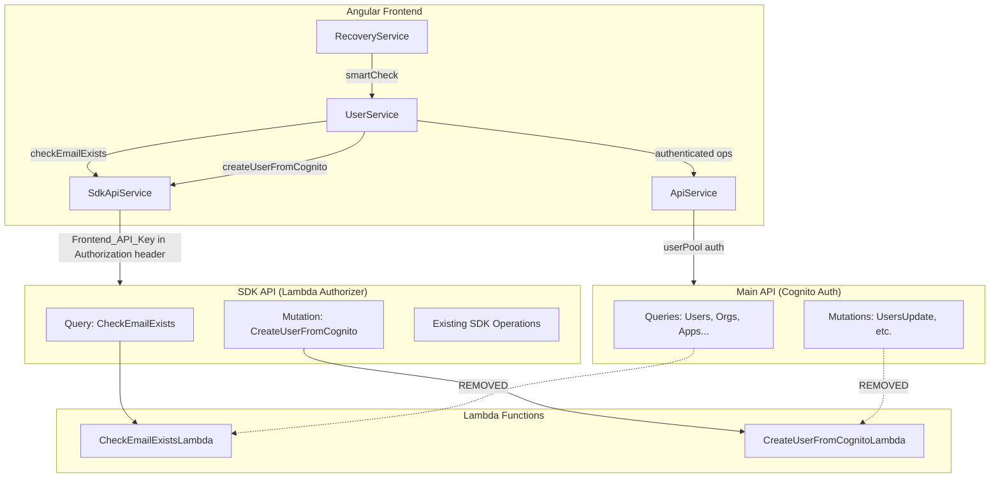

# Design Document: Migrate Pre-Auth Operations to SDK API

## Overview

The orb-integration-hub platform has a dual AppSync API architecture: a Main API (Cognito userPool auth) and an SDK API (Lambda authorizer). Two pre-authentication operations — `CheckEmailExists` and `CreateUserFromCognito` — are annotated with `@aws_api_key` on the Main API schema, but the Main API has no API key auth mode configured. The frontend calls these with `authMode: 'apiKey'`, which fails at runtime.

This design migrates these operations to the SDK API, introduces a dedicated SDK GraphQL client on the frontend, cleans up stale `@aws_api_key` annotations and unused `apiKey` configuration, provisions a frontend API key for the SDK API, and documents the dual-API architecture.

### Key Design Decisions

1. **Direct HTTP fetch instead of Amplify `generateClient` for SDK API**: The Amplify `generateClient` is tightly coupled to the single API configured in `Amplify.configure()`. Rather than fighting Amplify's single-API assumption, the SDK client will use a lightweight `fetch`-based GraphQL client that sends requests directly to the SDK API endpoint with the `Authorization` header containing the Frontend_API_Key. This avoids Amplify configuration conflicts and keeps the SDK client independent.

2. **Schema changes via orb-schema-generator YAML files**: Both the Main API and SDK API schemas are auto-generated. All schema modifications must be made in the YAML schema files under `schemas/` and regenerated. The design specifies the YAML changes needed.

3. **Lambda authorizer validates the Frontend_API_Key**: The SDK API uses a Lambda authorizer that validates keys in `orb_{env}_{key}` format. The frontend API key follows this same format and is validated by the existing authorizer — no authorizer changes needed.

4. **SSM-based key provisioning**: The Frontend_API_Key is stored in SSM at `/orb/integration-hub/{env}/appsync/sdk-frontend-api-key` and retrieved by the `setup-dev-env.js` script, consistent with existing credential provisioning patterns.

## Architecture



### Before vs After

| Aspect | Before | After |
|--------|--------|-------|
| CheckEmailExists endpoint | Main API (broken `@aws_api_key`) | SDK API (Lambda authorizer) |
| CreateUserFromCognito endpoint | Main API (broken `@aws_api_key`) | SDK API (Lambda authorizer) |
| Frontend SDK client | None | `SdkApiService` with fetch-based client |
| `apiKey` in environment config | Present but unused | Removed; replaced by `sdkApi.apiKey` |
| `apiKeyClient` in ApiService | Present but broken | Removed |
| Main API schema | Has `@aws_api_key` annotations | Clean — Cognito-only annotations |

## Components and Interfaces

### 1. SdkApiService (New)

A new Angular service that provides a lightweight GraphQL client for the SDK API.

**Location**: `apps/web/src/app/core/services/sdk-api.service.ts`

```typescript
@Injectable({ providedIn: 'root' })
export class SdkApiService {
  private sdkEndpoint: string;
  private sdkApiKey: string;

  constructor() {
    this.sdkEndpoint = environment.sdkApi.url;
    this.sdkApiKey = environment.sdkApi.apiKey;
  }

  /**
   * Execute a GraphQL query against the SDK API.
   * Sends the Frontend_API_Key in the Authorization header.
   */
  async query<T>(query: string, variables?: Record<string, unknown>): Promise<GraphQLResult<T>>;

  /**
   * Execute a GraphQL mutation against the SDK API.
   */
  async mutate<T>(mutation: string, variables?: Record<string, unknown>): Promise<GraphQLResult<T>>;
}
```

**Design rationale**: Using `fetch` directly avoids coupling to Amplify's single-API configuration. The Lambda authorizer expects the API key in the `Authorization` header, which `fetch` handles trivially.

### 2. ApiService (Modified)

**Changes**:
- Remove `apiKeyClient` field (`generateClient({ authMode: 'apiKey' })`)
- Remove or redirect `apiKey` auth mode in the `execute()` method — if `authMode === 'apiKey'` is passed, throw an error with a message directing callers to use `SdkApiService` instead

### 3. UserService (Modified)

**Changes**:
- Inject `SdkApiService`
- `checkEmailExists()`: Call `sdkApiService.query()` instead of `this.query(..., 'apiKey')`
- `createUserFromCognito()`: Call `sdkApiService.mutate()` instead of `this.mutate(..., 'apiKey')`
- Add error handling that distinguishes network errors from authorization errors

### 4. RecoveryService (No Changes)

`RecoveryService.smartCheck()` calls `UserService.checkEmailExists()` and consumes the same response shape. Since only the transport layer changes inside `UserService`, `RecoveryService` requires no modifications.

### 5. Environment Configuration (Modified)

**Add** `sdkApi` block to all environment files:

```typescript
export const environment = {
  // ... existing config ...
  sdkApi: {
    url: '{{SDK_API_URL}}',
    apiKey: '{{SDK_API_KEY}}',
    region: '{{AWS_REGION}}'
  }
};
```

**Remove** `apiKey` from the `graphql` block in all environment files.

### 6. SDK API Schema (Modified via YAML)

Add `CheckEmailExists` query and `CreateUserFromCognito` mutation to the SDK API schema by updating the relevant YAML schema files. After regeneration, the SDK API schema will include:

```graphql
type CheckEmailExists {
  email: String!
  exists: Boolean
  cognitoStatus: String
  cognitoSub: String
}

input CheckEmailExistsInput {
  email: String!
  exists: Boolean
  cognitoStatus: String
  cognitoSub: String
}

type CreateUserFromCognito {
  cognitoSub: String!
  userId: String
  email: String
  firstName: String
  lastName: String
  status: String
  emailVerified: Boolean
  phoneVerified: Boolean
  mfaEnabled: Boolean
  mfaSetupComplete: Boolean
  groups: [String]
  createdAt: AWSTimestamp
  updatedAt: AWSTimestamp
}

input CreateUserFromCognitoInput {
  cognitoSub: String!
  # ... remaining fields matching Main API
}
```

### 7. SDK API CDK Construct (Modified via YAML + Regeneration)

After schema regeneration, the SDK API CDK construct (`sdk_api.py`) will include Lambda data sources and resolvers for `CheckEmailExists` and `CreateUserFromCognito`, wired to the existing Lambda functions via SSM parameter ARN lookup.

### 8. Main API Schema (Modified via YAML)

Remove `@aws_api_key` annotations from `CheckEmailExists` and `CreateUserFromCognito` types and field definitions. Remove the Lambda data sources and resolvers for these operations from the Main API CDK construct.

### 9. setup-dev-env.js (Modified)

Add retrieval of SDK API URL and Frontend_API_Key from SSM:

```javascript
const FRONTEND_SECRETS_MAP = {
  // ... existing entries ...
  'SDK_API_URL': {
    type: 'parameter',
    name: ssmParameterName('appsync/sdk-graphql-url')
  },
  'SDK_API_KEY': {
    type: 'parameter',
    name: ssmParameterName('appsync/sdk-frontend-api-key')
  }
};
```

### 10. Frontend API Key Provisioning

A dedicated API key in `orb_{env}_{key}` format is provisioned and stored in SSM at `/orb/integration-hub/{env}/appsync/sdk-frontend-api-key`. This is a manual provisioning step (or a CDK custom resource) — the key is created in the ApplicationApiKeys DynamoDB table with permissions scoped to `CheckEmailExists` and `CreateUserFromCognito` operations only.

The Lambda authorizer already validates keys from this table, so no authorizer changes are needed.


## Data Models

### Environment Configuration Interface

```typescript
interface EnvironmentConfig {
  appName: string;
  production: boolean;
  debugMode: boolean;
  loggingLevel: string;
  cognito: {
    userPoolId: string;
    userPoolClientId: string;
    qrCodeIssuer: string;
  };
  graphql: {
    url: string;
    region: string;
    // apiKey: REMOVED
  };
  sdkApi: {                    // NEW
    url: string;
    apiKey: string;
    region: string;
  };
}
```

### SDK API Request/Response

The `SdkApiService` sends standard GraphQL POST requests:

```typescript
// Request body
interface GraphQLRequest {
  query: string;
  variables?: Record<string, unknown>;
}

// Response body (matches existing GraphQLResult<T>)
interface GraphQLResult<T> {
  data?: T;
  errors?: GraphQLError[];
}
```

### CheckEmailExists Response (Unchanged)

```typescript
interface CheckEmailExistsResponse {
  CheckEmailExists?: {
    email: string;
    exists: boolean;
    cognitoStatus?: string | null;
    cognitoSub?: string | null;
  };
}
```

### CreateUserFromCognito Response (Unchanged)

```typescript
interface CreateUserFromCognitoResponse {
  CreateUserFromCognito?: {
    cognitoSub: string;
    userId: string;
    email: string;
    firstName: string;
    lastName: string;
    status: string;
    emailVerified: boolean;
    phoneVerified: boolean;
    mfaEnabled: boolean;
    mfaSetupComplete: boolean;
    groups: string[];
    createdAt: number;
    updatedAt: number;
  };
}
```

### SSM Parameter Paths

| Parameter | Path | Description |
|-----------|------|-------------|
| SDK API URL | `/orb/integration-hub/{env}/appsync/sdk-graphql-url` | Already exists |
| SDK Frontend API Key | `/orb/integration-hub/{env}/appsync/sdk-frontend-api-key` | New — stores the `orb_{env}_{key}` value |
| CheckEmailExists Lambda ARN | `/orb/integration-hub/{env}/lambda/checkemailexists/arn` | Already exists |
| CreateUserFromCognito Lambda ARN | `/orb/integration-hub/{env}/lambda/createuserfromcognito/arn` | Already exists |


## Correctness Properties

*A property is a characteristic or behavior that should hold true across all valid executions of a system — essentially, a formal statement about what the system should do. Properties serve as the bridge between human-readable specifications and machine-verifiable correctness guarantees.*

### Property 1: SDK client sends correct Authorization header

*For any* GraphQL operation string and variables object, when `SdkApiService` executes the operation, the HTTP request SHALL include the `Authorization` header set to the configured `sdkApi.apiKey` value and the request URL SHALL match the configured `sdkApi.url` endpoint.

**Validates: Requirements 2.4**

### Property 2: Pre-auth operations route through SDK client

*For any* email string passed to `checkEmailExists()` and *for any* cognitoSub string passed to `createUserFromCognito()`, the `UserService` SHALL delegate the GraphQL execution to `SdkApiService` (not to the Main API client). The SDK client's `query` or `mutate` method SHALL be called exactly once, and the Main API client's `query` or `mutate` methods SHALL not be called.

**Validates: Requirements 3.1, 3.2**

### Property 3: Response shape compatibility

*For any* valid `CheckEmailExists` response from the SDK API containing `{ email, exists, cognitoStatus, cognitoSub }`, the `UserService.checkEmailExists()` method SHALL return an object with the same `{ exists, cognitoStatus, cognitoSub }` shape that `RecoveryService.smartCheck()` consumes, preserving all field values.

**Validates: Requirements 3.3**

### Property 4: Error classification correctness

*For any* error thrown by the SDK client, if the error indicates a network failure (e.g., `Failed to fetch`, `ERR_NAME_NOT_RESOLVED`, `NetworkError`), the `UserService` SHALL throw an error whose message indicates the SDK API is unreachable. If the error indicates an authorization failure (e.g., HTTP 401, `Unauthorized`), the `UserService` SHALL throw an error whose message indicates the Frontend_API_Key is invalid or expired. The two error categories SHALL be mutually exclusive.

**Validates: Requirements 3.4, 3.5**

### Property 5: apiKey auth mode rejection

*For any* GraphQL operation string and variables, when `ApiService.execute()` is called with `authMode === 'apiKey'`, the method SHALL throw an error (not silently succeed or route to the Main API). The error message SHALL indicate that callers should use `SdkApiService` for SDK API operations.

**Validates: Requirements 5.5**

## Error Handling

### SdkApiService Errors

| Error Scenario | Detection | Behavior |
|----------------|-----------|----------|
| Network failure (DNS, timeout, connection refused) | `fetch` throws `TypeError` or error message contains network-related keywords | Throw `NetworkError` with message: "SDK API is unreachable. Check network connectivity." |
| HTTP non-200 response | `response.ok === false` | Parse response body for GraphQL errors; if 401/403, throw `AuthenticationError` |
| Authorization failure (invalid/expired key) | HTTP 401 or GraphQL error with `Unauthorized` type | Throw `AuthenticationError` with message: "SDK API key is invalid or expired. Contact your administrator." |
| GraphQL errors in response body | `response.data.errors` array is non-empty | Throw `ApiError` with the first error message |
| Invalid JSON response | `response.json()` throws | Throw `ApiError` with message: "Invalid response from SDK API" |

### ApiService apiKey Rejection

When `execute()` receives `authMode === 'apiKey'`:
- Throw `ApiError` with code `DEPRECATED_AUTH_MODE`
- Message: "apiKey auth mode is no longer supported on the Main API. Use SdkApiService for pre-auth operations."
- Log a warning via `DebugLogService`

### UserService Error Wrapping

`checkEmailExists()` and `createUserFromCognito()` catch errors from `SdkApiService` and re-throw with context-specific messages:

```typescript
try {
  const response = await this.sdkApiService.query<CheckEmailExistsResponse>(...);
  // process response
} catch (error) {
  if (error instanceof NetworkError) {
    throw new Error('Failed to check email existence: SDK API is unreachable');
  }
  if (error instanceof AuthenticationError) {
    throw new Error('Failed to check email existence: API key is invalid or expired');
  }
  throw new Error('Failed to check email existence');
}
```

## Testing Strategy

### Unit Tests

Unit tests verify specific examples and edge cases:

| Test | Description | File |
|------|-------------|------|
| SdkApiService constructs correct request | Verify fetch is called with correct URL, headers, body | `sdk-api.service.spec.ts` |
| SdkApiService handles empty response | Verify graceful handling when response has no data | `sdk-api.service.spec.ts` |
| UserService.checkEmailExists uses SDK client | Mock SdkApiService, verify it's called (not ApiService) | `user.service.spec.ts` |
| UserService.createUserFromCognito uses SDK client | Mock SdkApiService, verify it's called | `user.service.spec.ts` |
| ApiService rejects apiKey auth mode | Verify error thrown when apiKey is passed | `api.service.spec.ts` |
| ApiService no longer has apiKeyClient | Verify the field is removed | `api.service.spec.ts` |
| Environment config has sdkApi block | Verify structure of environment files | `environment.spec.ts` |
| Environment config has no graphql.apiKey | Verify apiKey removed from graphql block | `environment.spec.ts` |
| RecoveryService.smartCheck still works | Integration test with mocked UserService | `recovery.service.spec.ts` |

### Property-Based Tests

Property tests verify universal properties across generated inputs. Use `fast-check` as the property-based testing library.

Each test runs a minimum of 100 iterations and is tagged with the design property reference.

| Property | Test Description | Library |
|----------|-----------------|---------|
| Property 1 | Generate random operation strings and variables; verify Authorization header and URL | fast-check |
| Property 2 | Generate random email/cognitoSub strings; verify SDK client is called, Main API client is not | fast-check |
| Property 3 | Generate random CheckEmailExists response shapes; verify UserService returns matching shape | fast-check |
| Property 4 | Generate random error objects (network vs auth); verify correct error classification | fast-check |
| Property 5 | Generate random operation strings; verify apiKey auth mode throws | fast-check |

**Property test tag format**: `Feature: migrate-auth-to-sdk-api, Property {N}: {title}`

Example:
```typescript
// Feature: migrate-auth-to-sdk-api, Property 1: SDK client sends correct Authorization header
it('should send correct Authorization header for all operations', () => {
  fc.assert(
    fc.property(
      fc.string({ minLength: 1 }),  // operation
      fc.dictionary(fc.string(), fc.jsonValue()),  // variables
      async (operation, variables) => {
        // ... verify header and URL
      }
    ),
    { numRuns: 100 }
  );
});
```

### CDK Snapshot Tests

Verify infrastructure changes via CDK snapshot tests:

| Test | Description |
|------|-------------|
| SDK API construct includes CheckEmailExists resolver | Snapshot includes Lambda data source and resolver |
| SDK API construct includes CreateUserFromCognito resolver | Snapshot includes Lambda data source and resolver |
| Main API construct excludes CheckEmailExists resolver | Snapshot no longer includes these resolvers |
| Main API construct excludes CreateUserFromCognito resolver | Snapshot no longer includes these resolvers |

### Integration Tests (Manual)

These require a deployed environment and are run manually:

1. Call `CheckEmailExists` via SDK API with valid Frontend_API_Key → expect success
2. Call `CreateUserFromCognito` via SDK API with valid Frontend_API_Key → expect success
3. Call `CheckEmailExists` via SDK API with invalid key → expect 401
4. Full signup flow: email check → Cognito signup → email verify → MFA → CreateUserFromCognito → dashboard
