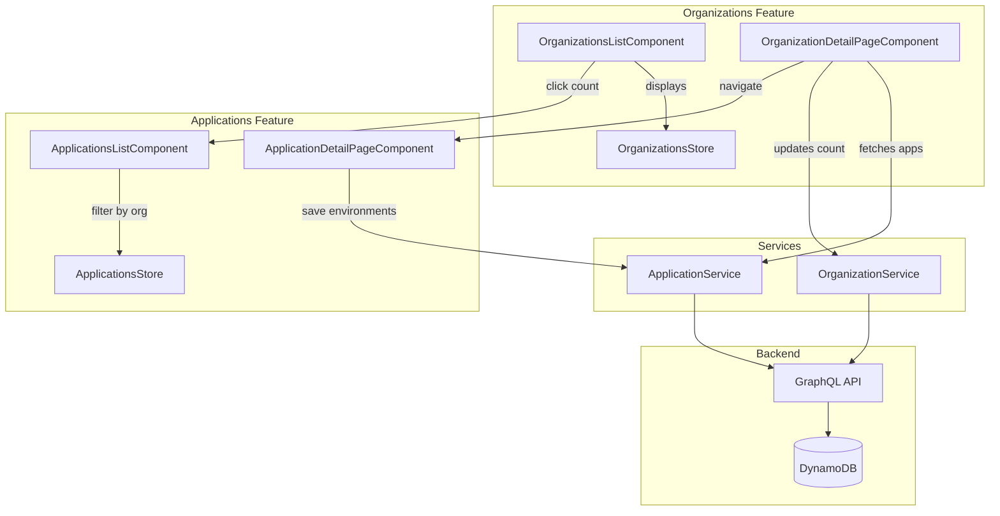

# Design Document: Organizations-Applications Integration

## Overview

This design addresses the integration gaps between Organizations and Applications features in the orb-integration-hub frontend. The implementation adds:

1. A denormalized `applicationCount` attribute to Organizations for efficient list display
2. An Applications section on the Organization detail page showing linked applications
3. Environment selection checkboxes on the Application detail page
4. Navigation from organization application count to filtered applications list

The design follows existing patterns from the Organizations and Applications features, using NgRx for state management and the established service layer for GraphQL operations.

## Architecture



## Components and Interfaces

### Schema Changes

Add `applicationCount` attribute to Organizations schema:

```yaml
# schemas/tables/Organizations.yml - add to attributes section
applicationCount:
  type: integer
  required: false
  default: 0
  description: Denormalized count of applications belonging to this organization
```

After schema change, run `pipenv run orb-schema generate` to regenerate models.

### OrganizationsListComponent Updates

The component already has an `appCountCell` template reference. Update to:
- Display `applicationCount` from the organization record
- Make the count clickable to navigate to filtered applications list

```typescript
// organizations-list.component.ts - add method
onApplicationCountClick(event: Event, row: OrganizationTableRow): void {
  event.stopPropagation(); // Prevent row click
  this.router.navigate(['/customers/applications'], {
    queryParams: { organizationId: row.organization.organizationId }
  });
}
```

```html
<!-- organizations-list.component.html - update appCountCell template -->
<ng-template #appCountCell let-row>
  <button 
    class="app-count-link"
    (click)="onApplicationCountClick($event, row)"
    [attr.aria-label]="'View ' + row.applicationCount + ' applications'">
    {{ row.applicationCount }}
  </button>
</ng-template>
```

### ApplicationsListComponent Updates

Add support for query parameter filtering:

```typescript
// applications-list.component.ts - update ngOnInit
ngOnInit(): void {
  // Check for organization filter from query params
  this.route.queryParams.pipe(
    takeUntil(this.destroy$)
  ).subscribe(params => {
    if (params['organizationId']) {
      this.organizationFilter = params['organizationId'];
    }
  });
  
  // ... existing user loading logic
}
```

### OrganizationDetailPageComponent Updates

Add applications section with loading, display, and navigation:

```typescript
// organization-detail-page.component.ts - add properties
applications: IApplications[] = [];
applicationsLoading = false;
applicationsError: string | null = null;

// Add method to load applications
private loadApplications(): void {
  if (!this.organization?.organizationId) return;
  
  this.applicationsLoading = true;
  this.applicationsError = null;
  
  this.applicationService.getApplicationsByOrganization(
    this.organization.organizationId
  ).pipe(
    take(1)
  ).subscribe({
    next: (connection) => {
      this.applications = connection.items.filter(
        app => app.status !== ApplicationStatus.Pending
      );
      this.applicationsLoading = false;
      
      // Update applicationCount if different
      this.syncApplicationCount();
    },
    error: (error) => {
      this.applicationsError = error.message || 'Failed to load applications';
      this.applicationsLoading = false;
    }
  });
}

private syncApplicationCount(): void {
  const actualCount = this.applications.length;
  if (this.organization && this.organization.applicationCount !== actualCount) {
    this.organizationService.updateOrganization({
      ...this.organization,
      applicationCount: actualCount
    }).pipe(take(1)).subscribe();
  }
}

onCreateApplication(): void {
  const tempId = 'new-' + Date.now();
  // Pass organizationId as query param for pre-selection
  this.router.navigate(['/customers/applications', tempId], {
    queryParams: { organizationId: this.organization?.organizationId }
  });
}

onApplicationClick(application: IApplications): void {
  this.router.navigate(['/customers/applications', application.applicationId]);
}
```

### ApplicationDetailPageComponent Updates

Add environment selection with checkboxes:

```typescript
// application-detail-page.component.ts - add to editForm
editForm = {
  name: '',
  description: '',
  organizationId: '',
  environments: [] as string[]
};

// Add validation error
validationErrors = {
  name: '',
  description: '',
  organizationId: '',
  environments: ''
};

// Available environments (from schema enum)
readonly availableEnvironments = [
  { value: 'PRODUCTION', label: 'Production', description: 'Live production environment' },
  { value: 'STAGING', label: 'Staging', description: 'Pre-production testing' },
  { value: 'DEVELOPMENT', label: 'Development', description: 'Development and debugging' },
  { value: 'TEST', label: 'Test', description: 'Automated testing' },
  { value: 'PREVIEW', label: 'Preview', description: 'Feature previews and demos' }
];

// Update loadFormData
private loadFormData(): void {
  if (this.application) {
    this.editForm = {
      name: this.application.name || '',
      description: '',
      organizationId: this.application.organizationId || '',
      environments: [...(this.application.environments || [])]
    };
  }
}

// Add environment toggle method
onEnvironmentToggle(env: string): void {
  const index = this.editForm.environments.indexOf(env);
  if (index === -1) {
    this.editForm.environments.push(env);
  } else {
    this.editForm.environments.splice(index, 1);
  }
  // Clear validation error when user makes a selection
  if (this.editForm.environments.length > 0) {
    this.validationErrors.environments = '';
  }
}

isEnvironmentSelected(env: string): boolean {
  return this.editForm.environments.includes(env);
}

// Update validateForm
private validateForm(): boolean {
  // ... existing validation
  
  // Environment validation
  if (this.editForm.environments.length === 0) {
    this.validationErrors.environments = 'At least one environment must be selected';
    isValid = false;
  }
  
  return isValid;
}

// Update onSave to include environments
onSave(): void {
  // ... existing validation
  
  const updateData = {
    applicationId: this.application.applicationId,
    name: this.editForm.name.trim(),
    organizationId: this.editForm.organizationId,
    status: this.isDraft ? ApplicationStatus.Active : this.application.status,
    environments: this.editForm.environments
  };
  
  // ... rest of save logic
}
```

## Data Models

### OrganizationsModel Update

After schema regeneration, the Organizations model will include:

```typescript
interface IOrganizations {
  organizationId: string;
  name: string;
  description?: string;
  ownerId: string;
  status: OrganizationStatus;
  createdAt: Date;
  updatedAt: Date;
  applicationCount?: number;  // New field
  kmsKeyId?: string;
  kmsKeyArn?: string;
  kmsAlias?: string;
}
```

### OrganizationTableRow Update

```typescript
interface OrganizationTableRow {
  organization: Organizations;
  userRole: string;
  isOwner: boolean;
  memberCount: number;
  applicationCount: number;  // Now populated from organization.applicationCount
}
```

## Correctness Properties

*A property is a characteristic or behavior that should hold true across all valid executions of a system—essentially, a formal statement about what the system should do. Properties serve as the bridge between human-readable specifications and machine-verifiable correctness guarantees.*


### Property 1: Organization rows display applicationCount correctly

*For any* organization with an applicationCount value, the OrganizationTableRow SHALL contain that same applicationCount value, and the rendered list SHALL display that count in the Applications column.

**Validates: Requirements 1.2, 1.3**

### Property 2: Application list renders with required fields

*For any* list of applications displayed in the Organization detail page, each rendered application row SHALL contain the application's name, status badge, and environment count.

**Validates: Requirements 2.2, 2.3**

### Property 3: Application count synchronization

*For any* organization, after loading applications on the detail page, the organization's applicationCount SHALL equal the actual number of non-PENDING applications. When an application is created, the count SHALL increment by 1. When an application is deleted, the count SHALL decrement by 1.

**Validates: Requirements 2.9, 2.10, 2.11**

### Property 4: Environment toggle updates form state

*For any* environment checkbox toggle action, the form state's environments array SHALL reflect the toggle: if the environment was not selected, it SHALL be added; if it was selected, it SHALL be removed.

**Validates: Requirements 3.3**

### Property 5: Save persists environments

*For any* application save operation, the ApplicationService SHALL receive the complete environments array from the form state, and the persisted application SHALL contain exactly those environments.

**Validates: Requirements 3.4**

### Property 6: Empty environments validation

*For any* form state where the environments array is empty, the validateForm function SHALL return false and set a validation error message for environments.

**Validates: Requirements 3.5**

### Property 7: Applications store updates on create

*For any* application created from the Organization detail page, the Applications store SHALL contain the new application after the create operation completes.

**Validates: Requirements 4.1**

### Property 8: Organizations store updates count on delete

*For any* application deletion, the Organizations store SHALL update the applicationCount for the affected organization to reflect the deletion.

**Validates: Requirements 4.2**

## Error Handling

### Organization List
- If organization loading fails, display error message and retry option
- If applicationCount is undefined/null, display 0

### Organization Detail - Applications Section
- Loading state: Show spinner while fetching applications
- Error state: Show error message with retry button
- Empty state: Show "No applications yet" with Create button

### Application Detail - Environments
- Validation error: Show inline error below checkboxes
- Save error: Show error banner at top of form

## Testing Strategy

### Unit Tests
- OrganizationsListComponent: Test applicationCount display and click navigation
- OrganizationDetailPageComponent: Test applications section rendering, loading states, empty state
- ApplicationDetailPageComponent: Test environment checkboxes, toggle behavior, validation

### Property-Based Tests
Use `fast-check` library with minimum 100 iterations per property:

1. **Property 1**: Generate random organizations with applicationCount, verify store and display
2. **Property 2**: Generate random applications, verify all required fields rendered
3. **Property 3**: Generate organizations with apps, verify count sync logic
4. **Property 4**: Generate toggle sequences, verify form state consistency
5. **Property 5**: Generate environment selections, verify save payload
6. **Property 6**: Generate empty environment states, verify validation fails
7. **Property 7**: Generate create operations, verify store contains new app
8. **Property 8**: Generate delete operations, verify count decremented

### Integration Tests
- End-to-end flow: Create org → Create app → Verify count → Delete app → Verify count
- Navigation flow: Org list → Click count → Apps list filtered
