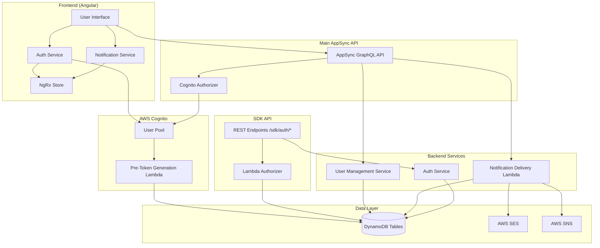
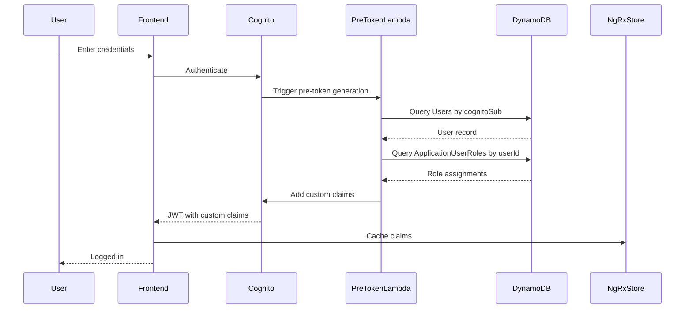
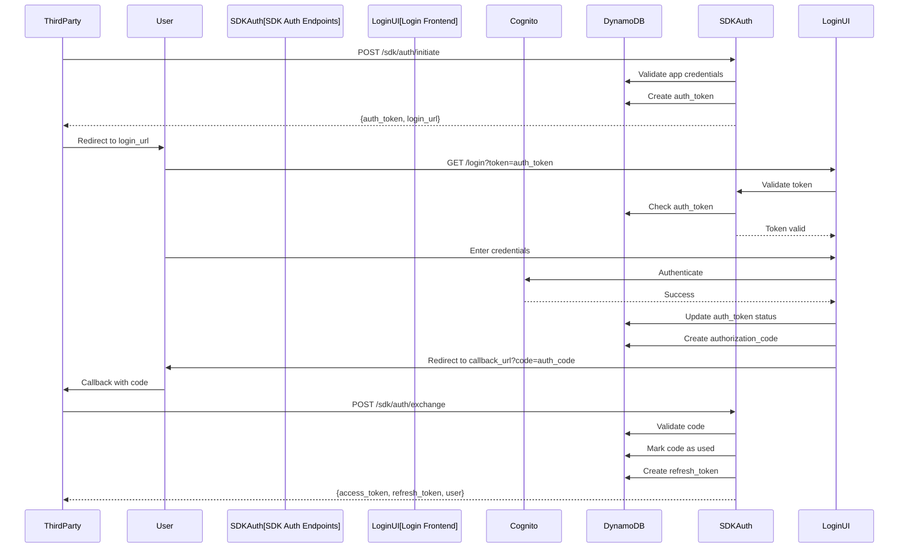
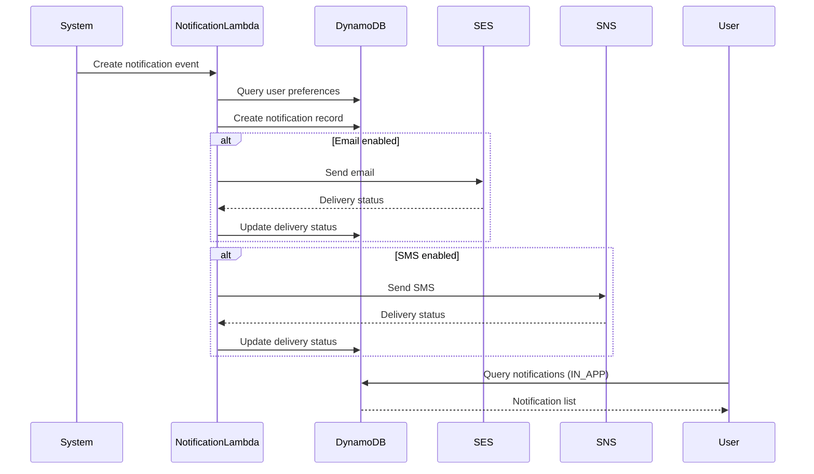
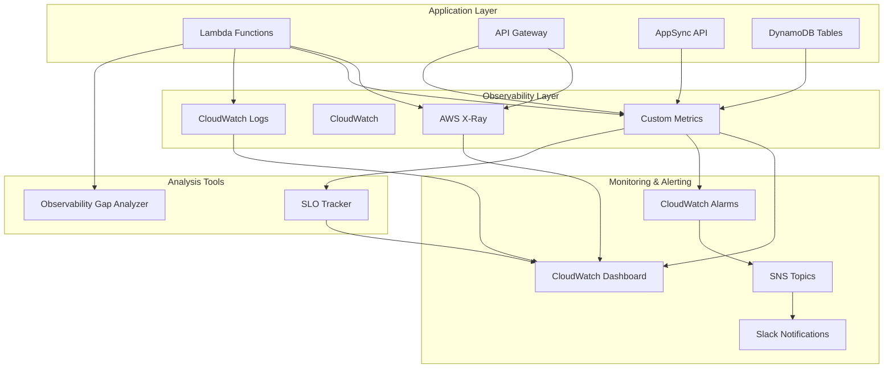
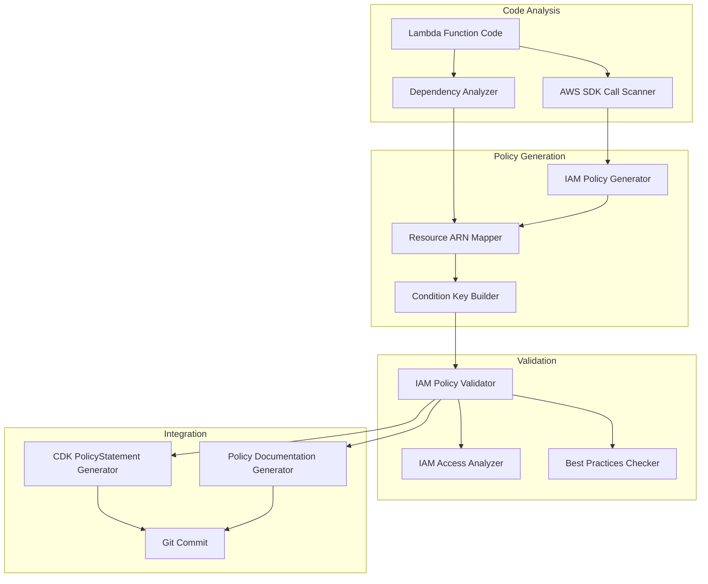
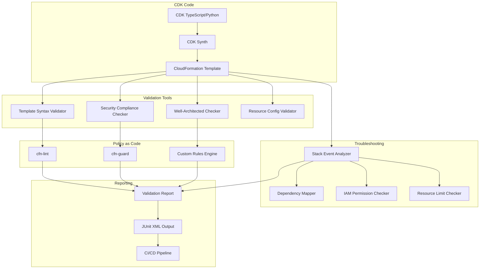
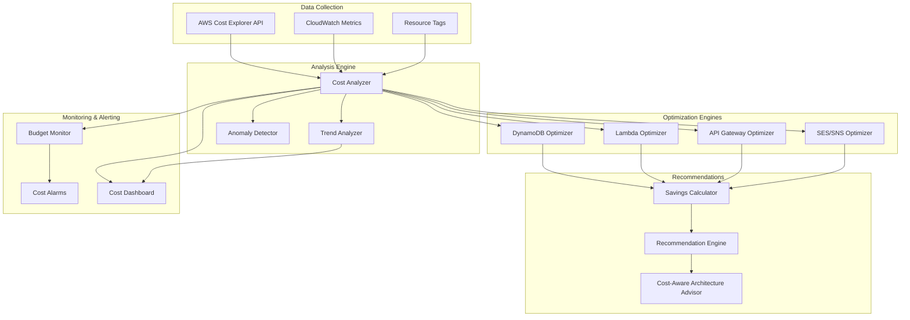

# Design Document: Production Readiness Features

## Overview

This design document specifies the implementation of nine critical production readiness features for the orb-integration-hub platform. These features address authentication, authorization, user lifecycle management, notification delivery, observability, infrastructure automation, and cost optimization - all essential for a production-grade multi-tenant SaaS application.

The features are:
1. **JWT Token Claims Enhancement** - Enriches Cognito JWT tokens with custom claims for authorization
2. **Third-Party OAuth Authentication Flow** - Implements OAuth-style authentication for third-party applications
3. **Admin User Management** - Provides user removal and role management capabilities
4. **Notifications UI System** - Displays and manages in-app notifications
5. **Email/SMS Notification Delivery** - Delivers notifications via email and SMS channels
6. **Observability and Monitoring** - Comprehensive monitoring, alerting, and distributed tracing
7. **IAM Policy Automation** - Auto-generated least-privilege policies from Lambda code analysis
8. **Infrastructure Validation** - CDK template validation and security compliance checking
9. **Cost Optimization** - Resource cost analysis and optimization recommendations

### Design Goals

- Maintain strict separation between SDK API (Lambda authorizer) and Main AppSync API (Cognito authentication)
- Minimize database queries by caching authorization data in JWT tokens
- Implement secure OAuth flow with proper token lifecycle management
- Provide comprehensive notification system with multiple delivery channels
- Follow orb-templates standards for testing, documentation, and code quality

### Architecture Context

The orb-integration-hub platform has two distinct API boundaries:

**SDK API** - For third-party integrations, secured with Lambda authorizer and API keys
**Main AppSync API** - For web application, secured with Cognito authentication

This design maintains strict separation between these APIs to prevent security vulnerabilities.

## Architecture

### System Components




### JWT Token Enhancement Flow




### OAuth Authentication Flow




### Notification Delivery Flow




### Observability System Architecture



### IAM Policy Automation Architecture




### Infrastructure Validation Architecture



### Cost Optimization Architecture



## Components and Interfaces

### 1. Pre-Token Generation Lambda

**Purpose:** Enriches Cognito JWT tokens with custom claims for authorization

**Location:** `apps/api/lambdas/pre_cognito_claims/index.py`

**Trigger:** Cognito Pre-Token Generation event

**Input:**
```python
{
    "request": {
        "userAttributes": {
            "sub": "cognito-user-sub",
            "email": "user@example.com"
        },
        "groupConfiguration": {
            "groupsToOverride": ["USER", "CUSTOMER"]
        },
        "clientMetadata": {
            "applicationId": "app-uuid"
        }
    }
}
```

**Output:**
```python
{
    "response": {
        "claimsOverrideDetails": {
            "claimsToAddOrOverride": {
                "userId": "user-uuid",
                "email": "user@example.com",
                "cognitoSub": "cognito-user-sub",
                "groups": ["USER", "CUSTOMER"],
                "organizations": [{"orgId": "org-uuid", "role": "MEMBER"}],
                "applicationPermissions": [
                    {
                        "applicationId": "app-uuid",
                        "environment": "PRODUCTION",
                        "roleName": "ADMIN"
                    }
                ]
            }
        }
    }
}
```

**Key Operations:**
- Query Users table by cognitoSub to get userId
- Query ApplicationUserRoles table by userId to get all role assignments
- Transform role assignments into JWT claims format
- Handle errors gracefully (return token without custom claims on failure)
- Complete within 5 seconds to avoid Cognito timeout

**Dependencies:**
- `layers.authentication_dynamodb.CoreDynamoDBService`
- `layers.authentication_dynamodb.core.auth_service`

### 2. SDK Auth Endpoints

**Purpose:** Implement OAuth-style authentication flow for third-party applications

**Location:** `apps/api/lambdas/sdk_auth/` (new)

**Endpoints:**

#### POST /sdk/auth/initiate
```

#### 6.2 CloudWatch Alarms

**Purpose:** Proactive alerting for system issues

**Location:** `infrastructure/cdk/lib/observability/alarms-stack.ts`

**Alarm Definitions:**

| Alarm Name | Metric | Threshold | Period | Action |
|------------|--------|-----------|--------|--------|
| AuthFailureRate | Authentication failures / total attempts | > 10% | 5 min | SNS → Slack |
| TokenGenerationErrors | Token generation errors | > 5/min | 5 min | SNS → Slack |
| NotificationFailureRate | Failed deliveries / total attempts | > 15% | 10 min | SNS → Slack |
| LambdaErrorRate | Lambda errors / invocations | > 5% | 5 min | SNS → Slack |
| DynamoDBThrottling | Throttled requests | > 0 | 1 min | SNS → Slack |
| APIGateway5xxRate | 5xx errors / total requests | > 1% | 5 min | SNS → Slack |
| LambdaTimeoutWarning | Duration / timeout threshold | > 80% | 5 min | SNS → Email |

**SNS Topic Configuration:**
```typescript
{
  topicName: "orb-integration-hub-alerts",
  subscriptions: [
    { protocol: "email", endpoint: "ops@example.com" },
    { protocol: "https", endpoint: "https://hooks.slack.com/..." }
  ]
}
```

#### 6.3 X-Ray Distributed Tracing

**Purpose:** End-to-end request tracing across services

**Location:** Enabled via CDK for all Lambda functions, API Gateway, and DynamoDB

**Trace Segments:**
- OAuth Flow: Initiate → Token Validation → Authentication → Code Generation → Exchange
- JWT Generation: Cognito Trigger → DynamoDB Queries → Claims Addition
- Notification Delivery: Creation → Preference Check → SES/SNS Call → Status Update

**Configuration:**
```typescript
{
  tracingEnabled: true,
  samplingRate: 1.0, // 100% for production critical paths
  retentionDays: 30
}
```

**Trace Annotations:**
```python
# In Lambda functions
from aws_xray_sdk.core import xray_recorder

@xray_recorder.capture('oauth_initiate')
def handle_initiate(event):
    xray_recorder.put_annotation('client_id', client_id)
    xray_recorder.put_annotation('environment', environment)
    # ... function logic
```

#### 6.4 Custom Metrics Emission

**Purpose:** Application-specific metrics for business logic monitoring

**Location:** `apps/api/lambdas/shared/metrics.py`

**Metric Definitions:**
```python
class MetricsEmitter:
    def emit_oauth_flow_metric(self, flow_type: str, duration_ms: int, outcome: str):
        cloudwatch.put_metric_data(
            Namespace='OrbIntegrationHub/OAuth',
            MetricData=[
                {
                    'MetricName': f'{flow_type}Duration',
                    'Value': duration_ms,
                    'Unit': 'Milliseconds',
                    'Dimensions': [{'Name': 'Outcome', 'Value': outcome}]
                }
            ]
        )
    
    def emit_token_generation_metric(self, token_type: str, expiration_hours: int):
        cloudwatch.put_metric_data(
            Namespace='OrbIntegrationHub/Tokens',
            MetricData=[
                {
                    'MetricName': 'TokenGenerated',
                    'Value': 1,
                    'Unit': 'Count',
                    'Dimensions': [
                        {'Name': 'TokenType', 'Value': token_type},
                        {'Name': 'Expiration', 'Value': str(expiration_hours)}
                    ]
                }
            ]
        )
```


#### 6.5 Structured Logging

**Purpose:** JSON-formatted logs with correlation IDs for easy parsing and tracing

**Location:** `apps/api/lambdas/shared/logger.py`

**Logger Configuration:**
```python
import json
import logging
from datetime import datetime
from uuid import uuid4

class StructuredLogger:
    def __init__(self, service_name: str):
        self.service_name = service_name
        self.correlation_id = str(uuid4())
    
    def log(self, level: str, message: str, **kwargs):
        log_entry = {
            'timestamp': datetime.utcnow().isoformat(),
            'level': level,
            'service': self.service_name,
            'correlation_id': self.correlation_id,
            'message': message,
            **kwargs
        }
        print(json.dumps(log_entry))
    
    def info(self, message: str, **kwargs):
        self.log('INFO', message, **kwargs)
    
    def error(self, message: str, error: Exception = None, **kwargs):
        error_data = {
            'error_type': type(error).__name__,
            'error_message': str(error)
        } if error else {}
        self.log('ERROR', message, **{**kwargs, **error_data})
```

**Usage Example:**
```python
logger = StructuredLogger('oauth-service')
logger.info('OAuth flow initiated', client_id=client_id, environment=env)
logger.error('Token validation failed', error=e, token_id=token_id)
```

#### 6.6 SLO Tracking System

**Purpose:** Track and visualize Service Level Objectives

**Location:** `infrastructure/cdk/lib/observability/slo-tracker.ts`

**SLO Definitions:**
```typescript
const slos = [
  {
    name: 'OAuth Flow Success Rate',
    target: 99.5,
    metric: 'OAuth/SuccessRate',
    period: Duration.days(30)
  },
  {
    name: 'JWT Generation Latency',
    target: 500, // p99 < 500ms
    metric: 'JWT/GenerationLatency',
    statistic: 'p99',
    period: Duration.days(30)
  },
  {
    name: 'Notification Delivery Success Rate',
    target: 98.0,
    metric: 'Notifications/DeliverySuccessRate',
    period: Duration.days(30)
  },
  {
    name: 'API Availability',
    target: 99.9,
    metric: 'API/Availability',
    period: Duration.days(30)
  }
];
```

**Dashboard Widget:**
```typescript
new GraphWidget({
  title: 'SLO Compliance',
  left: slos.map(slo => new Metric({
    namespace: 'OrbIntegrationHub/SLO',
    metricName: slo.name,
    statistic: 'Average'
  })),
  leftAnnotations: slos.map(slo => ({
    value: slo.target,
    color: '#2ca02c',
    label: `${slo.name} Target`
  }))
});
```

#### 6.7 Observability Gap Analyzer

**Purpose:** Identify Lambda functions missing observability instrumentation

**Location:** `tools/observability-gap-analyzer.py`

**Analysis Checks:**
```python
class ObservabilityGapAnalyzer:
    def analyze_lambda_function(self, function_path: str) -> List[str]:
        gaps = []
        code = read_file(function_path)
        
        # Check for error handling
        if 'try:' not in code or 'except' not in code:
            gaps.append('Missing error handling')
        
        # Check for CloudWatch metrics
        if 'put_metric_data' not in code and 'MetricsEmitter' not in code:
            gaps.append('Missing CloudWatch metrics emission')
        
        # Check for X-Ray tracing
        if 'xray_recorder' not in code and '@xray_recorder.capture' not in code:
            gaps.append('Missing X-Ray tracing annotations')
        
        # Check for structured logging
        if 'StructuredLogger' not in code and 'json.dumps' not in code:
            gaps.append('Missing structured logging')
        
        return gaps
    
    def generate_report(self, lambda_functions: List[str]) -> str:
        report = "# Observability Gap Analysis Report\n\n"
        for func in lambda_functions:
            gaps = self.analyze_lambda_function(func)
            if gaps:
                report += f"## {func}\n"
                for gap in gaps:
                    report += f"- ⚠️ {gap}\n"
                report += "\n"
        return report
```


### 7. IAM Policy Automation Components

#### 7.1 Lambda Code Scanner

**Purpose:** Scan Lambda function code for AWS SDK calls

**Location:** `tools/iam-policy-autopilot/code-scanner.py`

**Scanner Implementation:**
```python
import ast
from typing import List, Dict

class AWSSDKCallScanner:
    def __init__(self):
        self.sdk_patterns = {
            'boto3': ['client', 'resource'],
            'aws-sdk': ['DynamoDB', 'S3', 'SNS', 'SES', 'SecretsManager']
        }
    
    def scan_python_file(self, file_path: str) -> List[Dict]:
        """Scan Python file for boto3 calls"""
        with open(file_path, 'r') as f:
            tree = ast.parse(f.read())
        
        sdk_calls = []
        for node in ast.walk(tree):
            if isinstance(node, ast.Call):
                call_info = self._extract_sdk_call(node)
                if call_info:
                    sdk_calls.append(call_info)
        
        return sdk_calls
    
    def _extract_sdk_call(self, node: ast.Call) -> Dict:
        """Extract AWS service and operation from AST node"""
        # Example: dynamodb.get_item() → {'service': 'dynamodb', 'operation': 'GetItem'}
        if isinstance(node.func, ast.Attribute):
            if isinstance(node.func.value, ast.Name):
                service = node.func.value.id
                operation = self._to_pascal_case(node.func.attr)
                return {
                    'service': service,
                    'operation': operation,
                    'line': node.lineno
                }
        return None
    
    def _to_pascal_case(self, snake_str: str) -> str:
        """Convert snake_case to PascalCase"""
        return ''.join(word.capitalize() for word in snake_str.split('_'))
```

**Detected SDK Calls:**
```python
{
    'dynamodb': ['GetItem', 'PutItem', 'Query', 'UpdateItem', 'DeleteItem'],
    'cognito-idp': ['AdminGetUser', 'AdminUpdateUserAttributes'],
    'ses': ['SendEmail', 'SendTemplatedEmail'],
    'sns': ['Publish'],
    'secretsmanager': ['GetSecretValue'],
    'logs': ['CreateLogGroup', 'CreateLogStream', 'PutLogEvents']
}
```

#### 7.2 IAM Policy Generator

**Purpose:** Generate minimal IAM policies from detected SDK calls

**Location:** `tools/iam-policy-autopilot/policy-generator.py`

**Generator Implementation:**
```python
from typing import List, Dict

class IAMPolicyGenerator:
    def __init__(self, resource_arns: Dict[str, str]):
        self.resource_arns = resource_arns
        self.action_mapping = {
            'dynamodb': {
                'GetItem': 'dynamodb:GetItem',
                'PutItem': 'dynamodb:PutItem',
                'Query': 'dynamodb:Query',
                'UpdateItem': 'dynamodb:UpdateItem',
                'DeleteItem': 'dynamodb:DeleteItem'
            },
            'ses': {
                'SendEmail': 'ses:SendEmail',
                'SendTemplatedEmail': 'ses:SendTemplatedEmail'
            },
            'sns': {
                'Publish': 'sns:Publish'
            }
        }
    
    def generate_policy(self, sdk_calls: List[Dict]) -> Dict:
        """Generate IAM policy from SDK calls"""
        statements = []
        
        # Group by service
        by_service = {}
        for call in sdk_calls:
            service = call['service']
            if service not in by_service:
                by_service[service] = []
            by_service[service].append(call['operation'])
        
        # Generate statements
        for service, operations in by_service.items():
            statement = self._create_statement(service, operations)
            if statement:
                statements.append(statement)
        
        return {
            'Version': '2012-10-17',
            'Statement': statements
        }
    
    def _create_statement(self, service: str, operations: List[str]) -> Dict:
        """Create policy statement for a service"""
        actions = [
            self.action_mapping[service][op]
            for op in operations
            if service in self.action_mapping and op in self.action_mapping[service]
        ]
        
        if not actions:
            return None
        
        # Get resource ARN from mapping
        resource_arn = self.resource_arns.get(service, '*')
        
        statement = {
            'Effect': 'Allow',
            'Action': actions,
            'Resource': resource_arn
        }
        
        # Add condition keys for security
        if service == 'dynamodb':
            statement['Condition'] = {
                'Bool': {'aws:SecureTransport': 'true'}
            }
        
        return statement
```

**Generated Policy Example:**
```json
{
  "Version": "2012-10-17",
  "Statement": [
    {
      "Effect": "Allow",
      "Action": [
        "dynamodb:GetItem",
        "dynamodb:PutItem",
        "dynamodb:Query"
      ],
      "Resource": "arn:aws:dynamodb:us-east-1:123456789012:table/orb-integration-hub-*",
      "Condition": {
        "Bool": {"aws:SecureTransport": "true"}
      }
    },
    {
      "Effect": "Allow",
      "Action": ["ses:SendEmail"],
      "Resource": "*"
    }
  ]
}
```


#### 7.3 IAM Policy Validator

**Purpose:** Validate generated policies for security and compliance

**Location:** `tools/iam-policy-autopilot/policy-validator.py`

**Validator Implementation:**
```python
import boto3
from typing import List, Dict

class IAMPolicyValidator:
    def __init__(self):
        self.access_analyzer = boto3.client('accessanalyzer')
    
    def validate_policy(self, policy: Dict) -> List[str]:
        """Validate policy and return list of issues"""
        issues = []
        
        # Check for overly permissive statements
        for statement in policy['Statement']:
            if '*' in statement.get('Action', []):
                issues.append('Overly permissive: Action contains wildcard "*"')
            
            if statement.get('Resource') == '*' and statement.get('Action') != ['logs:*']:
                issues.append(f'Overly permissive: Resource is "*" for actions {statement["Action"]}')
        
        # Use AWS IAM Access Analyzer
        try:
            response = self.access_analyzer.validate_policy(
                policyDocument=json.dumps(policy),
                policyType='IDENTITY_POLICY'
            )
            
            for finding in response.get('findings', []):
                if finding['findingType'] == 'ERROR':
                    issues.append(f"Access Analyzer Error: {finding['issueCode']} - {finding['findingDetails']}")
                elif finding['findingType'] == 'SECURITY_WARNING':
                    issues.append(f"Security Warning: {finding['issueCode']} - {finding['findingDetails']}")
        
        except Exception as e:
            issues.append(f"Access Analyzer validation failed: {str(e)}")
        
        return issues
    
    def check_best_practices(self, policy: Dict) -> List[str]:
        """Check policy against AWS best practices"""
        recommendations = []
        
        for statement in policy['Statement']:
            # Check for missing conditions
            if 'Condition' not in statement:
                recommendations.append('Consider adding condition keys for additional security')
            
            # Check for specific resource ARNs
            if isinstance(statement.get('Resource'), str) and '*' in statement['Resource']:
                recommendations.append('Consider using specific resource ARNs instead of wildcards')
        
        return recommendations
```

#### 7.4 CDK Integration

**Purpose:** Generate CDK PolicyStatement objects from validated policies

**Location:** `tools/iam-policy-autopilot/cdk-integration.py`

**CDK Generator:**
```python
class CDKPolicyGenerator:
    def generate_cdk_code(self, policy: Dict, function_name: str) -> str:
        """Generate CDK TypeScript code for policy statements"""
        statements = []
        
        for stmt in policy['Statement']:
            actions = stmt['Action']
            resources = stmt['Resource'] if isinstance(stmt['Resource'], list) else [stmt['Resource']]
            
            statement_code = f"""
new iam.PolicyStatement({{
  effect: iam.Effect.ALLOW,
  actions: {json.dumps(actions)},
  resources: {json.dumps(resources)}
}})"""
            
            if 'Condition' in stmt:
                statement_code = statement_code.replace(
                    '})',
                    f",\n  conditions: {json.dumps(stmt['Condition'])}\n}})"
                )
            
            statements.append(statement_code)
        
        return f"""
// Auto-generated IAM policy for {function_name}
// Generated from Lambda code analysis
const {function_name}Policies = [
  {','.join(statements)}
];

{function_name}Lambda.addToRolePolicy(...{function_name}Policies);
"""
```

#### 7.5 Policy Documentation Generator

**Purpose:** Generate human-readable documentation for policies

**Location:** `tools/iam-policy-autopilot/documentation-generator.py`

**Documentation Format:**
```markdown
# IAM Policy Documentation

## Lambda Function: oauth-initiate-handler

**Generated:** 2024-01-15 10:30:00 UTC
**Code Location:** `apps/api/lambdas/sdk_auth/initiate.py`

### Policy Statements

#### Statement 1: DynamoDB Access
**Actions:**
- `dynamodb:GetItem` - Read application credentials (line 45)
- `dynamodb:PutItem` - Create auth token record (line 67)
- `dynamodb:Query` - Query callback URLs (line 52)

**Resources:**
- `arn:aws:dynamodb:us-east-1:123456789012:table/orb-integration-hub-dev-applications`
- `arn:aws:dynamodb:us-east-1:123456789012:table/orb-integration-hub-dev-auth-tokens`

**Conditions:**
- Requires secure transport (HTTPS)

#### Statement 2: CloudWatch Logs
**Actions:**
- `logs:CreateLogGroup`
- `logs:CreateLogStream`
- `logs:PutLogEvents`

**Resources:**
- `arn:aws:logs:us-east-1:123456789012:log-group:/aws/lambda/oauth-initiate-handler:*`

### Security Analysis
✅ No overly permissive wildcards
✅ Specific resource ARNs used
✅ Secure transport enforced
✅ Follows least-privilege principle
```


### 8. Infrastructure Validation Components

#### 8.1 CDK Template Validator

**Purpose:** Validate CloudFormation templates for syntax and structure

**Location:** `tools/infrastructure-validation/template-validator.py`

**Validator Implementation:**
```python
import subprocess
import json
from typing import List, Dict

class CDKTemplateValidator:
    def validate_template(self, template_path: str) -> List[Dict]:
        """Validate CloudFormation template using cfn-lint"""
        try:
            result = subprocess.run(
                ['cfn-lint', template_path, '--format', 'json'],
                capture_output=True,
                text=True
            )
            
            if result.returncode != 0:
                errors = json.loads(result.stdout)
                return [
                    {
                        'severity': error['Level'],
                        'message': error['Message'],
                        'rule': error['Rule']['Id'],
                        'location': f"{error['Location']['Path']} (line {error['Location']['Start']['LineNumber']})"
                    }
                    for error in errors
                ]
            
            return []
        
        except Exception as e:
            return [{'severity': 'ERROR', 'message': f'Validation failed: {str(e)}'}]
    
    def check_circular_dependencies(self, template: Dict) -> List[str]:
        """Check for circular dependencies in template"""
        resources = template.get('Resources', {})
        dependencies = {}
        
        # Build dependency graph
        for resource_name, resource in resources.items():
            deps = []
            if 'DependsOn' in resource:
                deps = resource['DependsOn'] if isinstance(resource['DependsOn'], list) else [resource['DependsOn']]
            dependencies[resource_name] = deps
        
        # Detect cycles
        cycles = self._find_cycles(dependencies)
        return [f"Circular dependency detected: {' → '.join(cycle)}" for cycle in cycles]
    
    def _find_cycles(self, graph: Dict[str, List[str]]) -> List[List[str]]:
        """Find cycles in dependency graph using DFS"""
        visited = set()
        rec_stack = set()
        cycles = []
        
        def dfs(node, path):
            visited.add(node)
            rec_stack.add(node)
            path.append(node)
            
            for neighbor in graph.get(node, []):
                if neighbor not in visited:
                    dfs(neighbor, path.copy())
                elif neighbor in rec_stack:
                    cycle_start = path.index(neighbor)
                    cycles.append(path[cycle_start:] + [neighbor])
            
            rec_stack.remove(node)
        
        for node in graph:
            if node not in visited:
                dfs(node, [])
        
        return cycles
```

#### 8.2 Security Compliance Checker

**Purpose:** Verify infrastructure meets security compliance requirements

**Location:** `tools/infrastructure-validation/security-checker.py`

**Compliance Rules (cfn-guard format):**
```
# DynamoDB encryption rule
rule dynamodb_encryption_enabled {
  Resources.*[ Type == 'AWS::DynamoDB::Table' ] {
    Properties.SSESpecification.SSEEnabled == true
    <<
      Violation: DynamoDB table must have encryption enabled
      Fix: Add SSESpecification.SSEEnabled: true
    >>
  }
}

# Lambda IAM role rule
rule lambda_has_iam_role {
  Resources.*[ Type == 'AWS::Lambda::Function' ] {
    Properties.Role exists
    Properties.Role != ""
    <<
      Violation: Lambda function must have an IAM role
      Fix: Add Role property with IAM role ARN
    >>
  }
}

# API Gateway logging rule
rule api_gateway_logging_enabled {
  Resources.*[ Type == 'AWS::ApiGateway::Stage' ] {
    Properties.AccessLogSetting exists
    Properties.AccessLogSetting.DestinationArn exists
    <<
      Violation: API Gateway stage must have access logging enabled
      Fix: Add AccessLogSetting with CloudWatch Logs destination
    >>
  }
}

# S3 encryption rule
rule s3_encryption_enabled {
  Resources.*[ Type == 'AWS::S3::Bucket' ] {
    Properties.BucketEncryption exists
    Properties.BucketEncryption.ServerSideEncryptionConfiguration exists
    <<
      Violation: S3 bucket must have encryption enabled
      Fix: Add BucketEncryption configuration
    >>
  }
}

# Secrets Manager rotation rule
rule secrets_rotation_enabled {
  Resources.*[ Type == 'AWS::SecretsManager::Secret' ] {
    Properties.RotationSchedule exists
    <<
      Violation: Secrets Manager secret should have rotation enabled
      Fix: Add RotationSchedule configuration
    >>
  }
}

# CloudWatch Logs retention rule
rule logs_retention_configured {
  Resources.*[ Type == 'AWS::Logs::LogGroup' ] {
    Properties.RetentionInDays exists
    Properties.RetentionInDays >= 90
    <<
      Violation: CloudWatch Logs must have retention policy >= 90 days
      Fix: Add RetentionInDays property with value >= 90
    >>
  }
}
```

**Checker Implementation:**
```python
class SecurityComplianceChecker:
    def check_compliance(self, template_path: str, rules_path: str) -> List[Dict]:
        """Run cfn-guard to check compliance"""
        try:
            result = subprocess.run(
                ['cfn-guard', 'validate', '--data', template_path, '--rules', rules_path, '--output-format', 'json'],
                capture_output=True,
                text=True
            )
            
            violations = json.loads(result.stdout)
            return [
                {
                    'severity': 'ERROR' if v['status'] == 'FAIL' else 'WARNING',
                    'rule': v['rule_name'],
                    'message': v['message'],
                    'resource': v['resource_path']
                }
                for v in violations.get('violations', [])
            ]
        
        except Exception as e:
            return [{'severity': 'ERROR', 'message': f'Compliance check failed: {str(e)}'}]
```


#### 8.3 Well-Architected Framework Checker

**Purpose:** Validate infrastructure against AWS Well-Architected best practices

**Location:** `tools/infrastructure-validation/well-architected-checker.py`

**Checker Implementation:**
```python
class WellArchitectedChecker:
    def check_lambda_configuration(self, template: Dict) -> List[Dict]:
        """Check Lambda functions against best practices"""
        issues = []
        
        for name, resource in template.get('Resources', {}).items():
            if resource['Type'] == 'AWS::Lambda::Function':
                props = resource['Properties']
                
                # Check timeout
                timeout = props.get('Timeout', 3)
                if timeout > 900:  # 15 minutes
                    issues.append({
                        'resource': name,
                        'severity': 'WARNING',
                        'message': f'Lambda timeout ({timeout}s) exceeds recommended 15 minutes'
                    })
                
                # Check memory
                memory = props.get('MemorySize', 128)
                if memory < 512:
                    issues.append({
                        'resource': name,
                        'severity': 'WARNING',
                        'message': f'Lambda memory ({memory}MB) below recommended 512MB for production'
                    })
                
                # Check reserved concurrency for critical functions
                if 'ReservedConcurrentExecutions' not in props:
                    if 'auth' in name.lower() or 'critical' in name.lower():
                        issues.append({
                            'resource': name,
                            'severity': 'INFO',
                            'message': 'Consider setting ReservedConcurrentExecutions for critical function'
                        })
        
        return issues
    
    def check_dynamodb_configuration(self, template: Dict) -> List[Dict]:
        """Check DynamoDB tables against best practices"""
        issues = []
        
        for name, resource in template.get('Resources', {}).items():
            if resource['Type'] == 'AWS::DynamoDB::Table':
                props = resource['Properties']
                
                # Check auto-scaling
                billing_mode = props.get('BillingMode', 'PROVISIONED')
                if billing_mode == 'PROVISIONED':
                    # Look for associated auto-scaling resources
                    scaling_found = any(
                        r['Type'] == 'AWS::ApplicationAutoScaling::ScalableTarget'
                        and name in str(r.get('Properties', {}).get('ResourceId', ''))
                        for r in template.get('Resources', {}).values()
                    )
                    
                    if not scaling_found:
                        issues.append({
                            'resource': name,
                            'severity': 'WARNING',
                            'message': 'DynamoDB table with provisioned capacity should have auto-scaling enabled'
                        })
        
        return issues
    
    def check_api_gateway_configuration(self, template: Dict) -> List[Dict]:
        """Check API Gateway against best practices"""
        issues = []
        
        for name, resource in template.get('Resources', {}).items():
            if resource['Type'] == 'AWS::ApiGateway::Stage':
                props = resource['Properties']
                
                # Check throttling
                if 'ThrottleSettings' not in props:
                    issues.append({
                        'resource': name,
                        'severity': 'WARNING',
                        'message': 'API Gateway stage should have throttling configured'
                    })
                
                # Check caching
                if props.get('CacheClusterEnabled') != True:
                    issues.append({
                        'resource': name,
                        'severity': 'INFO',
                        'message': 'Consider enabling caching for frequently accessed endpoints'
                    })
        
        return issues
```

#### 8.4 Deployment Troubleshooter

**Purpose:** Analyze CloudFormation stack failures and provide recommendations

**Location:** `tools/infrastructure-validation/deployment-troubleshooter.py`

**Troubleshooter Implementation:**
```python
import boto3
from typing import List, Dict

class DeploymentTroubleshooter:
    def __init__(self):
        self.cfn = boto3.client('cloudformation')
    
    def analyze_stack_failure(self, stack_name: str) -> Dict:
        """Analyze failed stack deployment"""
        try:
            # Get stack events
            events = self.cfn.describe_stack_events(StackName=stack_name)['StackEvents']
            
            # Find failure events
            failures = [
                e for e in events
                if e['ResourceStatus'] in ['CREATE_FAILED', 'UPDATE_FAILED', 'DELETE_FAILED']
            ]
            
            if not failures:
                return {'status': 'No failures found'}
            
            # Analyze each failure
            analysis = {
                'stack_name': stack_name,
                'failures': [],
                'recommendations': []
            }
            
            for failure in failures:
                failure_info = {
                    'resource': failure['LogicalResourceId'],
                    'type': failure['ResourceType'],
                    'reason': failure.get('ResourceStatusReason', 'Unknown'),
                    'timestamp': failure['Timestamp'].isoformat()
                }
                
                # Generate recommendations based on failure reason
                recommendations = self._generate_recommendations(failure_info)
                failure_info['recommendations'] = recommendations
                
                analysis['failures'].append(failure_info)
                analysis['recommendations'].extend(recommendations)
            
            return analysis
        
        except Exception as e:
            return {'error': f'Failed to analyze stack: {str(e)}'}
    
    def _generate_recommendations(self, failure: Dict) -> List[str]:
        """Generate actionable recommendations based on failure reason"""
        recommendations = []
        reason = failure['reason'].lower()
        
        # IAM permission issues
        if 'access denied' in reason or 'not authorized' in reason:
            recommendations.append('Check IAM permissions for the CloudFormation execution role')
            recommendations.append(f"Ensure role has permissions for {failure['type']}")
        
        # Resource limit issues
        if 'limit exceeded' in reason or 'quota' in reason:
            recommendations.append('Request service limit increase in AWS Service Quotas')
            recommendations.append(f"Current limit exceeded for {failure['type']}")
        
        # Dependency issues
        if 'does not exist' in reason or 'not found' in reason:
            recommendations.append('Check resource dependencies and ensure they exist')
            recommendations.append('Verify resource names and ARNs are correct')
        
        # Validation issues
        if 'invalid' in reason or 'validation' in reason:
            recommendations.append('Review resource properties for invalid values')
            recommendations.append('Check CloudFormation template syntax')
        
        return recommendations
```


### 9. Cost Optimization Components

#### 9.1 Cost Analyzer

**Purpose:** Analyze AWS spending and identify cost trends

**Location:** `tools/cost-optimization/cost-analyzer.py`

**Analyzer Implementation:**
```python
import boto3
from datetime import datetime, timedelta
from typing import Dict, List

class CostAnalyzer:
    def __init__(self):
        self.ce = boto3.client('ce')  # Cost Explorer
    
    def get_cost_breakdown(self, days: int = 30) -> Dict:
        """Get cost breakdown by service and environment"""
        end_date = datetime.now().date()
        start_date = end_date - timedelta(days=days)
        
        response = self.ce.get_cost_and_usage(
            TimePeriod={
                'Start': start_date.isoformat(),
                'End': end_date.isoformat()
            },
            Granularity='DAILY',
            Metrics=['UnblendedCost'],
            GroupBy=[
                {'Type': 'DIMENSION', 'Key': 'SERVICE'},
                {'Type': 'TAG', 'Key': 'Environment'}
            ]
        )
        
        # Process results
        breakdown = {
            'total_cost': 0,
            'by_service': {},
            'by_environment': {},
            'daily_costs': []
        }
        
        for result in response['ResultsByTime']:
            date = result['TimePeriod']['Start']
            daily_cost = 0
            
            for group in result['Groups']:
                service = group['Keys'][0]
                environment = group['Keys'][1] if len(group['Keys']) > 1 else 'untagged'
                cost = float(group['Metrics']['UnblendedCost']['Amount'])
                
                # Aggregate by service
                if service not in breakdown['by_service']:
                    breakdown['by_service'][service] = 0
                breakdown['by_service'][service] += cost
                
                # Aggregate by environment
                if environment not in breakdown['by_environment']:
                    breakdown['by_environment'][environment] = 0
                breakdown['by_environment'][environment] += cost
                
                daily_cost += cost
            
            breakdown['daily_costs'].append({'date': date, 'cost': daily_cost})
            breakdown['total_cost'] += daily_cost
        
        return breakdown
    
    def identify_top_resources(self, limit: int = 10) -> List[Dict]:
        """Identify top N most expensive resources"""
        response = self.ce.get_cost_and_usage(
            TimePeriod={
                'Start': (datetime.now() - timedelta(days=30)).date().isoformat(),
                'End': datetime.now().date().isoformat()
            },
            Granularity='MONTHLY',
            Metrics=['UnblendedCost'],
            GroupBy=[{'Type': 'DIMENSION', 'Key': 'RESOURCE_ID'}]
        )
        
        resources = []
        for result in response['ResultsByTime']:
            for group in result['Groups']:
                resource_id = group['Keys'][0]
                cost = float(group['Metrics']['UnblendedCost']['Amount'])
                resources.append({'resource_id': resource_id, 'cost': cost})
        
        # Sort by cost and return top N
        resources.sort(key=lambda x: x['cost'], reverse=True)
        return resources[:limit]
    
    def detect_cost_anomalies(self) -> List[Dict]:
        """Detect unexpected cost spikes"""
        response = self.ce.get_anomalies(
            DateInterval={
                'StartDate': (datetime.now() - timedelta(days=30)).date().isoformat(),
                'EndDate': datetime.now().date().isoformat()
            },
            MaxResults=10
        )
        
        anomalies = []
        for anomaly in response.get('Anomalies', []):
            anomalies.append({
                'service': anomaly['DimensionValue'],
                'impact': float(anomaly['Impact']['TotalImpact']),
                'date': anomaly['AnomalyStartDate'],
                'score': anomaly['AnomalyScore']['CurrentScore']
            })
        
        return anomalies
```

#### 9.2 DynamoDB Optimizer

**Purpose:** Analyze DynamoDB usage and recommend optimizations

**Location:** `tools/cost-optimization/dynamodb-optimizer.py`

**Optimizer Implementation:**
```python
class DynamoDBOptimizer:
    def __init__(self):
        self.dynamodb = boto3.client('dynamodb')
        self.cloudwatch = boto3.client('cloudwatch')
    
    def analyze_table(self, table_name: str) -> Dict:
        """Analyze DynamoDB table for optimization opportunities"""
        # Get table description
        table = self.dynamodb.describe_table(TableName=table_name)['Table']
        
        # Get CloudWatch metrics
        metrics = self._get_table_metrics(table_name)
        
        recommendations = []
        potential_savings = 0
        
        # Check billing mode
        billing_mode = table.get('BillingModeSummary', {}).get('BillingMode', 'PROVISIONED')
        
        if billing_mode == 'PROVISIONED':
            # Calculate utilization
            provisioned_read = table['ProvisionedThroughput']['ReadCapacityUnits']
            provisioned_write = table['ProvisionedThroughput']['WriteCapacityUnits']
            
            avg_read_utilization = metrics['avg_read_utilization']
            avg_write_utilization = metrics['avg_write_utilization']
            
            # Check if on-demand would be cheaper
            if avg_read_utilization < 20 and avg_write_utilization < 20:
                recommendations.append({
                    'type': 'billing_mode',
                    'message': 'Consider switching to on-demand billing mode',
                    'reason': f'Low utilization: Read {avg_read_utilization}%, Write {avg_write_utilization}%',
                    'potential_savings': self._calculate_on_demand_savings(table_name, metrics)
                })
        
        # Check for Standard-IA storage class opportunity
        table_size_gb = table['TableSizeBytes'] / (1024**3)
        if table_size_gb > 10 and metrics['avg_read_frequency'] < 1:  # Less than 1 read per minute
            recommendations.append({
                'type': 'storage_class',
                'message': 'Consider using Standard-IA storage class',
                'reason': f'Large table ({table_size_gb:.2f} GB) with infrequent access',
                'potential_savings': table_size_gb * 0.10 * 0.5  # Rough estimate: 50% savings on storage
            })
        
        # Check TTL configuration
        ttl_status = self.dynamodb.describe_time_to_live(TableName=table_name)
        if ttl_status['TimeToLiveDescription']['TimeToLiveStatus'] != 'ENABLED':
            # Check if table has temporary data patterns
            if 'token' in table_name.lower() or 'session' in table_name.lower():
                recommendations.append({
                    'type': 'ttl',
                    'message': 'Enable TTL for automatic data expiration',
                    'reason': 'Table appears to store temporary data',
                    'potential_savings': 'Reduces storage costs for expired data'
                })
        
        return {
            'table_name': table_name,
            'current_cost': metrics['monthly_cost'],
            'recommendations': recommendations,
            'total_potential_savings': sum(r.get('potential_savings', 0) for r in recommendations if isinstance(r.get('potential_savings'), (int, float)))
        }
    
    def _get_table_metrics(self, table_name: str) -> Dict:
        """Get CloudWatch metrics for table"""
        end_time = datetime.now()
        start_time = end_time - timedelta(days=7)
        
        # Get consumed capacity metrics
        read_capacity = self.cloudwatch.get_metric_statistics(
            Namespace='AWS/DynamoDB',
            MetricName='ConsumedReadCapacityUnits',
            Dimensions=[{'Name': 'TableName', 'Value': table_name}],
            StartTime=start_time,
            EndTime=end_time,
            Period=3600,
            Statistics=['Average']
        )
        
        write_capacity = self.cloudwatch.get_metric_statistics(
            Namespace='AWS/DynamoDB',
            MetricName='ConsumedWriteCapacityUnits',
            Dimensions=[{'Name': 'TableName', 'Value': table_name}],
            StartTime=start_time,
            EndTime=end_time,
            Period=3600,
            Statistics=['Average']
        )
        
        # Calculate averages
        avg_read = sum(dp['Average'] for dp in read_capacity['Datapoints']) / len(read_capacity['Datapoints']) if read_capacity['Datapoints'] else 0
        avg_write = sum(dp['Average'] for dp in write_capacity['Datapoints']) / len(write_capacity['Datapoints']) if write_capacity['Datapoints'] else 0
        
        return {
            'avg_read_utilization': (avg_read / 100) * 100 if avg_read else 0,  # Assuming 100 provisioned
            'avg_write_utilization': (avg_write / 100) * 100 if avg_write else 0,
            'avg_read_frequency': avg_read / 60,  # Per minute
            'monthly_cost': (avg_read + avg_write) * 0.00013 * 730  # Rough estimate
        }
```


#### 9.3 Lambda Optimizer

**Purpose:** Analyze Lambda functions and recommend memory/architecture optimizations

**Location:** `tools/cost-optimization/lambda-optimizer.py`

**Optimizer Implementation:**
```python
class LambdaOptimizer:
    def __init__(self):
        self.lambda_client = boto3.client('lambda')
        self.cloudwatch = boto3.client('cloudwatch')
    
    def analyze_function(self, function_name: str) -> Dict:
        """Analyze Lambda function for optimization opportunities"""
        # Get function configuration
        func = self.lambda_client.get_function(FunctionName=function_name)['Configuration']
        
        # Get CloudWatch metrics
        metrics = self._get_function_metrics(function_name)
        
        recommendations = []
        
        # Check memory utilization
        current_memory = func['MemorySize']
        avg_memory_used = metrics['avg_memory_used']
        memory_utilization = (avg_memory_used / current_memory) * 100
        
        if memory_utilization < 50:
            recommended_memory = self._calculate_optimal_memory(avg_memory_used)
            cost_savings = self._calculate_memory_savings(
                current_memory, recommended_memory, metrics['monthly_invocations']
            )
            recommendations.append({
                'type': 'memory_reduction',
                'message': f'Reduce memory from {current_memory}MB to {recommended_memory}MB',
                'reason': f'Average utilization only {memory_utilization:.1f}%',
                'potential_savings': cost_savings
            })
        
        elif memory_utilization > 90:
            recommended_memory = self._calculate_optimal_memory(avg_memory_used, increase=True)
            recommendations.append({
                'type': 'memory_increase',
                'message': f'Increase memory from {current_memory}MB to {recommended_memory}MB',
                'reason': f'High utilization {memory_utilization:.1f}% may cause performance issues',
                'potential_cost_increase': self._calculate_memory_savings(
                    current_memory, recommended_memory, metrics['monthly_invocations']
                )
            })
        
        # Check architecture
        current_arch = func.get('Architectures', ['x86_64'])[0]
        if current_arch == 'x86_64' and metrics['monthly_invocations'] > 1000000:
            arm_savings = metrics['monthly_cost'] * 0.20  # 20% savings with ARM64
            recommendations.append({
                'type': 'architecture',
                'message': 'Consider switching to ARM64 (Graviton2) architecture',
                'reason': f'High invocation count ({metrics["monthly_invocations"]:,}) makes ARM64 cost-effective',
                'potential_savings': arm_savings
            })
        
        # Check reserved concurrency
        if 'ReservedConcurrentExecutions' not in func:
            if metrics['monthly_invocations'] > 10000000:  # 10M+ invocations
                recommendations.append({
                    'type': 'reserved_concurrency',
                    'message': 'Consider using reserved concurrency',
                    'reason': 'High invocation volume benefits from reserved capacity',
                    'note': 'Prevents throttling and provides predictable performance'
                })
        
        return {
            'function_name': function_name,
            'current_cost': metrics['monthly_cost'],
            'recommendations': recommendations,
            'total_potential_savings': sum(
                r.get('potential_savings', 0) 
                for r in recommendations 
                if isinstance(r.get('potential_savings'), (int, float))
            )
        }
    
    def _get_function_metrics(self, function_name: str) -> Dict:
        """Get CloudWatch metrics for Lambda function"""
        end_time = datetime.now()
        start_time = end_time - timedelta(days=30)
        
        # Get invocation count
        invocations = self.cloudwatch.get_metric_statistics(
            Namespace='AWS/Lambda',
            MetricName='Invocations',
            Dimensions=[{'Name': 'FunctionName', 'Value': function_name}],
            StartTime=start_time,
            EndTime=end_time,
            Period=86400,  # Daily
            Statistics=['Sum']
        )
        
        # Get duration
        duration = self.cloudwatch.get_metric_statistics(
            Namespace='AWS/Lambda',
            MetricName='Duration',
            Dimensions=[{'Name': 'FunctionName', 'Value': function_name}],
            StartTime=start_time,
            EndTime=end_time,
            Period=86400,
            Statistics=['Average']
        )
        
        total_invocations = sum(dp['Sum'] for dp in invocations['Datapoints'])
        avg_duration = sum(dp['Average'] for dp in duration['Datapoints']) / len(duration['Datapoints']) if duration['Datapoints'] else 0
        
        # Estimate memory usage (would need Lambda Insights for actual data)
        # This is a placeholder - in production, use CloudWatch Lambda Insights
        estimated_memory_used = 256  # MB
        
        # Calculate cost
        # Lambda pricing: $0.0000166667 per GB-second
        gb_seconds = (estimated_memory_used / 1024) * (avg_duration / 1000) * total_invocations
        monthly_cost = gb_seconds * 0.0000166667
        
        return {
            'monthly_invocations': total_invocations,
            'avg_duration_ms': avg_duration,
            'avg_memory_used': estimated_memory_used,
            'monthly_cost': monthly_cost
        }
    
    def _calculate_optimal_memory(self, avg_used: int, increase: bool = False) -> int:
        """Calculate optimal memory size"""
        if increase:
            # Increase by 50% with headroom
            target = int(avg_used * 1.5)
        else:
            # Add 20% headroom above average usage
            target = int(avg_used * 1.2)
        
        # Round to nearest Lambda memory increment (64MB)
        return ((target + 63) // 64) * 64
    
    def _calculate_memory_savings(self, current_mb: int, new_mb: int, invocations: int) -> float:
        """Calculate monthly savings from memory change"""
        # Simplified calculation
        current_cost = (current_mb / 1024) * 0.0000166667 * invocations * 0.1  # Assume 100ms avg
        new_cost = (new_mb / 1024) * 0.0000166667 * invocations * 0.1
        return current_cost - new_cost
```


#### 9.4 Cost Monitor and Alerting

**Purpose:** Monitor costs and trigger alerts for budget overruns

**Location:** `infrastructure/cdk/lib/cost-optimization/cost-monitor-stack.ts`

**Monitor Configuration:**
```typescript
import * as cdk from 'aws-cdk-lib';
import * as budgets from 'aws-cdk-lib/aws-budgets';
import * as cloudwatch from 'aws-cdk-lib/aws-cloudwatch';
import * as sns from 'aws-cdk-lib/aws-sns';

export class CostMonitorStack extends cdk.Stack {
  constructor(scope: cdk.App, id: string, props?: cdk.StackProps) {
    super(scope, id, props);
    
    // Create SNS topic for cost alerts
    const costAlertTopic = new sns.Topic(this, 'CostAlertTopic', {
      displayName: 'Cost Optimization Alerts'
    });
    
    // Create budget with alerts
    new budgets.CfnBudget(this, 'MonthlyBudget', {
      budget: {
        budgetName: 'orb-integration-hub-monthly',
        budgetType: 'COST',
        timeUnit: 'MONTHLY',
        budgetLimit: {
          amount: 1000,  // $1000/month
          unit: 'USD'
        }
      },
      notificationsWithSubscribers: [
        {
          notification: {
            notificationType: 'ACTUAL',
            comparisonOperator: 'GREATER_THAN',
            threshold: 80,  // Alert at 80% of budget
            thresholdType: 'PERCENTAGE'
          },
          subscribers: [
            {
              subscriptionType: 'SNS',
              address: costAlertTopic.topicArn
            }
          ]
        },
        {
          notification: {
            notificationType: 'FORECASTED',
            comparisonOperator: 'GREATER_THAN',
            threshold: 100,  // Alert if forecast exceeds budget
            thresholdType: 'PERCENTAGE'
          },
          subscribers: [
            {
              subscriptionType: 'SNS',
              address: costAlertTopic.topicArn
            }
          ]
        }
      ]
    });
    
    // Create CloudWatch dashboard for cost metrics
    const costDashboard = new cloudwatch.Dashboard(this, 'CostDashboard', {
      dashboardName: 'orb-integration-hub-costs'
    });
    
    // Add cost widgets
    costDashboard.addWidgets(
      new cloudwatch.GraphWidget({
        title: 'Daily Costs',
        left: [
          new cloudwatch.Metric({
            namespace: 'AWS/Billing',
            metricName: 'EstimatedCharges',
            dimensionsMap: { Currency: 'USD' },
            statistic: 'Maximum',
            period: cdk.Duration.days(1)
          })
        ]
      }),
      new cloudwatch.GraphWidget({
        title: 'Cost by Service',
        left: [
          new cloudwatch.Metric({
            namespace: 'AWS/Billing',
            metricName: 'EstimatedCharges',
            dimensionsMap: { 
              Currency: 'USD',
              ServiceName: 'AWS Lambda'
            },
            statistic: 'Maximum'
          }),
          new cloudwatch.Metric({
            namespace: 'AWS/Billing',
            metricName: 'EstimatedCharges',
            dimensionsMap: { 
              Currency: 'USD',
              ServiceName: 'Amazon DynamoDB'
            },
            statistic: 'Maximum'
          })
        ]
      })
    );
  }
}
```

#### 9.5 Cost Report Generator

**Purpose:** Generate comprehensive cost optimization reports

**Location:** `tools/cost-optimization/report-generator.py`

**Report Generator:**
```python
class CostReportGenerator:
    def __init__(self):
        self.cost_analyzer = CostAnalyzer()
        self.dynamodb_optimizer = DynamoDBOptimizer()
        self.lambda_optimizer = LambdaOptimizer()
    
    def generate_report(self) -> str:
        """Generate comprehensive cost optimization report"""
        # Get cost breakdown
        breakdown = self.cost_analyzer.get_cost_breakdown(days=30)
        top_resources = self.cost_analyzer.identify_top_resources(limit=10)
        anomalies = self.cost_analyzer.detect_cost_anomalies()
        
        # Analyze DynamoDB tables
        dynamodb_tables = self._get_dynamodb_tables()
        dynamodb_recommendations = [
            self.dynamodb_optimizer.analyze_table(table)
            for table in dynamodb_tables
        ]
        
        # Analyze Lambda functions
        lambda_functions = self._get_lambda_functions()
        lambda_recommendations = [
            self.lambda_optimizer.analyze_function(func)
            for func in lambda_functions
        ]
        
        # Generate markdown report
        report = f"""# Cost Optimization Report
Generated: {datetime.now().isoformat()}

## Executive Summary

**Total Monthly Cost:** ${breakdown['total_cost']:.2f}
**Potential Savings:** ${self._calculate_total_savings(dynamodb_recommendations, lambda_recommendations):.2f}

## Cost Breakdown

### By Service
{self._format_cost_table(breakdown['by_service'])}

### By Environment
{self._format_cost_table(breakdown['by_environment'])}

## Top 10 Most Expensive Resources
{self._format_resource_table(top_resources)}

## Cost Anomalies
{self._format_anomalies(anomalies)}

## DynamoDB Optimization Recommendations
{self._format_dynamodb_recommendations(dynamodb_recommendations)}

## Lambda Optimization Recommendations
{self._format_lambda_recommendations(lambda_recommendations)}

## Action Items

### High Priority (>$100/month savings)
{self._format_high_priority_actions(dynamodb_recommendations, lambda_recommendations)}

### Medium Priority ($50-$100/month savings)
{self._format_medium_priority_actions(dynamodb_recommendations, lambda_recommendations)}

### Low Priority (<$50/month savings)
{self._format_low_priority_actions(dynamodb_recommendations, lambda_recommendations)}

## Cost Trends
{self._format_cost_trends(breakdown['daily_costs'])}
"""
        
        return report
    
    def _format_cost_table(self, costs: Dict[str, float]) -> str:
        """Format cost dictionary as markdown table"""
        table = "| Item | Cost |\n|------|------|\n"
        for item, cost in sorted(costs.items(), key=lambda x: x[1], reverse=True):
            table += f"| {item} | ${cost:.2f} |\n"
        return table
    
    def _calculate_total_savings(self, dynamodb_recs: List[Dict], lambda_recs: List[Dict]) -> float:
        """Calculate total potential savings"""
        total = 0
        for rec in dynamodb_recs:
            total += rec.get('total_potential_savings', 0)
        for rec in lambda_recs:
            total += rec.get('total_potential_savings', 0)
        return total
```


## Data Models

### Observability Data Models

No new DynamoDB tables required. Observability data is stored in:
- CloudWatch Metrics (time-series data)
- CloudWatch Logs (structured JSON logs)
- X-Ray Traces (distributed tracing data)
- CloudWatch Dashboards (configuration stored in CloudWatch)

### IAM Policy Automation Data Models

No new DynamoDB tables required. Policy data is stored in:
- Generated policy files in `infrastructure/cdk/lib/policies/`
- Policy documentation in `docs/iam-policies/`
- Version control (Git) for policy history

### Infrastructure Validation Data Models

No new DynamoDB tables required. Validation data is stored in:
- Validation reports in CI/CD artifacts
- JUnit XML files for CI integration
- CloudFormation stack events (AWS-managed)

### Cost Optimization Data Models

No new DynamoDB tables required. Cost data is retrieved from:
- AWS Cost Explorer API (AWS-managed)
- CloudWatch Metrics (AWS-managed)
- AWS Budgets (AWS-managed)

**Cost Report Structure:**
```typescript
interface CostReport {
  generated_at: string;  // ISO 8601 timestamp
  period_days: number;
  total_cost: number;
  breakdown: {
    by_service: Record<string, number>;
    by_environment: Record<string, number>;
  };
  top_resources: Array<{
    resource_id: string;
    cost: number;
  }>;
  anomalies: Array<{
    service: string;
    impact: number;
    date: string;
    score: number;
  }>;
  recommendations: {
    dynamodb: Array<DynamoDBRecommendation>;
    lambda: Array<LambdaRecommendation>;
  };
  total_potential_savings: number;
}

interface DynamoDBRecommendation {
  table_name: string;
  current_cost: number;
  recommendations: Array<{
    type: 'billing_mode' | 'storage_class' | 'ttl' | 'auto_scaling';
    message: string;
    reason: string;
    potential_savings: number;
  }>;
}

interface LambdaRecommendation {
  function_name: string;
  current_cost: number;
  recommendations: Array<{
    type: 'memory_reduction' | 'memory_increase' | 'architecture' | 'reserved_concurrency';
    message: string;
    reason: string;
    potential_savings?: number;
    potential_cost_increase?: number;
  }>;
}
```


## Correctness Properties

*A property is a characteristic or behavior that should hold true across all valid executions of a system-essentially, a formal statement about what the system should do. Properties serve as the bridge between human-readable specifications and machine-verifiable correctness guarantees.*

### Property Reflection

After analyzing all acceptance criteria, the following properties were identified. Redundant properties have been eliminated through reflection:

**Eliminated Redundancies:**
- Dashboard widget configuration properties (6.1-6.6) were combined into a single comprehensive property
- Alarm configuration properties (6.8-6.15) were combined into a single property
- X-Ray tracing properties (6.16-6.22) were combined to avoid duplication
- IAM policy generation properties (7.8-7.13) were consolidated
- Infrastructure validation properties (8.1-8.6) were combined

### Requirement 6: Observability and Monitoring

#### Property 1: Dashboard Configuration Completeness

*For any* deployed observability system, the CloudWatch dashboard configuration SHALL include all required metric widgets (OAuth flow, JWT generation, notification delivery, Lambda, DynamoDB, API Gateway) with 1-minute refresh interval.

**Validates: Requirements 6.1, 6.2, 6.3, 6.4, 6.5, 6.6, 6.7**

#### Property 2: Alarm Threshold Configuration

*For any* CloudWatch alarm in the observability system, the alarm SHALL have a defined threshold, evaluation period, and SNS topic action configured.

**Validates: Requirements 6.8, 6.9, 6.10, 6.11, 6.12, 6.13, 6.14, 6.15**

#### Property 3: X-Ray Trace Completeness

*For any* request through OAuth flow, JWT generation, or notification delivery, the X-Ray trace SHALL contain segments for all service calls (Lambda, DynamoDB, SES/SNS) with error details captured when failures occur.

**Validates: Requirements 6.16, 6.17, 6.18, 6.19, 6.20, 6.21, 6.22**

#### Property 4: Custom Metrics Emission

*For any* OAuth flow completion, token generation, or notification delivery event, the system SHALL emit a custom CloudWatch metric with appropriate dimensions and timestamp.

**Validates: Requirements 6.23, 6.24, 6.25, 6.26**

#### Property 5: Structured Logging Format

*For any* log entry emitted by Lambda functions, the log SHALL be valid JSON containing timestamp, level, service name, correlation ID, and message fields.

**Validates: Requirements 6.27, 6.28**

#### Property 6: SLO Metric Calculation

*For any* SLO metric (OAuth success rate, JWT latency, notification delivery rate, API availability), the calculated value SHALL be compared against the target threshold and compliance status SHALL be determined correctly.

**Validates: Requirements 6.30, 6.31, 6.32, 6.33, 6.34**

#### Property 7: Observability Gap Detection

*For any* Lambda function code analyzed, the gap analyzer SHALL correctly identify missing error handling, CloudWatch metrics, X-Ray tracing, and structured logging patterns.

**Validates: Requirements 6.35, 6.36, 6.37, 6.38, 6.39**

### Requirement 7: IAM Policy Automation

#### Property 8: SDK Call Detection

*For any* Lambda function code containing AWS SDK calls (boto3 or aws-sdk), the code scanner SHALL identify the service name and operation name for each call.

**Validates: Requirements 7.1, 7.2, 7.3, 7.4, 7.5, 7.6, 7.7**

#### Property 9: Policy Generation from SDK Calls

*For any* set of detected AWS SDK calls, the policy generator SHALL create IAM policy statements with specific actions, resource ARNs from environment variables, and appropriate condition keys.

**Validates: Requirements 7.8, 7.9, 7.10, 7.11, 7.12, 7.13**

#### Property 10: Policy Validation

*For any* generated IAM policy, the validator SHALL check for overly permissive statements (wildcards in Action or Resource), missing resource ARNs, and compliance with AWS best practices.

**Validates: Requirements 7.14, 7.15, 7.16, 7.17, 7.18**

#### Property 11: CDK Code Generation

*For any* validated IAM policy, the CDK integration SHALL generate syntactically correct TypeScript PolicyStatement objects that can be imported into CDK stacks.

**Validates: Requirements 7.19, 7.20, 7.21, 7.22**

#### Property 12: Policy Documentation Generation

*For any* generated IAM policy, the documentation generator SHALL create a markdown file containing the Lambda function name, code location, policy statements with explanations, and security analysis.

**Validates: Requirements 7.23, 7.24, 7.25, 7.26**

#### Property 13: Policy Change Detection

*For any* Lambda code change that modifies AWS SDK calls, the CI/CD pipeline SHALL detect the change, regenerate policies, and create a diff report showing added or removed permissions.

**Validates: Requirements 7.27, 7.28, 7.29, 7.30**

### Requirement 8: Infrastructure Validation

#### Property 14: Template Syntax Validation

*For any* CloudFormation template synthesized from CDK, the validator SHALL check for syntax errors, missing required properties, invalid resource references, and circular dependencies.

**Validates: Requirements 8.1, 8.2, 8.3, 8.4, 8.5, 8.6**

#### Property 15: Security Compliance Validation

*For any* CloudFormation template, the security compliance checker SHALL verify that DynamoDB tables have encryption, Lambda functions have IAM roles, API Gateway has logging, S3 buckets have encryption and versioning, Secrets Manager has rotation, and CloudWatch Logs have retention policies.

**Validates: Requirements 8.7, 8.8, 8.9, 8.10, 8.11, 8.12, 8.13, 8.14**

#### Property 16: Well-Architected Framework Compliance

*For any* CloudFormation template, the Well-Architected checker SHALL verify Lambda timeouts < 15 minutes, Lambda memory >= 512MB for production, DynamoDB auto-scaling enabled, API Gateway throttling configured, Lambda reserved concurrency for critical paths, and CloudWatch alarms for critical resources.

**Validates: Requirements 8.15, 8.16, 8.17, 8.18, 8.19, 8.20, 8.21**

#### Property 17: Resource Configuration Validation

*For any* resource in a CloudFormation template, the validator SHALL check that Lambda environment variables don't contain hardcoded secrets, VPC configuration is present when network access is required, DynamoDB partition keys are designed for even distribution, GSI projection types are optimized, and API Gateway CORS is configured securely.

**Validates: Requirements 8.22, 8.23, 8.24, 8.25, 8.26, 8.27**

#### Property 18: Deployment Failure Analysis

*For any* failed CloudFormation stack deployment, the troubleshooter SHALL analyze stack events, identify the root cause category (IAM permissions, resource dependencies, resource limits, validation errors), and provide actionable recommendations.

**Validates: Requirements 8.28, 8.29, 8.30, 8.31, 8.32**

### Requirement 9: Cost Optimization

#### Property 19: Cost Data Retrieval

*For any* cost analysis period, the cost analyzer SHALL retrieve spending data from AWS Cost Explorer broken down by service and environment, calculate daily costs, and identify the top 10 most expensive resources.

**Validates: Requirements 9.1, 9.2, 9.3, 9.4, 9.5, 9.6, 9.7**

#### Property 20: DynamoDB Cost Optimization

*For any* DynamoDB table with usage metrics, the optimizer SHALL calculate whether on-demand pricing is more cost-effective than provisioned, check if auto-scaling is optimal, identify low utilization tables, recommend Standard-IA storage class for infrequent access, and recommend TTL for temporary data.

**Validates: Requirements 9.8, 9.9, 9.10, 9.11, 9.12, 9.13**

#### Property 21: Lambda Cost Optimization

*For any* Lambda function with CloudWatch metrics, the optimizer SHALL identify over-provisioned memory (< 50% utilization), under-provisioned memory (> 90% utilization), recommend optimal memory settings, identify high-invocation functions suitable for reserved concurrency, and recommend ARM64 architecture for cost savings.

**Validates: Requirements 9.14, 9.15, 9.16, 9.17, 9.18, 9.19**

#### Property 22: API Gateway and Data Transfer Optimization

*For any* API Gateway configuration and data transfer metrics, the optimizer SHALL identify opportunities to use HTTP API instead of REST API, check if caching is enabled, identify high egress costs, and recommend CloudFront or VPC endpoints.

**Validates: Requirements 9.20, 9.21, 9.22, 9.23**

#### Property 23: Messaging Service Optimization

*For any* SES and SNS usage metrics, the optimizer SHALL identify email bounce rates, recommend list hygiene, identify SMS delivery failures, recommend phone number validation, and recommend batching for bulk notifications.

**Validates: Requirements 9.24, 9.25, 9.26, 9.27**

#### Property 24: Cost Monitoring and Alerting

*For any* daily spending data, the cost monitor SHALL trigger CloudWatch alarms when spending exceeds budget threshold, detect cost anomalies, send early warning notifications when monthly spending is projected to exceed budget, and update the cost dashboard.

**Validates: Requirements 9.28, 9.29, 9.30, 9.31**

#### Property 25: Cost-Aware Architecture Recommendations

*For any* new feature design, the cost advisor SHALL recommend cost-effective architecture patterns, estimate monthly costs based on expected usage, compare alternative implementations, and document cost considerations in architecture decision records.

**Validates: Requirements 9.32, 9.33, 9.34, 9.35**


## Error Handling

### Observability System Error Handling

**Dashboard Creation Failures:**
- Catch CloudWatch API errors during dashboard creation
- Log error details with stack trace
- Retry with exponential backoff (3 attempts)
- Fall back to basic dashboard configuration if custom widgets fail
- Alert operations team if dashboard creation fails after retries

**Alarm Configuration Failures:**
- Validate alarm thresholds before creation
- Catch InvalidParameterValue exceptions
- Log misconfigured alarms with details
- Continue with other alarms if one fails
- Generate report of failed alarm configurations

**X-Ray Tracing Failures:**
- Gracefully degrade if X-Ray is unavailable
- Log warning but don't fail request
- Use correlation IDs in logs as fallback for tracing
- Monitor X-Ray service health
- Alert if tracing failure rate exceeds 5%

**Metrics Emission Failures:**
- Use async/fire-and-forget pattern for metrics
- Don't block request processing on metric failures
- Log metric emission errors
- Batch metrics to reduce API calls
- Implement local metric buffer with retry logic

**Gap Analyzer Failures:**
- Catch file parsing errors gracefully
- Skip files that can't be analyzed
- Log skipped files with reason
- Continue analysis with remaining files
- Generate partial report with warnings

### IAM Policy Automation Error Handling

**Code Scanning Failures:**
- Catch syntax errors in Lambda code
- Skip files with parsing errors
- Log skipped files with error details
- Continue scanning remaining files
- Generate report with warnings for unparseable files

**Policy Generation Failures:**
- Validate SDK calls before generating policies
- Handle missing resource ARN mappings
- Use safe defaults (deny by default)
- Log warnings for unmapped resources
- Generate policy with comments indicating manual review needed

**Policy Validation Failures:**
- Catch IAM Access Analyzer API errors
- Retry validation with exponential backoff
- Fall back to basic validation if Access Analyzer unavailable
- Log validation errors with policy content
- Block deployment if critical validation fails

**CDK Integration Failures:**
- Validate generated TypeScript syntax
- Catch compilation errors
- Log invalid CDK code
- Generate fallback policy in JSON format
- Alert development team for manual review

### Infrastructure Validation Error Handling

**Template Validation Failures:**
- Catch cfn-lint execution errors
- Handle missing cfn-lint installation gracefully
- Log validation tool errors
- Continue with other validation checks
- Generate report indicating which checks failed

**Security Compliance Failures:**
- Catch cfn-guard execution errors
- Handle rule parsing errors
- Log failed compliance checks with severity
- Block deployment for ERROR-level violations
- Allow deployment with warnings but require acknowledgment

**Well-Architected Check Failures:**
- Handle missing CloudWatch metrics gracefully
- Use default values when metrics unavailable
- Log assumptions made during analysis
- Generate recommendations with confidence levels
- Indicate which checks couldn't be performed

**Deployment Troubleshooting Failures:**
- Catch CloudFormation API errors
- Handle stack not found errors
- Log API errors with request details
- Provide generic troubleshooting steps if analysis fails
- Recommend manual investigation in AWS Console

### Cost Optimization Error Handling

**Cost Explorer API Failures:**
- Catch API throttling errors
- Implement exponential backoff with jitter
- Cache cost data to reduce API calls
- Use stale data if API unavailable
- Log API errors with request details
- Alert if cost data is more than 24 hours old

**Metrics Retrieval Failures:**
- Handle missing CloudWatch metrics gracefully
- Use default values for missing data
- Log assumptions made in calculations
- Indicate confidence level in recommendations
- Skip resources with insufficient data

**Optimization Calculation Failures:**
- Validate input data before calculations
- Handle division by zero errors
- Catch overflow errors in cost projections
- Log calculation errors with input data
- Generate partial recommendations for valid data

**Report Generation Failures:**
- Catch template rendering errors
- Generate plain text report if markdown fails
- Log formatting errors
- Include raw data in report if formatting fails
- Email report even if some sections fail


## Testing Strategy

### Dual Testing Approach

This design employs both unit testing and property-based testing for comprehensive coverage:

**Unit Tests:**
- Specific examples demonstrating correct behavior
- Edge cases and error conditions
- Integration points between components
- Configuration validation

**Property Tests:**
- Universal properties across all inputs
- Comprehensive input coverage through randomization
- Minimum 100 iterations per property test
- Each test references its design document property

Together, unit tests catch concrete bugs while property tests verify general correctness.

### Property-Based Testing Configuration

**Python (Backend):**
- Library: `hypothesis`
- Configuration: `@given` decorators with strategies
- Minimum iterations: 100 per test
- Tag format: `# Feature: production-readiness-features, Property N: {title}`

**TypeScript (Frontend/CDK):**
- Library: `fast-check`
- Configuration: `fc.assert(fc.property(...), { numRuns: 100 })`
- Tag format: `// Feature: production-readiness-features, Property N: {title}`

### Requirement 6: Observability Testing

**Unit Tests:**
- Dashboard widget configuration is valid JSON
- Alarm thresholds are within valid ranges
- SNS topic ARNs are correctly formatted
- X-Ray sampling rate is between 0 and 1
- Log retention days match allowed values (1, 3, 5, 7, 14, 30, 60, 90, etc.)

**Property Tests:**

```python
# Property 1: Dashboard Configuration Completeness
# Feature: production-readiness-features, Property 1: Dashboard Configuration Completeness
@given(
    oauth_metrics=st.lists(st.text(min_size=1), min_size=1),
    jwt_metrics=st.lists(st.text(min_size=1), min_size=1),
    notification_metrics=st.lists(st.text(min_size=1), min_size=1)
)
@settings(max_examples=100)
def test_dashboard_contains_all_required_widgets(oauth_metrics, jwt_metrics, notification_metrics):
    dashboard = create_dashboard_config(oauth_metrics, jwt_metrics, notification_metrics)
    
    assert 'widgets' in dashboard
    widget_titles = [w['title'] for w in dashboard['widgets']]
    
    assert any('OAuth' in title for title in widget_titles)
    assert any('JWT' in title or 'Token' in title for title in widget_titles)
    assert any('Notification' in title for title in widget_titles)
    assert any('Lambda' in title for title in widget_titles)
    assert any('DynamoDB' in title for title in widget_titles)
    assert any('API Gateway' in title for title in widget_titles)
    
    assert dashboard['refreshInterval'] == 60  # 1 minute in seconds

# Property 7: Observability Gap Detection
# Feature: production-readiness-features, Property 7: Observability Gap Detection
@given(
    has_error_handling=st.booleans(),
    has_metrics=st.booleans(),
    has_xray=st.booleans(),
    has_logging=st.booleans()
)
@settings(max_examples=100)
def test_gap_analyzer_detects_missing_patterns(has_error_handling, has_metrics, has_xray, has_logging):
    code = generate_lambda_code(
        error_handling=has_error_handling,
        metrics=has_metrics,
        xray=has_xray,
        logging=has_logging
    )
    
    gaps = analyze_observability_gaps(code)
    
    if not has_error_handling:
        assert 'Missing error handling' in gaps
    if not has_metrics:
        assert 'Missing CloudWatch metrics emission' in gaps
    if not has_xray:
        assert 'Missing X-Ray tracing annotations' in gaps
    if not has_logging:
        assert 'Missing structured logging' in gaps
```

### Requirement 7: IAM Policy Automation Testing

**Unit Tests:**
- Specific SDK calls generate correct IAM actions
- Resource ARN mapping works for known services
- Policy JSON is valid and parseable
- CDK TypeScript code compiles successfully
- Documentation markdown renders correctly

**Property Tests:**

```python
# Property 8: SDK Call Detection
# Feature: production-readiness-features, Property 8: SDK Call Detection
@given(
    service=st.sampled_from(['dynamodb', 'ses', 'sns', 'secretsmanager']),
    operation=st.text(min_size=1, alphabet=st.characters(whitelist_categories=('Lu', 'Ll')))
)
@settings(max_examples=100)
def test_sdk_call_detection(service, operation):
    code = f"""
import boto3
{service}_client = boto3.client('{service}')
response = {service}_client.{operation}()
"""
    
    detected_calls = scan_code_for_sdk_calls(code)
    
    assert len(detected_calls) >= 1
    assert any(call['service'] == service for call in detected_calls)

# Property 10: Policy Validation
# Feature: production-readiness-features, Property 10: Policy Validation
@given(
    actions=st.lists(st.text(min_size=1), min_size=1, max_size=10),
    resource=st.one_of(st.just('*'), st.text(min_size=10))
)
@settings(max_examples=100)
def test_policy_validator_detects_wildcards(actions, resource):
    policy = {
        'Version': '2012-10-17',
        'Statement': [{
            'Effect': 'Allow',
            'Action': actions,
            'Resource': resource
        }]
    }
    
    issues = validate_policy(policy)
    
    if '*' in actions:
        assert any('wildcard' in issue.lower() for issue in issues)
    
    if resource == '*' and not all(a.startswith('logs:') for a in actions):
        assert any('resource is "*"' in issue.lower() for issue in issues)
```

### Requirement 8: Infrastructure Validation Testing

**Unit Tests:**
- Known invalid templates are rejected
- Known valid templates pass validation
- Specific security violations are detected
- Well-Architected checks work for known configurations
- Deployment failure messages are parsed correctly

**Property Tests:**

```python
# Property 15: Security Compliance Validation
# Feature: production-readiness-features, Property 15: Security Compliance Validation
@given(
    has_encryption=st.booleans(),
    has_iam_role=st.booleans(),
    has_logging=st.booleans()
)
@settings(max_examples=100)
def test_security_compliance_checker(has_encryption, has_iam_role, has_logging):
    template = generate_cfn_template(
        dynamodb_encryption=has_encryption,
        lambda_iam_role=has_iam_role,
        api_gateway_logging=has_logging
    )
    
    violations = check_security_compliance(template)
    
    if not has_encryption:
        assert any('encryption' in v['message'].lower() for v in violations)
    if not has_iam_role:
        assert any('iam role' in v['message'].lower() for v in violations)
    if not has_logging:
        assert any('logging' in v['message'].lower() for v in violations)

# Property 18: Deployment Failure Analysis
# Feature: production-readiness-features, Property 18: Deployment Failure Analysis
@given(
    failure_reason=st.sampled_from([
        'Access Denied',
        'Limit Exceeded',
        'Resource Not Found',
        'Invalid Parameter'
    ])
)
@settings(max_examples=100)
def test_troubleshooter_generates_recommendations(failure_reason):
    failure_event = {
        'resource': 'TestResource',
        'type': 'AWS::Lambda::Function',
        'reason': failure_reason
    }
    
    recommendations = generate_recommendations(failure_event)
    
    assert len(recommendations) > 0
    
    if 'Access Denied' in failure_reason:
        assert any('IAM' in rec or 'permission' in rec.lower() for rec in recommendations)
    elif 'Limit Exceeded' in failure_reason:
        assert any('limit' in rec.lower() or 'quota' in rec.lower() for rec in recommendations)
    elif 'Not Found' in failure_reason:
        assert any('dependency' in rec.lower() or 'exist' in rec.lower() for rec in recommendations)
```

### Requirement 9: Cost Optimization Testing

**Unit Tests:**
- Cost Explorer API responses are parsed correctly
- Specific optimization scenarios generate correct recommendations
- Savings calculations are accurate for known inputs
- Budget thresholds trigger alerts correctly
- Report formatting produces valid markdown

**Property Tests:**

```python
# Property 20: DynamoDB Cost Optimization
# Feature: production-readiness-features, Property 20: DynamoDB Cost Optimization
@given(
    provisioned_read=st.integers(min_value=1, max_value=1000),
    provisioned_write=st.integers(min_value=1, max_value=1000),
    consumed_read=st.integers(min_value=0, max_value=1000),
    consumed_write=st.integers(min_value=0, max_value=1000)
)
@settings(max_examples=100)
def test_dynamodb_optimizer_recommendations(provisioned_read, provisioned_write, consumed_read, consumed_write):
    metrics = {
        'provisioned_read': provisioned_read,
        'provisioned_write': provisioned_write,
        'consumed_read': consumed_read,
        'consumed_write': consumed_write
    }
    
    recommendations = analyze_dynamodb_table(metrics)
    
    read_utilization = (consumed_read / provisioned_read * 100) if provisioned_read > 0 else 0
    write_utilization = (consumed_write / provisioned_write * 100) if provisioned_write > 0 else 0
    
    if read_utilization < 20 and write_utilization < 20:
        assert any('on-demand' in rec['message'].lower() for rec in recommendations)

# Property 21: Lambda Cost Optimization
# Feature: production-readiness-features, Property 21: Lambda Cost Optimization
@given(
    configured_memory=st.integers(min_value=128, max_value=10240),
    avg_memory_used=st.integers(min_value=64, max_value=10240)
)
@settings(max_examples=100)
def test_lambda_optimizer_memory_recommendations(configured_memory, avg_memory_used):
    metrics = {
        'configured_memory': configured_memory,
        'avg_memory_used': avg_memory_used
    }
    
    recommendations = analyze_lambda_function(metrics)
    
    utilization = (avg_memory_used / configured_memory * 100) if configured_memory > 0 else 0
    
    if utilization < 50:
        assert any('reduce memory' in rec['message'].lower() for rec in recommendations)
    elif utilization > 90:
        assert any('increase memory' in rec['message'].lower() for rec in recommendations)
```

### Test Execution

**Local Development:**
```bash
# Python property tests
cd apps/api
pipenv run pytest tests/property/ -v --hypothesis-show-statistics

# TypeScript property tests
cd apps/web
npm run test:property
```

**CI/CD Pipeline:**
- All tests run automatically on pull requests
- Property tests run with 100 iterations minimum
- Test results published as JUnit XML
- Coverage reports generated and tracked
- Failed property tests show counterexamples for debugging

