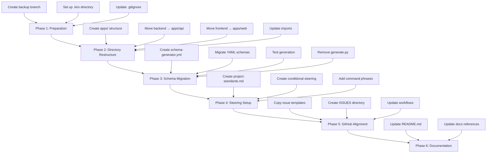

# Design Document: Repository Standardization

## Overview

This design document outlines the approach for standardizing the orb-integration-hub repository to align with orb-templates organizational standards. The migration will transform the current project structure into an Nx-style monorepo layout, integrate orb-schema-generator for code generation, and establish Kiro steering files for AI-assisted development.

## Architecture

### Current Structure vs Target Structure

```
CURRENT                              TARGET (Nx-Style)
─────────────────────────────────    ─────────────────────────────────
orb-integration-hub/                 orb-integration-hub/
├── backend/                         ├── apps/
│   └── src/                         │   ├── api/              ← backend/
│       ├── core/                    │   │   ├── models/       (generated)
│       │   ├── models/              │   │   ├── enums/        (generated)
│       │   └── testing/             │   │   ├── graphql/      (generated)
│       ├── lambdas/                 │   │   ├── services/
│       └── layers/                  │   │   ├── lambdas/
├── frontend/                        │   │   └── layers/
│   └── src/                         │   └── web/              ← frontend/
│       └── app/                     │       └── src/
│           ├── core/                │           ├── models/   (generated)
│           │   └── models/          │           ├── enums/    (generated)
│           └── features/            │           └── app/
├── infrastructure/                  ├── packages/             (new)
│   └── cloudformation/              ├── infrastructure/       (unchanged)
├── schemas/                         │   └── cloudformation/
│   ├── entities/                    ├── schemas/              (restructured)
│   ├── templates/                   │   ├── models/
│   └── generate.py                  │   ├── tables/
├── docs/                            │   └── core/
└── .taskmaster/                     ├── docs/
                                     ├── repositories/         (gitignored)
                                     ├── .kiro/
                                     │   ├── specs/
                                     │   └── steering/
                                     └── schema-generator.yml
```

### Migration Flow



## Components and Interfaces

### 1. Directory Structure Component

The new directory structure follows Nx-style conventions:

| Directory | Purpose | Contents |
|-----------|---------|----------|
| `apps/api/` | Backend API | Python services, Lambda handlers, generated models |
| `apps/web/` | Web frontend | Angular application, generated TypeScript models |
| `packages/` | Shared libraries | Reusable packages (initially empty) |
| `infrastructure/` | Cloud resources | CloudFormation, CDK constructs |
| `schemas/` | Schema definitions | YAML schemas for orb-schema-generator |
| `repositories/` | Reference repos | Cloned orb-templates, orb-infrastructure (gitignored) |
| `.kiro/` | Kiro configuration | Specs and steering files |

### 2. Schema Generator Configuration

The `schema-generator.yml` configuration file:

```yaml
version: '1.0'

project:
  name: orb-integration-hub
  customerId: orb
  projectId: integration-hub

paths:
  schemas: ./schemas

output:
  apps:
    api:
      models: ./apps/api/models
      enums: ./apps/api/enums
      graphql: ./apps/api/graphql
    web:
      models: ./apps/web/src/app/core/models
      enums: ./apps/web/src/app/core/enums
  infrastructure:
    cdk:
      output: ./infrastructure/cloudformation/generated
```

### 3. Steering Files Structure

```
.kiro/
├── specs/
│   └── repository-standardization/
│       ├── requirements.md
│       ├── design.md
│       └── tasks.md
└── steering/
    ├── project-standards.md      # Always loaded
    ├── testing-standards.md      # Conditional: test files
    ├── infrastructure.md         # Conditional: infrastructure files
    └── reference-projects.md     # Manual trigger
```

## Data Models

### Schema Migration Mapping

Current schema location → New schema location:

| Current Path | New Path | Format Change |
|--------------|----------|---------------|
| `schemas/entities/*.yml` | `schemas/models/*.yaml` | Adapt to orb-schema-generator format |
| `schemas/core/enums.yml` | `schemas/core/enums.yaml` | Minimal changes |
| `schemas/core/types.yml` | `schemas/core/types.yaml` | Minimal changes |

### Import Path Updates

| Current Import | New Import |
|----------------|------------|
| `backend/src/core/models/` | `apps/api/models/` |
| `frontend/src/app/core/models/` | `apps/web/src/app/core/models/` |
| `backend/src/lambdas/` | `apps/api/lambdas/` |
| `backend/src/layers/` | `apps/api/layers/` |


## Correctness Properties

*A property is a characteristic or behavior that should hold true across all valid executions of a system—essentially, a formal statement about what the system should do. Properties serve as the bridge between human-readable specifications and machine-verifiable correctness guarantees.*

### Property 1: Import Path Migration Completeness

*For any* source file in the repository (Python or TypeScript), there shall be no references to the old directory paths (`backend/`, `frontend/` as top-level directories in imports).

**Validates: Requirements 1.7, 7.3**

### Property 2: Schema Generator Output Correctness

*For any* valid YAML schema in the `schemas/` directory, running orb-schema-generator shall produce output files in the directories specified by `schema-generator.yml`.

**Validates: Requirements 2.5**

## Error Handling

### Migration Errors

| Error Scenario | Handling Strategy |
|----------------|-------------------|
| Import path not found after move | Log error, provide manual fix instructions |
| Schema validation failure | Stop migration, report schema issues |
| Test failures after restructure | Document failures, rollback if critical |
| Git conflicts during move | Use `git mv` to preserve history |

### Rollback Strategy

1. Create backup branch before migration: `git checkout -b backup/pre-standardization`
2. Each phase creates a checkpoint commit
3. If critical failure, reset to last checkpoint: `git reset --hard <checkpoint>`

## Testing Strategy

### Dual Testing Approach

This migration requires both unit tests (specific examples) and property-based tests (universal properties).

#### Unit Tests (Examples)

| Test | Purpose | Validates |
|------|---------|-----------|
| Directory structure exists | Verify apps/, packages/ created | Req 1.1, 1.6 |
| Steering file content | Verify required sections present | Req 3.1-3.7 |
| .gitignore entries | Verify repositories/ ignored | Req 4.1 |
| schema-generator.yml valid | Verify config parses correctly | Req 2.1, 2.2 |

#### Property-Based Tests

| Property | Test Strategy | Library |
|----------|---------------|---------|
| Import Path Migration | Grep all source files for old paths | Shell script |
| Schema Generator Output | Run generator, verify output locations | pytest + hypothesis |

### Test Configuration

- Property tests: Minimum 100 iterations (for schema variations)
- Tag format: **Feature: repository-standardization, Property {number}: {property_text}**

### Verification Commands

```bash
# Verify no old import paths exist
grep -r "from backend" apps/ --include="*.py" && echo "FAIL: Old imports found" || echo "PASS"
grep -r "from frontend" apps/ --include="*.ts" && echo "FAIL: Old imports found" || echo "PASS"

# Verify schema generator works
orb-schema-generator validate
orb-schema-generator generate --dry-run

# Run existing tests
cd apps/api && pipenv run pytest
cd apps/web && npm test
```

## Implementation Phases

### Phase 1: Preparation (Low Risk)
- Create backup branch
- Set up `.kiro/` directory structure
- Update `.gitignore` with `repositories/`
- Create steering files

### Phase 2: Directory Restructure (Medium Risk)
- Create `apps/` directory structure
- Move `backend/` → `apps/api/` using `git mv`
- Move `frontend/` → `apps/web/` using `git mv`
- Create `packages/` with `.gitkeep`
- Update all import paths

### Phase 3: Schema Migration (Medium Risk)
- Create `schema-generator.yml`
- Migrate schemas to orb-schema-generator format
- Test generation with dry-run
- Remove `schemas/generate.py` after verification

### Phase 4: GitHub Alignment (Low Risk)
- Copy issue templates from orb-infrastructure
- Create `.github/ISSUES/` directory
- Update workflows for OIDC (if applicable)

### Phase 5: Documentation (Low Risk)
- Update README.md with new structure
- Update docs/ references
- Add setup instructions for reference repositories

## Dependencies

### External Dependencies

| Dependency | Purpose | Installation |
|------------|---------|--------------|
| orb-schema-generator | Code generation | `pip install orb-schema-generator` |
| pipenv | Python package management | Already installed |
| npm | Node.js package management | Already installed |

### Repository Dependencies

| Repository | Purpose | Location |
|------------|---------|----------|
| orb-templates | Documentation reference | `repositories/orb-templates/` |
| orb-infrastructure | Workflow templates | `repositories/orb-infrastructure/` |

## Risks and Mitigations

| Risk | Impact | Mitigation |
|------|--------|------------|
| Breaking existing CI/CD | High | Update workflow paths before merge |
| Import path errors | Medium | Comprehensive grep verification |
| Schema format incompatibility | Medium | Test with orb-schema-generator validate |
| Lost git history | Low | Use `git mv` for all moves |
