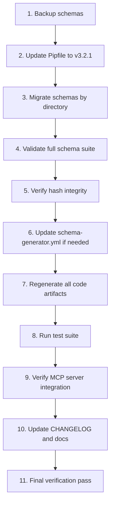

# Design Document: Schema Generator v3 Upgrade

## Overview

This design covers the migration of orb-integration-hub from orb-schema-generator v2.0.13 to v3.2.1. The upgrade affects 50 YAML schemas across 5 directories, the Pipfile dependency, all generated code artifacts, and the MCP server integration.

The v3 format introduces a fundamental architectural change: separating data model definitions from persistence configurations. Instead of a flat `type: dynamodb` schema with inline keys and attributes, v3 uses a `model` section for database-agnostic attributes and separate configuration sections (`dynamodb`, `appsync`, `lambda`, `lambda-dynamodb`) for target-specific settings. Every v3 schema requires `version: "1"` and a SHA-256 `hash` field for integrity verification.

The migration is automated via `orb-schema migrate-v3`, which handles the structural transformation, type mapping to the common type system, and hash computation. The project's dual-API architecture (main-api with Cognito auth, sdk-api with Lambda authorizer) must be preserved through the upgrade.

### Migration Scope

| Directory | Count | v2.x Type | v3 Sections |
|-----------|-------|-----------|-------------|
| `schemas/tables/` | 12 | `dynamodb`, `lambda-dynamodb` | `model` + `dynamodb` + `appsync` |
| `schemas/models/` | 4 | `standard` | `model` + `appsync` |
| `schemas/registries/` | 27 | `registry` | `version` + `hash` + items |
| `schemas/lambdas/` | 5 | `lambda` | `model` + `lambda` |
| `schemas/core/` | 2 | custom types | `version` + `hash` + types |

### Key Constraints

- v3.0.0 is NOT backward compatible — all schemas must be migrated before generation works
- The migration tool creates `.bak` backups and restores on validation failure
- Generated code (Python models, enums, GraphQL schemas, CDK constructs) must remain import-compatible
- `schema-generator.yml` already uses v2.x target-based configuration which v3 supports

## Architecture

The upgrade follows a sequential pipeline architecture where each phase depends on the successful completion of the previous one.



### Migration Order

Schemas must be migrated in dependency order to ensure cross-references resolve correctly:

1. **Core schemas** (`schemas/core/`) — shared types and validators, no dependencies
2. **Registry schemas** (`schemas/registries/`) — enum definitions referenced by other schemas
3. **Model schemas** (`schemas/models/`) — standard GraphQL types, may reference registries
4. **Table schemas** (`schemas/tables/`) — DynamoDB tables, reference registries and models
5. **Lambda schemas** (`schemas/lambdas/`) — Lambda resolvers, may reference tables and registries

### Rollback Strategy

- Git provides the primary rollback mechanism (commit v2.x state before migration)
- The migration tool creates `.bak` files as secondary backup
- If validation fails mid-migration, restore from git and retry

## Components and Interfaces

### CLI Tools (from orb-schema-generator v3.2.1)

| Tool | Command | Purpose |
|------|---------|---------|
| Migration Tool | `orb-schema migrate-v3 <path> [--dry-run] [--force]` | Convert v2.x schemas to v3 format |
| Validation Tool | `orb-schema validate-v3 <path> [--strict] [--verbose]` | Validate v3 schemas |
| Rehash Tool | `orb-schema rehash <path> [--verify-only]` | Compute/verify SHA-256 hashes |
| Generator | `orb-schema generate` | Generate code from v3 schemas |
| MCP Server | `python -m orb_schema_generator.mcp_server` | IDE integration tools |

### MCP Server Tools

| Tool | Input | Output |
|------|-------|--------|
| `list_schemas` | config path | List of all schema names and paths |
| `inspect_schema` | schema path | Schema details (version, hash, model, configs) |
| `validate_schema` | schema path | Validation result (valid/errors) |
| `generate_from_schema` | schema path, config | Generated code artifacts |

### Schema Transformation Rules

The migration tool applies these transformations per schema type:

**Table schemas (`type: dynamodb` / `type: lambda-dynamodb`):**
- `type` field → removed (target inferred from config sections)
- `targets` field → removed (target inferred)
- `model.keys.primary.partition` → `dynamodb.partition_key`
- `model.keys.primary.sort` → `dynamodb.sort_key`
- `model.keys.secondary[]` → `dynamodb.gsi[]` or `dynamodb.lsi[]`
- `model.stream` → `dynamodb.stream`
- `pitr_enabled` → `dynamodb.pitr_enabled`
- `model.authConfig` → `appsync.auth_config`
- `model.attributes` → `model.attributes` (with type mapping to common types)
- Adds `version: "1"` and computed `hash`

**Model schemas (`type: standard`):**
- `type` field → removed
- `targets` field → removed
- `model.attributes` → `model.attributes` (with type mapping)
- Adds `appsync` section (since models are used in GraphQL)
- Adds `version: "1"` and computed `hash`

**Registry schemas (`type: registry`):**
- `type` field → removed
- `targets` field → removed
- `items` → preserved as-is
- Adds `version: "1"` and computed `hash`

**Lambda schemas (`type: lambda`):**
- `type` field → removed
- `targets` field → removed
- `model.operation` → `lambda.operation`
- `model.attributes` → `model.attributes` (with type mapping)
- Adds `version: "1"` and computed `hash`

**Core schemas:**
- Structure preserved with `version: "1"` and `hash` added

### Common Type Mapping (v2.x → v3)

| v2.x Type | v3 Common Type | Notes |
|-----------|---------------|-------|
| `string` | `string` or `uuid` | IDs mapped to `uuid` |
| `number` | `integer` or `float` | Context-dependent |
| `boolean` | `boolean` | Direct mapping |
| `timestamp` | `timestamp` | Direct mapping |
| `array` | `json` | Arrays become JSON type |

### Generated Output Targets

| Target | Output Path | Content |
|--------|-------------|---------|
| `python-main` | `apps/api/models/` | Python model classes |
| `python-main` | `apps/api/enums/` | Python enum classes |
| `ts-main` | `apps/web/src/app/core/models/` | TypeScript model interfaces |
| `ts-main` | `apps/web/src/app/core/enums/` | TypeScript enums |
| `graphql-main` | `apps/api/graphql/schema.graphql` | Main API GraphQL schema |
| `graphql-sdk` | `apps/api/graphql-sdk/schema.graphql` | SDK API GraphQL schema |
| CDK | `infrastructure/cdk/generated/` | CDK table/API constructs |

## Data Models

### v2.x Schema Format (Current)

```yaml
# Example: schemas/tables/Users.yml (v2.x)
type: dynamodb
pitr_enabled: false
version: '1.0'
name: Users
targets:
  - python-main
  - ts-main
  - graphql-main
  - graphql-sdk
model:
  stream:
    enabled: true
    viewType: NEW_AND_OLD_IMAGES
  authConfig:
    cognitoAuthentication:
      groups:
        OWNER: ['*']
        USER: [Users, UsersResponse, UsersUpdate, UsersGet]
  keys:
    primary:
      partition: userId
    secondary:
      - name: EmailIndex
        type: GSI
        partition: email
        projection_type: ALL
  attributes:
    userId:
      type: string
      required: true
    email:
      type: string
      required: true
    status:
      type: string
      enum_type: UserStatus
      required: true
    createdAt:
      type: timestamp
      required: true
```

### v3 Schema Format (Target)

```yaml
# Example: schemas/tables/Users.yml (v3)
version: "1"
hash: "sha256:a1b2c3d4..."
name: Users

model:
  attributes:
    - name: userId
      type: uuid
      required: true
    - name: email
      type: string
      required: true
    - name: status
      type: string
      enum_type: UserStatus
      required: true
    - name: createdAt
      type: timestamp
      required: true

dynamodb:
  partition_key: userId
  pitr_enabled: false
  stream:
    view_type: NEW_AND_OLD_IMAGES
  gsi:
    - name: EmailIndex
      partition_key: email
      projection_type: ALL

appsync:
  auth_config:
    cognitoAuthentication:
      groups:
        OWNER: ['*']
        USER: [Users, UsersResponse, UsersUpdate, UsersGet]
```

### v2.x Registry Format (Current)

```yaml
type: registry
version: '1.0'
name: UserStatus
targets:
  - python-main
  - ts-main
  - graphql-main
  - graphql-sdk
description: "User account status"
items:
  ACTIVE:
    value: "ACTIVE"
    description: "Active user"
```

### v3 Registry Format (Target)

```yaml
version: "1"
hash: "sha256:b2c3d4e5..."
name: UserStatus
description: "User account status"
items:
  ACTIVE:
    value: "ACTIVE"
    description: "Active user"
```

### Pipfile Change

```toml
# Before (v2.x)
orb-schema-generator = "==2.0.13"

# After (v3.2.1)
orb-schema-generator = {version = "==3.2.1", index = "codeartifact"}
```

### schema-generator.yml

The existing `schema-generator.yml` already uses v2.x target-based configuration (`output.code.*` and `output.infrastructure.*` structure) which v3.2.1 supports. The `api_definitions` section with `main-api` and `sdk-api` entries is compatible with v3. No structural changes are expected unless v3.2.1 introduces new required fields — this will be verified during the migration.


## Correctness Properties

*A property is a characteristic or behavior that should hold true across all valid executions of a system — essentially, a formal statement about what the system should do. Properties serve as the bridge between human-readable specifications and machine-verifiable correctness guarantees.*

### Property 1: Migrated schemas contain version and valid hash

*For any* schema file in the project (table, model, registry, lambda, or core), after migration via `orb-schema migrate-v3`, the resulting YAML shall contain `version: "1"` and a `hash` field matching the format `sha256:<hexdigest>`, and the hash shall verify correctly against the file content.

**Validates: Requirements 1.1, 2.1, 3.1, 4.1, 5.1, 8.1**

### Property 2: Table schema structural transformation

*For any* v2.x table schema with `type: dynamodb` or `type: lambda-dynamodb`, after migration, the resulting v3 schema shall: (a) contain a `dynamodb` configuration section with `partition_key` matching the original `model.keys.primary.partition`, (b) contain an `appsync` section if the original had `authConfig`, (c) NOT contain the v2.x fields `type`, `targets`, or the nested `model.keys`/`model.stream` structures.

**Validates: Requirements 1.3, 1.4, 1.5**

### Property 3: Attributes use common type system

*For any* migrated schema that contains a `model.attributes` section, every attribute's `type` field shall be one of the valid v3 common types: `uuid`, `string`, `integer`, `float`, `boolean`, `timestamp`, `date`, `json`, or `binary`.

**Validates: Requirements 1.2**

### Property 4: Model schemas include appsync section

*For any* v2.x model schema with `type: standard`, after migration, the resulting v3 schema shall contain an `appsync` configuration section, since these models are used as GraphQL types.

**Validates: Requirements 2.2**

### Property 5: Registry items preservation round-trip

*For any* registry schema, the `items` section (all enum entries with their `value` and `description` fields) shall be identical before and after migration — no items added, removed, or modified.

**Validates: Requirements 3.2**

### Property 6: Lambda operation type preservation

*For any* v2.x lambda schema, the operation type (`query` or `mutation`) from `model.operation` shall be preserved in the v3 `lambda.operation` field after migration.

**Validates: Requirements 4.2**

### Property 7: Cross-schema reference integrity

*For any* migrated v3 schema that references an `enum_type` or another model type in its attributes, the referenced schema shall exist in the migrated schema suite and shall itself be a valid v3 schema.

**Validates: Requirements 7.2, 7.3**

### Property 8: Generated code compatibility round-trip

*For any* schema in the project, the Python model class name and attribute names generated from the v3 schema shall be identical to those generated from the original v2.x schema. For registry schemas, the generated enum class name and member values shall be identical before and after migration.

**Validates: Requirements 12.1, 12.2**

## Error Handling

### Migration Failures

| Error Scenario | Handling Strategy |
|---------------|-------------------|
| Migration tool fails on a schema | Tool automatically restores `.bak` backup; fix v2.x schema and retry |
| Validation fails after migration | Tool restores backup; review error messages with `--verbose` flag |
| Hash verification fails | Run `orb-schema rehash <file>` to recompute; investigate if file was manually edited |
| Cross-schema reference not found | Ensure all schemas are migrated (dependency order matters) |
| Type mapping ambiguity | Review migrated types manually; `string` IDs may need changing to `uuid` |

### Pipfile Update Failures

| Error Scenario | Handling Strategy |
|---------------|-------------------|
| CodeArtifact auth token expired | Re-export `CODEARTIFACT_AUTH_TOKEN` and retry |
| Package not found on CodeArtifact | Verify v3.2.1 is published; check `index = "codeartifact"` in Pipfile |
| Dependency conflict | Review `pipenv lock` output; resolve conflicts in Pipfile |

### Generation Failures

| Error Scenario | Handling Strategy |
|---------------|-------------------|
| Generator rejects schema | Run `orb-schema validate-v3 <file> --verbose` for detailed errors |
| Generated code differs from v2.x | Use `orb-schema generate --diff` to compare; review type mappings |
| Missing output files | Check `schema-generator.yml` target definitions match v3 expectations |
| GraphQL schema missing operations | Verify `api_definitions` in `schema-generator.yml` are correct |

### MCP Server Failures

| Error Scenario | Handling Strategy |
|---------------|-------------------|
| MCP server won't start | Verify v3.2.1 is installed in the venv; check `ORB_SCHEMA_CONFIG` env var |
| `list_schemas` returns empty | Verify schema paths in `schema-generator.yml` |
| `validate_schema` reports errors | Fix schema issues identified in error messages |

### Rollback Procedure

1. `git checkout -- schemas/` to restore v2.x schemas from git
2. Revert Pipfile change: `git checkout -- apps/api/Pipfile`
3. Regenerate code with v2.x: `orb-schema generate`
4. Verify tests pass: `pipenv run pytest`

## Testing Strategy

### Dual Testing Approach

This upgrade requires both unit/example tests and property-based tests for comprehensive coverage.

### Property-Based Tests

Property-based tests use the `hypothesis` library (already in dev dependencies at `>=6.82.0`) to verify universal properties across generated inputs. Each test runs a minimum of 100 iterations.

| Property | Test Description | Tag |
|----------|-----------------|-----|
| Property 1 | Generate random v2.x schemas, migrate, verify version+hash | `Feature: schema-generator-v3-upgrade, Property 1: Migrated schemas contain version and valid hash` |
| Property 2 | Generate random v2.x table schemas with keys/auth, migrate, verify dynamodb+appsync sections and absence of v2.x fields | `Feature: schema-generator-v3-upgrade, Property 2: Table schema structural transformation` |
| Property 3 | Generate random migrated schemas with attributes, verify all types are valid common types | `Feature: schema-generator-v3-upgrade, Property 3: Attributes use common type system` |
| Property 4 | Generate random v2.x standard model schemas, migrate, verify appsync section exists | `Feature: schema-generator-v3-upgrade, Property 4: Model schemas include appsync section` |
| Property 5 | Generate random registry schemas with items, migrate, verify items are identical | `Feature: schema-generator-v3-upgrade, Property 5: Registry items preservation round-trip` |
| Property 6 | Generate random lambda schemas with query/mutation, migrate, verify operation preserved | `Feature: schema-generator-v3-upgrade, Property 6: Lambda operation type preservation` |
| Property 7 | Generate schemas with enum_type/model references, verify referenced schemas exist in suite | `Feature: schema-generator-v3-upgrade, Property 7: Cross-schema reference integrity` |
| Property 8 | Generate v2.x schemas, capture generated Python output, migrate to v3, regenerate, compare class names and attributes | `Feature: schema-generator-v3-upgrade, Property 8: Generated code compatibility round-trip` |

### Unit / Example Tests

Unit tests verify specific concrete scenarios and edge cases:

| Test | What It Verifies |
|------|-----------------|
| Validate all 12 table schemas pass strict validation | Req 1.6 |
| Validate all 4 model schemas pass strict validation | Req 2.3 |
| Validate all 27 registry schemas pass strict validation | Req 3.3 |
| Validate all 5 lambda schemas pass strict validation | Req 4.3 |
| Validate all 2 core schemas pass strict validation | Req 5.2 |
| Pipfile contains correct v3.2.1 dependency line | Req 6.1 |
| Full schema suite validates with zero errors | Req 7.1 |
| All hashes verify with `--verify-only` | Req 8.2 |
| Python models generated in `apps/api/models/` | Req 9.1 |
| Python enums generated in `apps/api/enums/` | Req 9.2 |
| Main API GraphQL schema generated | Req 9.3 |
| SDK API GraphQL schema generated | Req 9.4 |
| TypeScript models generated | Req 9.5 |
| CDK constructs generated | Req 9.6 |
| Main API schema contains all 12 table types | Req 10.1 |
| SDK API schema contains only Users + 3 operations | Req 10.2 |
| schema-generator.yml has both API definitions | Req 10.3 |
| MCP list_schemas returns all schemas | Req 11.1 |
| MCP inspect_schema returns v3 details | Req 11.2 |
| MCP validate_schema reports valid | Req 11.3 |
| MCP validate_schema rejects invalid hash (edge case) | Req 11.4 |
| Existing pytest suite passes | Req 12.3 |
| CHANGELOG.md has upgrade entry | Req 14.1, 14.2 |
| Final verification: validate + rehash + generate + pytest all pass | Req 17.1-17.5 |

### Test Configuration

- **Library**: `hypothesis` (Python, already installed)
- **Minimum iterations**: 100 per property test
- **Test location**: `apps/api/tests/test_schema_v3_migration.py`
- **Tag format**: `Feature: schema-generator-v3-upgrade, Property {N}: {title}`
- Each correctness property is implemented by a single property-based test
- Unit tests complement property tests for specific examples and edge cases
