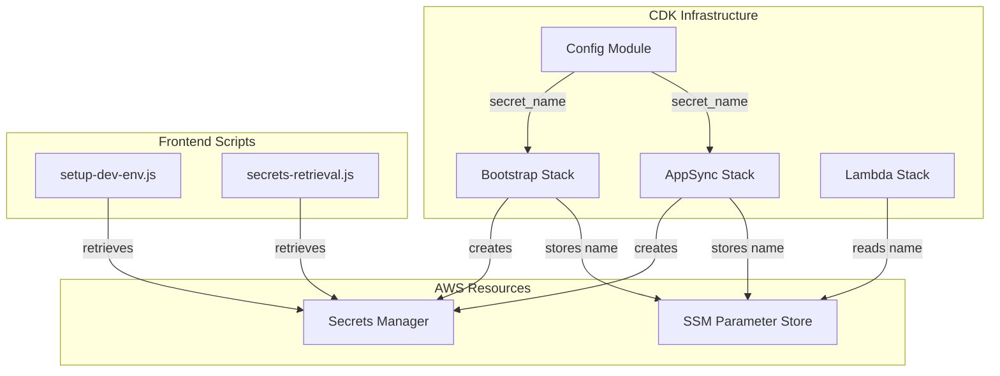

# Design Document: Secrets Naming Convention Migration

## Overview

This design document describes the migration of three AWS Secrets Manager secrets from dash-based naming to slash-based naming convention. The migration aligns Secrets Manager naming with the existing SSM Parameter Store convention, ensuring consistency across all AWS resource naming in the orb-integration-hub project.

### Current State

| Current Name | Purpose |
|--------------|---------|
| `orb-integration-hub-dev-github-actions-secret-access-key` | GitHub Actions IAM access key |
| `orb-integration-hub-dev-graphql-api-key` | AppSync GraphQL API key |
| `orb-integration-hub-dev-sms-verification-secret` | SMS verification HMAC secret |

### Target State

| New Name | Purpose |
|----------|---------|
| `orb/integration-hub/dev/secrets/github/access-key` | GitHub Actions IAM access key |
| `orb/integration-hub/dev/secrets/appsync/api-key` | AppSync GraphQL API key |
| `orb/integration-hub/dev/secrets/sms/verification` | SMS verification HMAC secret |

## Architecture

The migration affects three layers of the application:



## Components and Interfaces

### Config Module Enhancement

Add a new `secret_name` method to `infrastructure/cdk/config.py`:

```python
def secret_name(self, service: str, resource: str) -> str:
    """Generate path-based secret name for Secrets Manager.
    
    Follows the pattern: /{customer_id}/{project_id}/{environment}/secrets/{service}/{resource}
    
    Args:
        service: Service category (e.g., "github", "appsync", "sms")
        resource: Resource identifier (e.g., "access-key", "api-key", "verification")
    
    Returns:
        Full secret name path
    
    Example:
        secret_name("github", "access-key") -> "orb/integration-hub/dev/secrets/github/access-key"
    """
    return f"{self.customer_id}/{self.project_id}/{self.environment}/secrets/{service}/{resource}"
```

### Bootstrap Stack Changes

Update `infrastructure/cdk/stacks/bootstrap_stack.py`:

1. **GitHub Actions Secret**: Change from `resource_name("github-actions-secret-access-key")` to `secret_name("github", "access-key")`

2. **SMS Verification Secret**: Change from `resource_name("sms-verification-secret")` to `secret_name("sms", "verification")`

### AppSync Stack Changes

Update `infrastructure/cdk/stacks/appsync_stack.py`:

1. **GraphQL API Key Secret**: Change from `resource_name("graphql-api-key")` to `secret_name("appsync", "api-key")`

2. **SSM Parameter Update**: Update the SSM parameter that stores the secret name to use the new naming

### Lambda Stack Changes

Update `infrastructure/cdk/stacks/lambda_stack.py`:

1. **SMS Verification Lambda Environment**: Update `SMS_VERIFICATION_SECRET_NAME` to use `secret_name("sms", "verification")`

### Frontend Script Changes

Update `apps/web/scripts/setup-dev-env.js` and `apps/web/scripts/secrets-retrieval.js`:

```javascript
// Helper to generate secret names (mirrors Config.secret_name)
const secretName = (service, resource) => 
  `${CONFIG.customerId}/${CONFIG.projectId}/${CONFIG.environment}/secrets/${service}/${resource}`;

// Update FRONTEND_SECRETS_MAP
'GRAPHQL_API_KEY': {
  type: 'secret',
  name: secretName('appsync', 'api-key')
}
```

## Data Models

### Secret Naming Pattern

```
Pattern: {customer_id}/{project_id}/{environment}/secrets/{service}/{resource}

Components:
- customer_id: "orb" (from Config)
- project_id: "integration-hub" (from Config)
- environment: "dev" | "staging" | "prod" (from Config)
- service: Category of the secret (github, appsync, sms)
- resource: Specific resource identifier (access-key, api-key, verification)
```

### SSM Parameter Updates

The following SSM parameters store secret names and must be updated:

| SSM Parameter Path | Old Value | New Value |
|-------------------|-----------|-----------|
| `/{prefix}/secrets/sms-verification/name` | `{prefix}-sms-verification-secret` | `{prefix}/secrets/sms/verification` |
| `/{prefix}/appsync/api-key-secret-name` | `{prefix}-graphql-api-key` | `{prefix}/secrets/appsync/api-key` |


## Correctness Properties

*A property is a characteristic or behavior that should hold true across all valid executions of a system—essentially, a formal statement about what the system should do. Properties serve as the bridge between human-readable specifications and machine-verifiable correctness guarantees.*

Based on the prework analysis, the following properties have been identified:

### Property 1: Secret Name Format Consistency

*For any* valid service string and resource string, calling `Config.secret_name(service, resource)` SHALL return a string matching the pattern `{customer_id}/{project_id}/{environment}/secrets/{service}/{resource}` where all components are properly joined with forward slashes.

**Validates: Requirements 1.1, 1.2**

### Property 2: Resource Name Backward Compatibility

*For any* valid resource name string, calling `Config.resource_name(name)` SHALL return a string matching the pattern `{customer_id}-{project_id}-{environment}-{name}` where all components are properly joined with dashes, maintaining backward compatibility with existing non-secret resources.

**Validates: Requirements 1.3**

### Property 3: Frontend Secret Name Format Consistency

*For any* valid service string and resource string, calling the frontend `secretName(service, resource)` helper SHALL return a string matching the pattern `{customerId}/{projectId}/{environment}/secrets/{service}/{resource}` where all components are properly joined with forward slashes, mirroring the backend Config.secret_name behavior.

**Validates: Requirements 3.3, 3.4, 6.3**

## Error Handling

### Invalid Input Handling

The `secret_name` method should handle edge cases gracefully:

1. **Empty strings**: If service or resource is empty, the method should still produce a valid path (though this would be a configuration error)
2. **Special characters**: Service and resource names should only contain alphanumeric characters and hyphens
3. **Case sensitivity**: Secret names are case-sensitive in AWS; the method preserves input case

### Deployment Error Scenarios

| Scenario | Handling |
|----------|----------|
| Old secret doesn't exist | CDK creates new secret normally |
| New secret already exists | CDK update fails; manual cleanup required |
| SSM parameter update fails | Stack rollback; investigate permissions |
| Lambda can't read new secret | Check IAM policy scoping for new path pattern |

### IAM Policy Considerations

The Lambda execution role's Secrets Manager policy uses a prefix pattern:

```python
resources=[
    f"arn:aws:secretsmanager:{self.region}:{self.account}:secret:{self.config.prefix}-*",
]
```

This pattern (`orb-integration-hub-dev-*`) will NOT match the new slash-based names. The policy must be updated to:

```python
resources=[
    f"arn:aws:secretsmanager:{self.region}:{self.account}:secret:{self.config.customer_id}/{self.config.project_id}/{self.config.environment}/secrets/*",
]
```

## Testing Strategy

### Dual Testing Approach

This migration requires both unit tests and property-based tests:

- **Unit tests**: Verify specific CDK template outputs, SSM parameter values, and Lambda environment variables
- **Property tests**: Verify the naming convention methods produce correctly formatted output for all valid inputs

### Property-Based Testing Configuration

- **Library**: pytest with hypothesis for Python CDK tests
- **Minimum iterations**: 100 per property test
- **Tag format**: `Feature: secrets-naming-convention, Property {number}: {property_text}`

### Unit Test Coverage

| Component | Test File | Tests |
|-----------|-----------|-------|
| Config.secret_name | `test_config.py` | Format validation, component ordering |
| Bootstrap Stack secrets | `test_bootstrap_stack.py` | GitHub secret name, SMS secret name, SSM parameters |
| AppSync Stack secrets | `test_appsync_stack.py` | API key secret name, SSM parameter |
| Lambda Stack env vars | `test_lambda_stack.py` | SMS_VERIFICATION_SECRET_NAME value |

### Property Test Coverage

| Property | Test File | Description |
|----------|-----------|-------------|
| Property 1 | `test_config.py` | secret_name format for random service/resource |
| Property 2 | `test_config.py` | resource_name format for random names |
| Property 3 | Frontend unit tests | secretName helper format validation |

### Test Implementation Notes

1. CDK tests use `aws_cdk.assertions.Template` for template validation
2. Property tests use hypothesis `@given` decorator with string strategies
3. Frontend tests use Jest with custom matchers for pattern validation
4. All tests must pass before deployment per CI/CD workflow

### Manual Verification Checklist

After deployment, verify:

1. [ ] New secrets exist in Secrets Manager with slash-based names
2. [ ] SSM parameters contain the new secret names
3. [ ] Lambda functions can retrieve secrets (check CloudWatch logs)
4. [ ] Frontend local setup works with `npm run setup-dev`
5. [ ] Old secrets can be manually deleted after verification


## Post-Deployment Cleanup

After successful deployment and verification, the old secrets should be manually deleted from AWS Secrets Manager. This is intentionally not automated to ensure proper verification before cleanup.

### Old Secrets to Delete

After verifying the new secrets work correctly, delete these old secrets:

| Old Secret Name | Replacement |
|-----------------|-------------|
| `orb-integration-hub-dev-github-actions-secret-access-key` | `orb/integration-hub/dev/secrets/github/access-key` |
| `orb-integration-hub-dev-graphql-api-key` | `orb/integration-hub/dev/secrets/appsync/api-key` |
| `orb-integration-hub-dev-sms-verification-secret` | `orb/integration-hub/dev/secrets/sms/verification` |

### Cleanup Commands

```bash
# Verify new secrets exist and are accessible
aws --profile sso-orb-dev secretsmanager get-secret-value \
    --secret-id "orb/integration-hub/dev/secrets/github/access-key" \
    --query 'SecretString' --output text

aws --profile sso-orb-dev secretsmanager get-secret-value \
    --secret-id "orb/integration-hub/dev/secrets/appsync/api-key" \
    --query 'SecretString' --output text

aws --profile sso-orb-dev secretsmanager get-secret-value \
    --secret-id "orb/integration-hub/dev/secrets/sms/verification" \
    --query 'SecretString' --output text

# After verification, delete old secrets (with recovery window)
aws --profile sso-orb-dev secretsmanager delete-secret \
    --secret-id "orb-integration-hub-dev-github-actions-secret-access-key" \
    --recovery-window-in-days 7

aws --profile sso-orb-dev secretsmanager delete-secret \
    --secret-id "orb-integration-hub-dev-graphql-api-key" \
    --recovery-window-in-days 7

aws --profile sso-orb-dev secretsmanager delete-secret \
    --secret-id "orb-integration-hub-dev-sms-verification-secret" \
    --recovery-window-in-days 7
```

### Verification Steps Before Cleanup

1. Deploy the updated CDK stacks
2. Verify Lambda functions can access secrets (check CloudWatch logs for errors)
3. Test frontend local setup with `npm run setup-dev`
4. Verify GitHub Actions workflows still work (if applicable)
5. Wait at least 24 hours after deployment before deleting old secrets
6. Use the 7-day recovery window when deleting (allows restoration if issues arise)
