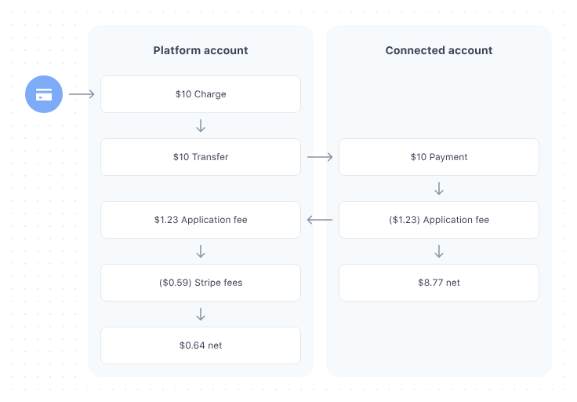

# orb-integration-hub
This is an integration hub for OneRedBoot.com(ORB). It is a platform that allows users to make payments 
using their credit card. The integration hub is built using Angular and AWS services. The integration hub is integrated 
with Stripe to process payments, with PayPal integration in progress.

The integration hub is also integrated with AWS services to send notifications to users after a successful payment.

## Setup

### Setup Angular Project
1. cd orb-integration-hub/frontend
2. npm install
3. ng serve

### Development Commands
- Build: `ng build`
- Test: `ng test`
- Lint: `ng lint`

## Feature Development with Claude Code

### Context Structure
This project uses a structured approach for maintaining development context:

1. **Project Context**: General project information in `/context/*.md` files:
   - `project.md`: Core project information and technology stack
   - `structure.md`: System architecture and file organization
   - `dynamodb_resolver_standards.md`: Database patterns and best practices
   - `state.md`: Application state management

2. **Feature Context**: Each feature has its own context folder:
   - Path: `/context/features/[feature-name]/`
   - Feature details: `[feature-name].md` - Requirements, dependencies, technical approach
   - Feature changelog: `changelog.md` - Detailed record of file changes and reasoning

### Claude Code Workflow
1. Start a Claude Code session
2. Reference CLAUDE.md to load project standards and commands
3. Identify current feature name (`[feature-name]-feature`)
4. Load feature-specific context from the appropriate directory
5. Work on only one feature at a time until completion
6. Maintain feature changelog with all significant file changes
7. Create branches following pattern: `[feature-name]-feature`

## Stripe flow

curl https://api.stripe.com/v1/balance \
  -u "{{SECRET_KEY}}" \
  -H "Stripe-Account: {{CONNECTED_ACCOUNT_ID}}" \
  -d "expand[]"="instant_available.net_available"

## Amplify Configuration
cd frontend
npx ampx generate outputs --stack orb-integration-hub-api-cognito
